# Chapter 13: Four-Layer Harness Architecture

## Diagram Description

Visualizes the four-layer harness model that transforms unreliable LLM outputs into production-quality code. Each layer adds constraints, feedback loops, and automation to increase signal-to-noise ratio.

## Primary View: Concentric Layers

```mermaid
flowchart TB
    subgraph Core["🎲 Core: LLM"]
        LLM["Probabilistic output<br/>High variance"]
    end

    subgraph Layer1["Layer 1: Claude Code Configuration"]
        L1["CLAUDE.md • Hooks • Scoping<br/>Applies constraints, defines invariants"]
    end

    subgraph Layer2["Layer 2: Repository Engineering"]
        L2["OTEL • Tests • DDD • Docker<br/>Clear feedback, environment parity"]
    end

    subgraph Layer3["Layer 3: Meta-Engineering"]
        L3["Workflows • Meta-tests • Agent swarms<br/>Automates the automation"]
    end

    subgraph Layer4["Layer 4: Closed-Loop Optimization"]
        L4["Telemetry • Constraints • CI/CD<br/>Self-correcting, self-optimizing"]
    end

    LLM --> L1 --> L2 --> L3 --> L4

    style Core fill:#ffcccc
    style Layer1 fill:#ffddaa
    style Layer2 fill:#ffffaa
    style Layer3 fill:#ddffaa
    style Layer4 fill:#aaffaa
```

## Alternative View: Components Per Layer

| Layer | Focus | Key Components | Result |
|-------|-------|----------------|--------|
| 1: Claude Code | Configure the agent | CLAUDE.md, hooks, scope constraints | Constrained solution space |
| 2: Repository | Engineer the environment | Tests, OTEL, DDD structure, Docker | Clear signal from failures |
| 3: Meta-Engineering | Automate processes | Workflows, tests for tests, agent swarms | Work happens autonomously |
| 4: Closed-Loop | Self-optimization | Telemetry input, constraint specs, CI/CD | Zero-touch maintenance |

## Alternative View: What Each Layer Provides

## Alternative View: Maturity Timeline

| Timeline | Layer | Activity | Outcome |
|----------|-------|----------|---------|
| Week 1 | Layer 1 | Write CLAUDE.md, add hooks | 3x faster development |
| Week 2-3 | Layer 2 | Add OTEL, tests, DDD refactor | Better signal, fewer regressions |
| Month 1 | Layer 3 | Build workflows, nightly jobs | Autonomous work |
| Month 2-3 | Layer 4 | Constraints, optimization loop | Zero-touch maintenance |
| Month 4+ | Factory | MCP servers, meta-tools | Exponential productivity |

## Building the Factory View

## Usage

**Chapter reference**: Lines 5-17, opening section and "The Signal Processing Mental Model"

**Key passage from chapter**:
> "The first layer configures Claude Code itself. The second layer engineers your repository for clarity. The third layer automates your processes. The fourth layer closes the feedback loop so the system optimizes itself."

**Where to use this diagram**:
- After line 17, to visualize the four-layer concept before diving into details
- Primary concentric view shows progression outward from LLM
- Components table provides quick reference for each layer
- Maturity timeline helps readers plan adoption

## Related Diagrams

- ch13-signal-processing-harness.md - Signal/noise improvement through layers
- ch13-four-automation-levels.md - Productivity multipliers at each level
- ch10-ralph-loop.md - Long-running agent patterns
