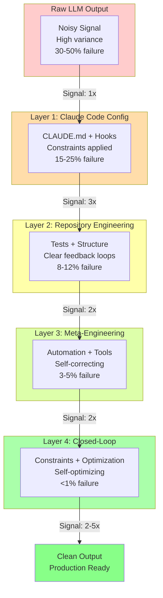
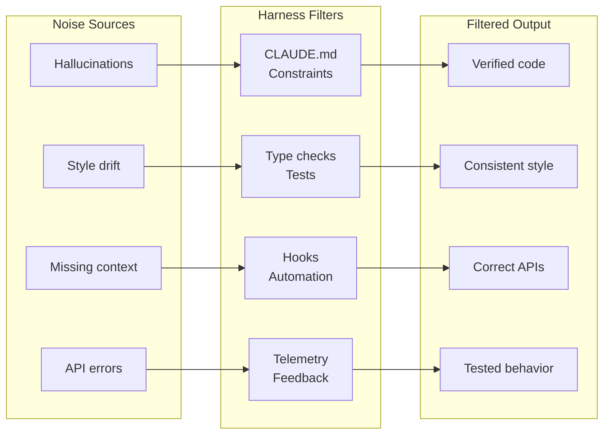
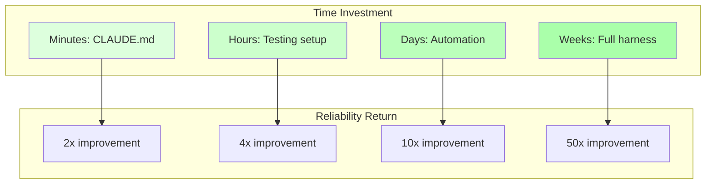

# Chapter 13: Signal Processing Harness

## Diagram Description

Visualizes the four-layer harness model as a signal processing system. Each layer filters noise and amplifies signal, transforming unreliable probabilistic outputs (30-50% failure rate) into consistent, high-quality code (<1% failure rate).

## Primary View: Signal Flow

## Alternative View: Noise Reduction Pipeline

## Alternative View: Failure Rate Table

| Layer | What It Does | Mechanism | Failure Rate |
|-------|-------------|-----------|--------------|
| 0: Raw LLM | Generates code | Probabilistic | 30-50% |
| 1: Claude Code | Applies constraints | CLAUDE.md, hooks | 15-25% |
| 2: Repository | Provides feedback | Tests, types, structure | 8-12% |
| 3: Meta-Engineering | Automates correction | MCP servers, agents | 3-5% |
| 4: Closed-Loop | Self-optimizes | Telemetry, constraints | <1% |

**Key insight**: Each layer provides 2-3x signal improvement. Stacked together, they transform a 30-50% failure rate into <1%.

## Alternative View: Investment vs Return

## Usage

**Chapter reference**: Lines 7-17, "The Signal Processing Mental Model" section

**Key passage from chapter**:
> "Each layer of harness you add filters noise and amplifies signal. The first layer configures Claude Code itself. The second layer engineers your repository for clarity. The third layer automates your processes. The fourth layer closes the feedback loop so the system optimizes itself."

**Where to use this diagram**:
- After line 17, before "Layer 1: Configuring Claude Code"
- Primary view shows the flow from noise to clean output
- Table view provides quick reference for reader recall
- Use noise reduction pipeline view for presentations

## Related Diagrams

- ch13-harness-architecture.md - Four-layer structural view
- ch06-verification-ladder.md - Quality gates at each level
- ch09-context-channel-capacity.md - Information theory foundation
