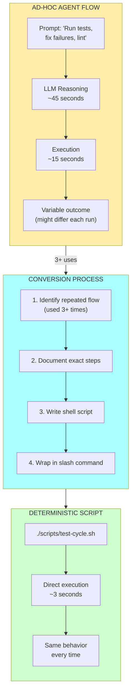
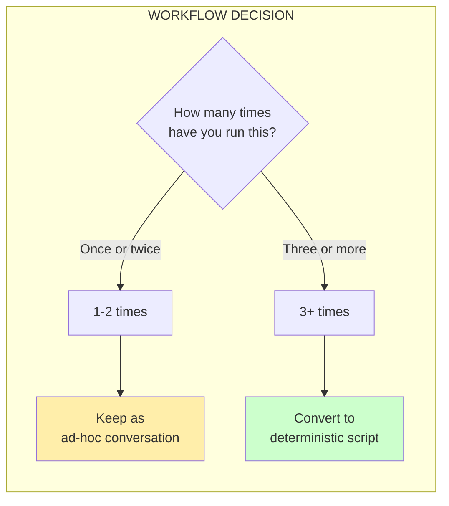
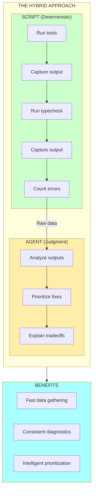
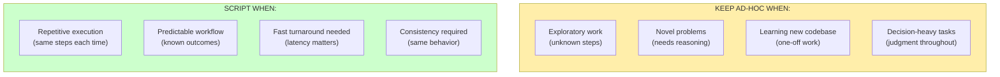
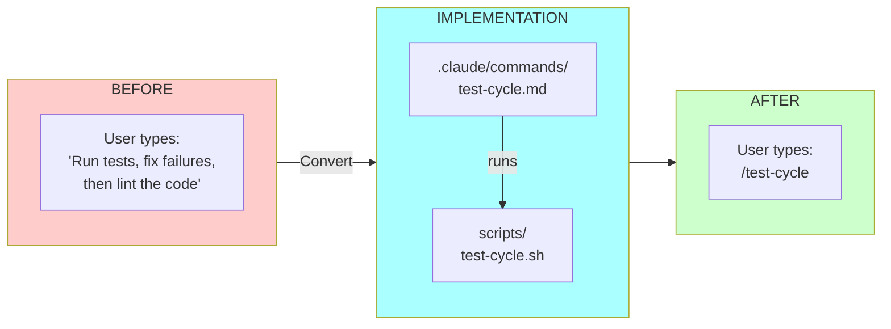

# Chapter 14: Ad-hoc to Deterministic Flow

## Diagram Description

Visualizes the conversion process from ad-hoc agent workflows to deterministic scripts. Shows the contrast between variable latency/cost of agent-driven flows versus fast, predictable scripts. Includes the hybrid approach where scripts gather data and agents apply judgment.

## Primary View: Conversion Flow

## Alternative View: Cost and Latency Comparison

| Metric | Ad-hoc Agent Flow | Deterministic Script |
|--------|-------------------|---------------------|
| **Latency** | ~60 seconds (45s reasoning + 15s execution) | ~3 seconds |
| **Token Cost** | $0.02-0.10 per run | $0.00 |
| **Consistency** | Variable (might differ) | Identical every time |
| **Context Use** | Consumes context window | Zero context used |
| **Error Handling** | Agent decides | Explicit in script |
| **Debugging** | Opaque (LLM reasoning) | Transparent (read script) |

**Impact over 100 runs:**
- Latency saved: ~95 minutes
- Tokens saved: $2-10
- Consistency: 100% vs ~85%

## Alternative View: The 3-Use Threshold

## Alternative View: Hybrid Approach

## Alternative View: When to Keep Ad-hoc

## Alternative View: The Slash Command Pattern

## Alternative View: Impact Calculation

| Scenario | Ad-hoc Time | Script Time | Savings per Run | Over 100 Runs |
|----------|-------------|-------------|-----------------|---------------|
| Test cycle | 60s | 3s | 57s | **95 minutes** |
| Deploy to staging | 120s | 15s | 105s | **175 minutes** |
| Lint and format | 45s | 2s | 43s | **72 minutes** |
| Database migration | 90s | 10s | 80s | **133 minutes** |

**Key insight**: The savings compound. Every repeated workflow converted to a script saves hours over time.

## Usage

**Chapter reference**: Lines 7-127, "Converting Ad-hoc Workflows to Deterministic Scripts" section

**Key passages from chapter**:
> "Every time you prompt an agent to 'run tests, fix failures, then lint,' you are burning context, tokens, and time. If you have typed that sequence three times, it should be a script."

> "The latency argument alone is compelling. An ad-hoc flow takes about 45 seconds of LLM reasoning plus 15 seconds of execution. A script takes 3 seconds total."

**Where to use this diagram**:
- After line 16, following the ad-hoc/deterministic pattern explanation
- Cost/latency table supports the numbers in lines 22-32
- Hybrid approach diagram aligns with lines 95-116

**Design notes**:
- Yellow = ad-hoc (flexible but slow)
- Green = deterministic (fast and consistent)
- Blue = conversion process or hybrid benefits

## Related Diagrams

- ch14-leverage-stack.md - What skills to keep vs delegate
- ch14-task-decomposition.md - How to size tasks for agents
- ch14-compound-effect-loop.md - How meta-engineering investments compound
