# Chapter 14: The Atrophy Ladder

## Diagram Description

Visualizes the five career levels based on skill retention during AI-assisted development. Shows how capability to specify, verify, and derive solutions maps to career trajectory. Level 4 (Senior Engineer) is highlighted as the minimum safe level, while Level 1 represents a career ceiling.

## Primary View: Career Ladder

```mermaid
flowchart TB
    subgraph L5["Level 5: ARCHITECT / STAFF+"]
        direction TB
        L5D["✅ Can SPECIFY problems clearly<br/>✅ Can VERIFY solutions rigorously<br/>✅ Can DERIVE solutions from scratch"]
    end

    subgraph L4["Level 4: SENIOR ENGINEER ★ SAFE ★"]
        direction TB
        L4D["✅ Can SPECIFY problems clearly<br/>✅ Can VERIFY solutions rigorously<br/>⚡ Could DERIVE if needed"]
    end

    subgraph L3["Level 3: MID-LEVEL + AI LEVERAGE"]
        direction TB
        L3D["✅ Can SPECIFY problems<br/>✅ Can VERIFY solutions<br/>❌ Couldn't DERIVE"]
    end

    subgraph L2["Level 2: JUNIOR + TOOLS"]
        direction TB
        L2D["⚠️ Can VERIFY (sometimes)<br/>❌ Can't SPECIFY well<br/>❌ Can't DERIVE"]
    end

    subgraph L1["Level 1: PROMPT OPERATOR 🛑"]
        direction TB
        L1D["❌ Can't VERIFY<br/>❌ Can't SPECIFY<br/>❌ Just accepts output<br/><br/>CEILING REACHED"]
    end

    L5 --> L4 --> L3 --> L2 --> L1

    style L5 fill:#22aa22,color:#fff
    style L4 fill:#66cc66,color:#000
    style L3 fill:#ffffaa,color:#000
    style L2 fill:#ffcc66,color:#000
    style L1 fill:#ff6666,color:#fff
```

## Alternative View: Skill Capability Matrix

| Level | Role | Specify | Verify | Derive | Career Outlook |
|-------|------|---------|--------|--------|----------------|
| **5** | Architect / Staff+ | ✅ Yes | ✅ Yes | ✅ Yes | No ceiling |
| **4** | Senior Engineer | ✅ Yes | ✅ Yes | ⚡ Could if needed | **SAFE** (minimum for stability) |
| **3** | Mid-level + AI | ✅ Yes | ✅ Yes | ❌ No | Productive but dependent |
| **2** | Junior + Tools | ⚠️ Sometimes | ❌ Weak | ❌ No | At risk |
| **1** | Prompt Operator | ❌ No | ❌ No | ❌ No | **CEILING REACHED** |

## Alternative View: The Three Core Skills

## Alternative View: Career Safety Zone

```mermaid
flowchart TB
    subgraph SAFE["🟢 CAREER SAFE ZONE"]
        direction LR
        S5["Level 5<br/>Architect/Staff+<br/><br/>Commands premium<br/>No ceiling"]
        S4["Level 4<br/>Senior Engineer<br/><br/>Stable career<br/>AI enhances"]
    end

    subgraph WARNING["🟡 WARNING ZONE"]
        direction LR
        W3["Level 3<br/>Mid + AI<br/><br/>Productive today<br/>Dependent on tools"]
    end

    subgraph DANGER["🔴 DANGER ZONE"]
        direction LR
        D2["Level 2<br/>Junior + Tools<br/><br/>At risk of<br/>obsolescence"]
        D1["Level 1<br/>Prompt Operator<br/><br/>CEILING<br/>REACHED"]
    end

    SAFE --- WARNING --- DANGER

    style SAFE fill:#ccffcc,stroke:#22aa22
    style WARNING fill:#ffffcc,stroke:#ccaa00
    style DANGER fill:#ffcccc,stroke:#cc0000
```

## Alternative View: Self-Assessment Questions

| Question | If Yes | If No |
|----------|--------|-------|
| Can I explain this problem to a non-technical stakeholder? | You can SPECIFY | Study domain modeling |
| After reading AI output, can I spot bugs without running it? | You can VERIFY | Practice code review |
| Could I solve this on a whiteboard interview? | You can DERIVE | Maintain no-AI practice |
| Can I predict the code's behavior before running tests? | Strong VERIFY | Slow down, trace by hand |
| Can I articulate why this approach beats alternatives? | Strong SPECIFY | Study system design |

## Alternative View: What Each Level Looks Like

## Alternative View: Career Trajectory Over Time

| Level | With AI Advancement | Without AI Advancement |
|-------|--------------------|-----------------------|
| **5** | Manages AI fleets, designs systems AI builds | Would still be architect |
| **4** | 10x productivity, leads AI-assisted teams | Would still be senior |
| **3** | High productivity but nervous about future | Would plateau at mid-level |
| **2** | Increasingly replaceable by better tools | Would struggle as junior |
| **1** | Replaced by AI + Level 4+ engineers | Would never have been hired |

## Alternative View: The Minimum Safe Level

## Usage

**Chapter reference**: Lines 281-302, "The Atrophy Ladder" section

**Key passage from chapter**:
> "Where you fall determines your career ceiling... Level 4 is the minimum for long-term career safety. AI does not eliminate the need for thinking. It redirects it."

**Where to use this diagram**:
- After line 300, following the ASCII art version
- Primary ladder view shows full hierarchy with color coding
- Skill matrix provides quick reference for self-assessment
- Career safety zone view emphasizes the Level 4 threshold
- Self-assessment questions help readers diagnose their current level

**Design notes**:
- Green = safe zone (Level 4-5)
- Yellow = warning zone (Level 3)
- Red/Orange = danger zone (Level 1-2)
- Star on Level 4 emphasizes it as the minimum safe threshold

## Related Diagrams

- ch14-leverage-stack.md - What skills to keep sharp vs delegate
- ch14-task-decomposition.md - How to size tasks for agent success
- ch14-six-waves.md - Evolution of AI-assisted development
