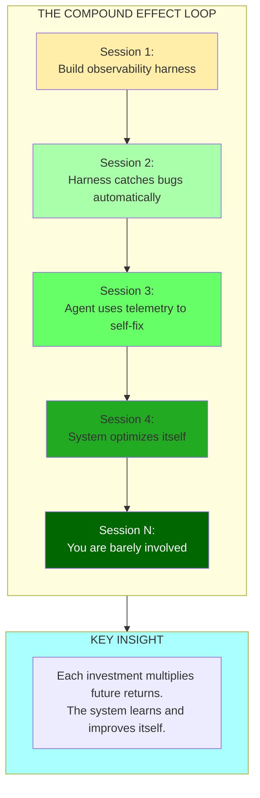
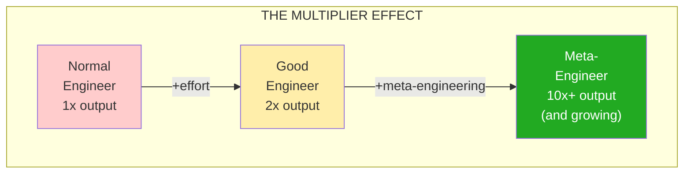
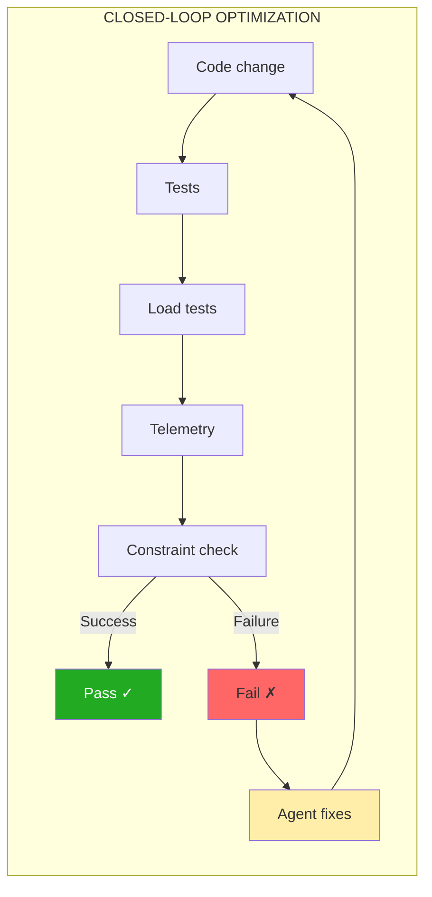
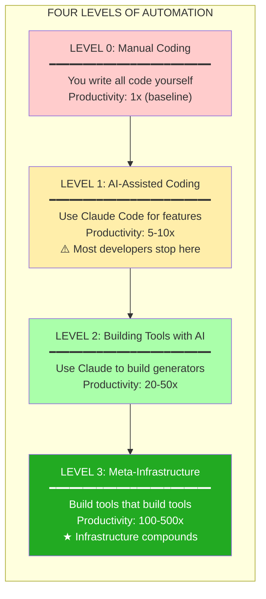
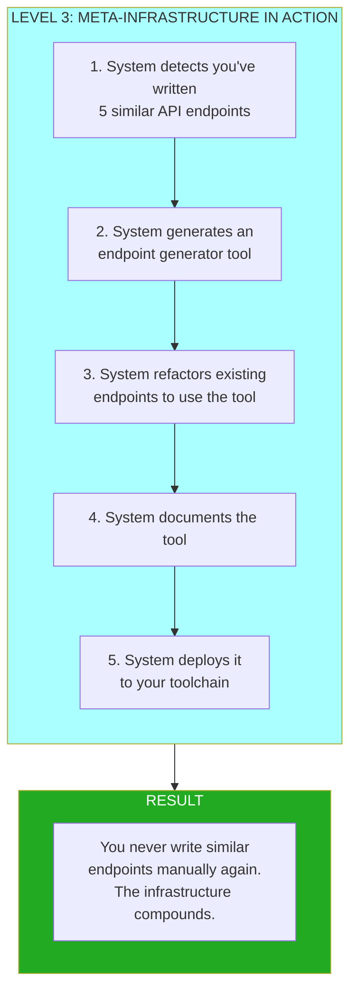
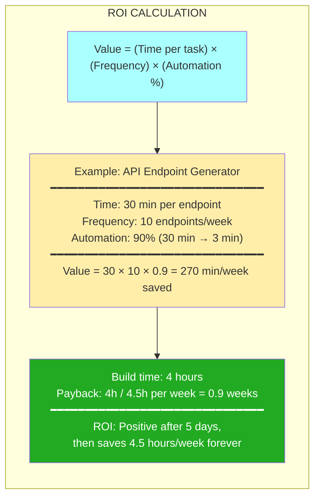
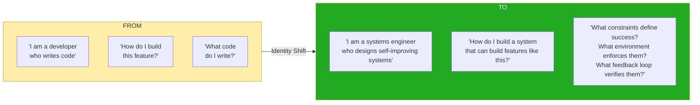

# Chapter 14: The Compound Effect Loop

## Diagram Description

Visualizes how meta-engineering investments multiply over time. Shows the feedback loop where harness investments lead to automatic bug detection, which enables agent self-fixing, which leads to system self-optimization. Illustrates exponential returns from meta-engineering.

## Primary View: The Compound Feedback Loop

## Alternative View: Multiplier Effect

## Alternative View: Why Meta-Engineering Multiplies

| Investment | First Session | Future Sessions |
|------------|--------------|-----------------|
| **Observability harness** | 4 hours to build | Every bug easier to find |
| **Testing framework** | 6 hours to design | Every feature has coverage |
| **Agent orchestration** | 8 hours to configure | Every task partially automated |
| **Constraint system** | 3 hours to define | Every change verified |

**Pattern**: Build once, benefit forever. The ROI compounds.

## Alternative View: Closed-Loop Optimization

## Alternative View: The Four Levels of Automation

## Alternative View: Level 3 Example

## Alternative View: ROI Calculation

## Alternative View: What You Are Actually Building

| Surface Level | Meta Level (What You're Actually Building) |
|---------------|-------------------------------------------|
| A SaaS product | A product-building system |
| An API | An API generation pipeline |
| A test suite | A correctness verification system |
| A deployment | A self-healing infrastructure |

**Key insight**: The product is the output. **The system is the asset.** Build the factory.

## Alternative View: The Identity Shift

## Alternative View: The Compound Timeline

| Session | Activity | Cumulative Benefit |
|---------|----------|-------------------|
| **1** | Build observability harness | Baseline visibility |
| **2** | Harness catches first bug automatically | Hours saved |
| **3** | Agent uses telemetry data to fix | Days saved |
| **4** | System begins self-optimizing | Weeks saved |
| **5-10** | Minor tweaks, system matures | Months of leverage |
| **10+** | You direct, system executes | Years of compound returns |

## Usage

**Chapter reference**: Lines 481-500, "The Compound Effect" section and Lines 547-608, "The Four Levels of Automation" section

**Key passages from chapter**:
> "Every meta-engineering investment multiplies future returns... Normal engineer: 1x output. Good engineer: 2x output. Meta-engineer: 10x output and growing."

> "Think like a Factorio player. Do not mine ore by hand. Build miners. Do not place miners by hand. Build systems that place miners."

**Where to use this diagram**:
- After line 500, following the session progression example
- Four Levels diagram supports lines 547-581
- ROI calculation supports lines 582-608

**Design notes**:
- Progress shown through color gradient (yellow → light green → dark green)
- Each level clearly shows productivity multiplier
- "Factory" metaphor emphasized in surface vs meta level table

## Related Diagrams

- ch14-meta-skill-stack.md - The full meta-engineer skill stack
- ch14-adhoc-to-deterministic.md - Converting workflows for compound effect
- ch14-leverage-stack.md - What skills enable compounding
