# Chapter 14: The Leverage Stack

## Diagram Description

Visualizes the skill hierarchy for AI-assisted development: what to keep sharp (understanding, design, verification), what to delegate (implementation patterns), and what to forget (syntax, boilerplate). Shows that high-leverage skills sit at the top of the pyramid while low-leverage skills should be gladly delegated.

## Primary View: Skill Pyramid

```mermaid
flowchart TB
    subgraph TOP["🧠 KEEP SHARP (High Leverage)"]
        direction TB
        U["Understanding the Problem<br/>What are we solving? What constraints exist?"]
        D["Designing the Solution<br/>What's the right abstraction? What's the complexity?"]
        V["Verification & Correctness<br/>Does it work? Is it correct, not just plausible?"]
    end

    subgraph MID["🤖 OK TO DELEGATE"]
        direction TB
        I["Implementation Patterns<br/>Standard coding patterns, common structures"]
    end

    subgraph LOW["👋 OK TO FORGET"]
        direction TB
        S["Syntax & API Recall<br/>Language trivia, library method signatures"]
        B["Boilerplate<br/>Setup code, configuration, repetitive structure"]
    end

    U --> D --> V --> I --> S --> B

    style TOP fill:#66ff66
    style MID fill:#ffeeaa
    style LOW fill:#ffcccc
```

## Alternative View: Action-Oriented Categories

## Alternative View: Self-Check Questions by Skill

| Skill Level | Category | Self-Check Question | If Answer Is "No"... |
|-------------|----------|---------------------|---------------------|
| Understanding | KEEP SHARP | Can I explain the problem without code? | Stop. Clarify requirements first. |
| Design | KEEP SHARP | Can I whiteboard the solution? | You don't own this code yet. |
| Verification | KEEP SHARP | Can I reason about edge cases? | Slow down. Review more carefully. |
| Patterns | DELEGATE | Could I implement this from scratch if needed? | Acceptable if Level 4+ (see Atrophy Ladder) |
| Syntax | FORGET | Do I remember the exact API signature? | This is fine. Let AI recall it. |
| Boilerplate | FORGET | Could I type this setup code from memory? | Good. Never memorize boilerplate. |

## Alternative View: What Happens When Skills Atrophy

## Alternative View: Investment vs Returns

| Skill | Time to Regain | Impact if Lost | Verdict |
|-------|---------------|----------------|---------|
| Problem understanding | Years of practice | Cannot solve new problems | **Never let atrophy** |
| Solution design | Months of study | Builds wrong things fast | **Never let atrophy** |
| Verification | Weeks of practice | Ships buggy code confidently | **Never let atrophy** |
| Implementation patterns | Days with AI assistance | Minor slowdown | Delegate freely |
| Syntax recall | Seconds with autocomplete | Zero impact | Forget gladly |
| Boilerplate | AI generates instantly | Good riddance | Celebrate forgetting |

## Alternative View: The Three Pillars to Protect

## Usage

**Chapter reference**: Lines 250-266, "The Leverage Stack" section

**Key passage from chapter**:
> "Let syntax recall atrophy. Let library trivia fade. Delegate boilerplate gladly. But algorithmic reasoning, invariant thinking, complexity analysis, and system reasoning must stay sharp."

**Where to use this diagram**:
- After line 266, following the ASCII art version
- Primary pyramid view shows full hierarchy with color coding
- Self-check questions table provides actionable guidance
- "What Happens When Skills Atrophy" view connects to the Atrophy Ladder (task-210)

**Design notes**:
- Green = keep sharp (high leverage, irreplaceable)
- Yellow = OK to delegate (medium leverage, recoverable)
- Red = OK to forget (low leverage, AI handles)

## Related Diagrams

- ch14-atrophy-ladder.md - Career levels based on skill retention
- ch14-task-decomposition.md - How to size tasks for agent success
- ch14-six-waves.md - Evolution of AI-assisted development
