# Chapter 14: Meta-Engineer Skill Stack

## Diagram Description

Visualizes the seven-layer skill pyramid that separates meta-engineers from regular engineers. Shows progression from core programming (bottom) through infrastructure, observability, agent orchestration, architecture, systems thinking, to mathematical reasoning (top). Most engineers develop only the bottom layers; meta-engineers develop the full stack.

## Primary View: The Seven-Layer Pyramid

```mermaid
flowchart TB
    subgraph FULL_STACK["THE FULL META-ENGINEER SKILL STACK"]
        direction TB

        L7["🧮 MATHEMATICAL REASONING<br/>Invariants, complexity, optimization"]
        L6["🔄 SYSTEMS THINKING<br/>Feedback loops, emergent behavior, constraints"]
        L5["🏗️ ARCHITECTURAL DESIGN<br/>DDD, boundaries, contracts"]
        L4["🤖 AGENT ORCHESTRATION<br/>Prompts, tools, verification"]
        L3["📊 OBSERVABILITY ENGINEERING<br/>OTEL, metrics, traces"]
        L2["☁️ INFRASTRUCTURE AS CODE<br/>Terraform, Docker, Kubernetes"]
        L1["💻 CORE PROGRAMMING<br/>TypeScript, Python, SQL"]

        L7 --> L6 --> L5 --> L4 --> L3 --> L2 --> L1
    end

    style L7 fill:#22aa22,color:#fff
    style L6 fill:#44bb44,color:#fff
    style L5 fill:#66cc66
    style L4 fill:#88dd88
    style L3 fill:#aaffaa
    style L2 fill:#ccffcc
    style L1 fill:#eeffee
```



## Alternative View: What Each Layer Provides

| Layer | Skill Domain | What It Enables | Example Application |
|-------|-------------|-----------------|---------------------|
| **7** | Mathematical Reasoning | Prove correctness, optimize algorithms | Know O(n²) vs O(n log n) before implementing |
| **6** | Systems Thinking | Design self-improving systems | Build feedback loops that auto-optimize |
| **5** | Architectural Design | Sustainable complexity management | Define bounded contexts, service contracts |
| **4** | Agent Orchestration | Automated implementation | Design prompts that produce correct code |
| **3** | Observability Engineering | Feedback data for optimization | Instrument everything, trace every request |
| **2** | Infrastructure as Code | Reproducible environments | One command deploys full stack |
| **1** | Core Programming | Express solutions in code | Write TypeScript, Python, SQL |

## Alternative View: Most Engineers vs Meta-Engineers

```mermaid
flowchart TB
    subgraph MOST["MOST ENGINEERS<br/>(Bottom 2-3 layers)"]
        direction TB
        M1["Core Programming ✅"]
        M2["Infrastructure ✅"]
        M3["Observability ⚠️"]
        M4["Agent Orchestration ❌"]
        M5["Architecture ❌"]
        M6["Systems Thinking ❌"]
        M7["Mathematical Reasoning ❌"]
    end

    subgraph META["META-ENGINEERS<br/>(Full Stack)"]
        direction TB
        E1["Core Programming ✅"]
        E2["Infrastructure ✅"]
        E3["Observability ✅"]
        E4["Agent Orchestration ✅"]
        E5["Architecture ✅"]
        E6["Systems Thinking ✅"]
        E7["Mathematical Reasoning ✅"]
    end

    style MOST fill:#ffeeaa
    style META fill:#ccffcc
```



## Alternative View: Layer Dependencies


## Alternative View: Learning Path


## Alternative View: What Each Layer Looks Like in Practice

| Layer | Tool/Framework | In Action |
|-------|---------------|-----------|
| **Mathematical Reasoning** | Whiteboard, pen | "The invariant is: sum of balances always equals total deposits" |
| **Systems Thinking** | Diagrams, models | "If we add caching here, it creates a feedback loop that..." |
| **Architecture** | DDD, event storming | "This bounded context owns Order, that one owns Inventory" |
| **Agent Orchestration** | Claude Code, MCP | "The sub-agent handles migrations, reports to coordinator" |
| **Observability** | OTEL, Jaeger, Grafana | "Trace shows P99 latency spike at database call" |
| **Infrastructure** | Terraform, Docker | "docker-compose up gives identical environment everywhere" |
| **Core Programming** | TypeScript, Python | "const result = await client.messages.create({...})" |

## Alternative View: The Three Levels of Engineering

```mermaid
flowchart TB
    subgraph LEVELS["THREE LEVELS OF ENGINEERING"]
        direction TB

        L3["LEVEL 3: Write systems that write systems<br/>━━━━━━━━━━━━━━━━━━━━━━━━━━━━━━━━━━━━━━━<br/>Full skill stack (all 7 layers)<br/>Builds meta-infrastructure<br/>100-500x productivity"]

        L2["LEVEL 2: Write systems<br/>━━━━━━━━━━━━━━━━━━━━━━━━━━━━━━━━━━━━━━━<br/>Layers 1-4 mastered<br/>Designs reusable components<br/>10-20x productivity"]

        L1["LEVEL 1: Write code<br/>━━━━━━━━━━━━━━━━━━━━━━━━━━━━━━━━━━━━━━━<br/>Layers 1-2 only<br/>Implements features<br/>1x productivity"]
    end

    L3 --> L2 --> L1

    style L3 fill:#22aa22,color:#fff
    style L2 fill:#66cc66
    style L1 fill:#ccffcc
```



## Alternative View: Skills by Category


## Usage

**Chapter reference**: Lines 516-545, "The Full Skill Stack" section

**Key passage from chapter**:
> "Most engineers only develop the bottom layers. Meta-engineers develop the full stack."

**ASCII from chapter (lines 519-542)**:
```
┌─────────────────────────────────────────────────────────────┐
│  Mathematical Reasoning                                     │
│  (Invariants, complexity, optimization)                     │
├─────────────────────────────────────────────────────────────┤
│  Systems Thinking                                           │
│  (Feedback loops, emergent behavior, constraints)           │
├─────────────────────────────────────────────────────────────┤
│  Architectural Design                                       │
│  (Domain-Driven Design (DDD), boundaries, contracts)        │
├─────────────────────────────────────────────────────────────┤
│  Agent Orchestration                                        │
│  (Prompts, tools, verification)                             │
├─────────────────────────────────────────────────────────────┤
│  Observability Engineering                                  │
│  (OTEL, metrics, traces)                                    │
├─────────────────────────────────────────────────────────────┤
│  Infrastructure as Code                                     │
│  (Terraform, Docker, Kubernetes (K8s))                      │
├─────────────────────────────────────────────────────────────┤
│  Core Programming                                           │
│  (TypeScript, Python, SQL)                                  │
└─────────────────────────────────────────────────────────────┘
```

**Where to use this diagram**:
- After line 542, following the ASCII version
- Primary pyramid view provides color-coded visualization
- "Most Engineers vs Meta-Engineers" contrasts development paths
- Learning path shows progression for engineers wanting to level up

**Design notes**:
- Darker green = higher leverage (top layers)
- Lighter green = foundation (bottom layers)
- Each layer explicitly named with examples

## Related Diagrams

- ch14-leverage-stack.md - What skills to keep sharp vs delegate
- ch14-atrophy-ladder.md - Career levels based on skill retention
- ch14-compound-effect-loop.md - How meta-engineering investments compound
