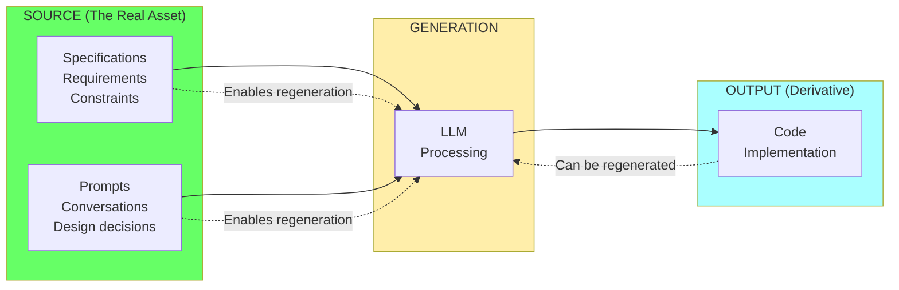
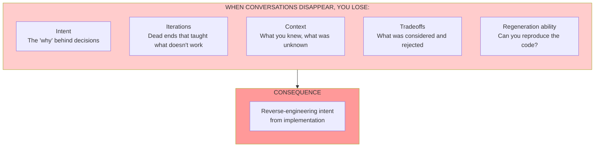
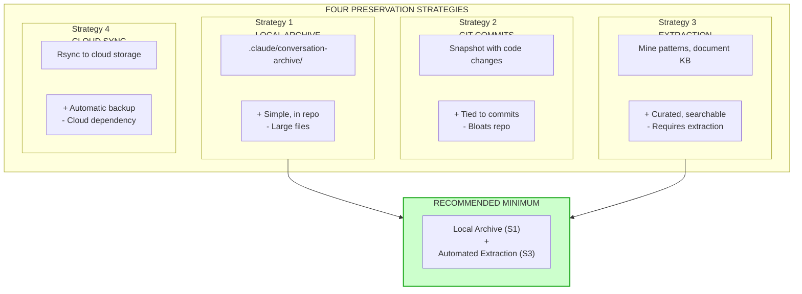
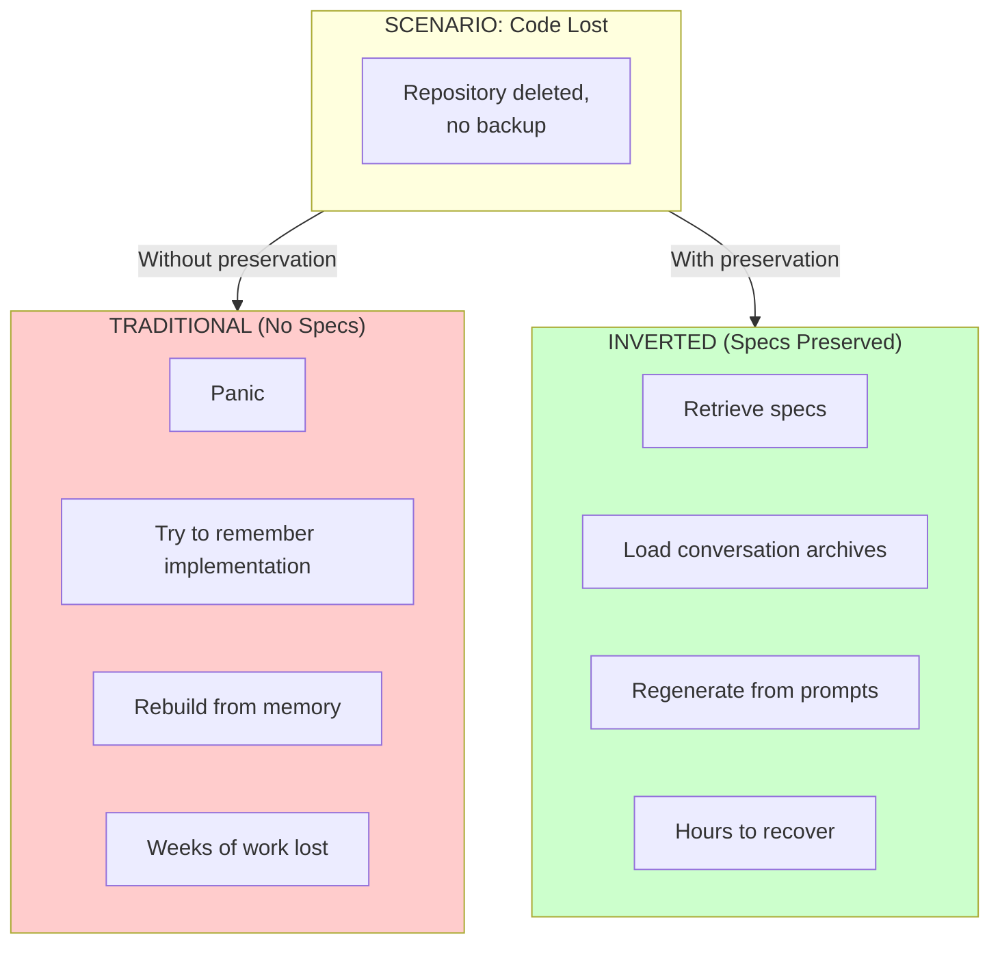
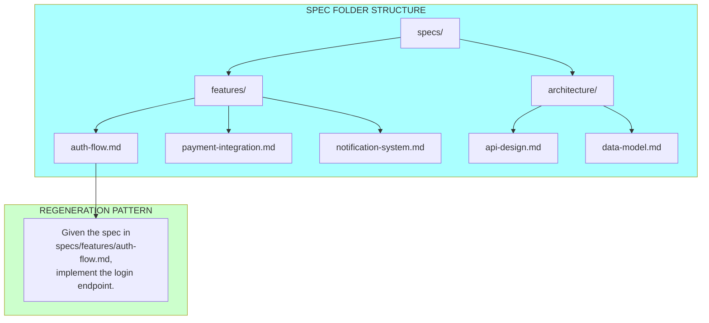
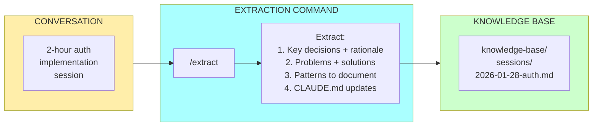

# Chapter 14: Prompts and Specs as Assets

## Diagram Description

Visualizes the insight that code is derivative of specs and prompts, not the other way around. Shows how prompts and specifications are the true source of value, with code being regenerable output. Illustrates the four preservation strategies for conversation assets.

## Primary View: Code is Derivative

## Alternative View: What Gets Lost

## Alternative View: Four Preservation Strategies

## Alternative View: Traditional vs Inverted Thinking

| Aspect | Traditional View | Inverted View (Correct) |
|--------|-----------------|------------------------|
| **Primary Asset** | Code | Specs + Prompts |
| **Secondary** | Documentation | Code |
| **What to back up** | Code repository | Conversations + Specs |
| **On code loss** | Disaster | Regenerate from specs |
| **On spec loss** | Minor inconvenience | Disaster |
| **Version control focus** | Code changes | Spec evolution |

## Alternative View: The Regeneration Pattern

## Alternative View: Spec Structure

## Alternative View: Extraction Command

## Alternative View: Implementation Roadmap

| Week | Action | Outcome |
|------|--------|---------|
| **1** | Create `.claude/conversation-archive/` + .gitignore | Immediate backup capability |
| **2** | Build `/extract` command | Convert conversations to knowledge |
| **3** | Create spec templates in `specs/features/` | Standardized requirement capture |
| **4** | Integrate into post-session workflow | Systematic preservation |

## Usage

**Chapter reference**: Lines 129-222, "Treating Prompts and Specs as First-Class Assets" section

**Key passages from chapter**:
> "Here is an insight that inverts how most engineers think: code is derivative. The prompts and specs that generated it are the source."

> "If you lose the code, you can regenerate it from the prompts. If you lose the prompts, you are back to reverse-engineering intent from implementation."

**Where to use this diagram**:
- After line 136, following the "Spec + Prompts → LLM → Code" formula
- Four strategies diagram supports lines 149-198
- Extraction command diagram supports lines 173-188

**Design notes**:
- Green = assets (specs, prompts, knowledge base)
- Yellow = process (conversations, extraction)
- Blue = structures (folders, commands)
- Red = loss scenarios (what happens without preservation)

## Related Diagrams

- ch14-adhoc-to-deterministic.md - Converting workflows to scripts
- ch14-compound-effect-loop.md - How investments compound
- ch14-meta-skill-stack.md - The full meta-engineer skill stack
