# Chapter 14: The Six Waves of AI Coding

## Diagram Description
Timeline showing the evolution of AI-assisted development.

## Mermaid Code

```mermaid
timeline
    title Six Waves of AI Coding

    section Wave 1: Autocomplete (2021)
    Copilot Launch : GitHub Copilot
                   : Line-by-line suggestions
                   : Tab to accept

    section Wave 2: Chat (2022-2023)
    ChatGPT Era   : Conversational coding
                  : Copy-paste workflow
                  : Context in prompts

    section Wave 3: Inline Edit (2023)
    Cursor/Continue : Edit in place
                   : Diff view
                   : Multi-file awareness

    section Wave 4: Agentic (2024)
    Claude Code    : Autonomous tasks
                   : Tool use
                   : Multi-step reasoning

    section Wave 5: Compound (2025)
    Harnesses      : Long-running agents
                   : Quality gates
                   : Self-improving systems

    section Wave 6: Autonomous (2026+)
    Full Agency    : 24/7 development
                   : Minimal supervision
                   : System-level thinking
```

## Meta-Engineer Evolution

```mermaid
flowchart TB
    subgraph Before["👨‍💻 Before: Write Code"]
        B1["Read requirements"]
        B2["Write code"]
        B3["Debug"]
        B4["Test"]
        B5["Deploy"]
    end

    subgraph After["🎯 After: Direct AI"]
        A1["Write CLAUDE.md"]
        A2["Set quality gates"]
        A3["Review AI output"]
        A4["Improve prompts"]
        A5["Scale systems"]
    end

    Before -->|"Evolution"| After

    style Before fill:#ffd06b
    style After fill:#6bff9f
```


