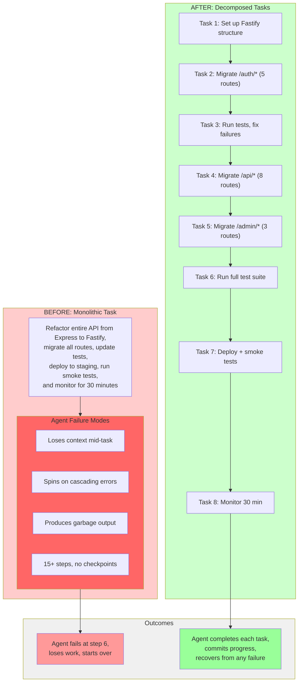
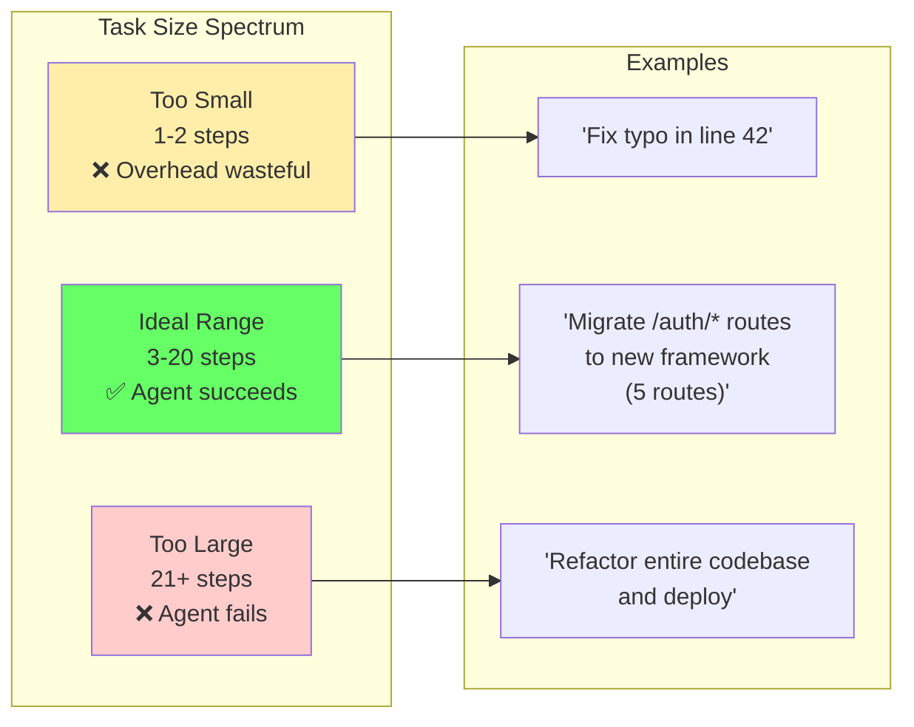
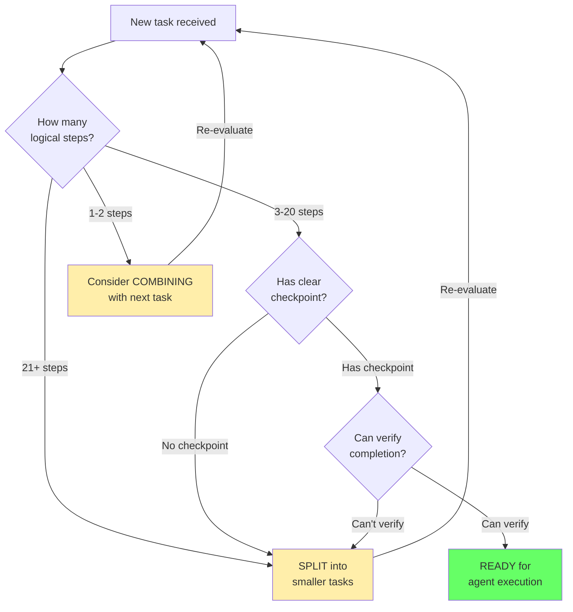
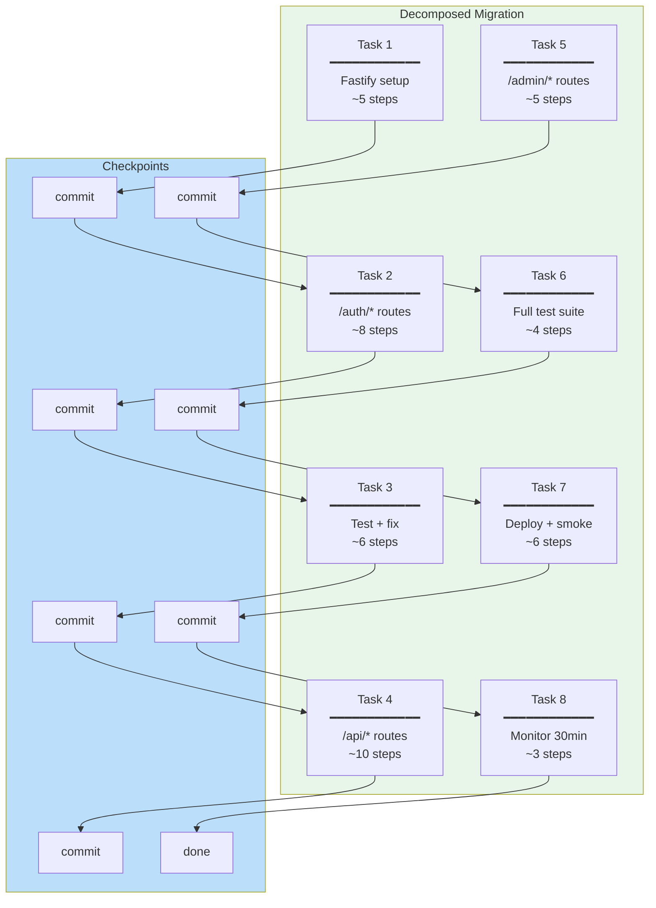
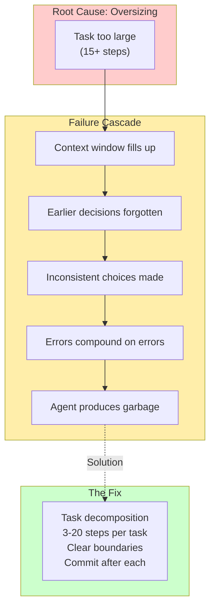

# Chapter 14: Task Decomposition Comparison

## Diagram Description

Visualizes the difference between monolithic tasks (which cause agents to fail) and properly decomposed tasks (which agents complete successfully). Shows the contrast between a 15-step block that overwhelms agents versus 8 smaller tasks with clear boundaries. Key insight: Oversizing is the primary cause of agent failure.

## Primary View: Before/After Comparison

## Alternative View: Task Sizing Guidelines

## Alternative View: Decomposition Decision Tree

## Alternative View: Failure Mode Analysis

| Aspect | Monolithic Task | Decomposed Tasks |
|--------|-----------------|------------------|
| **Steps** | 15+ steps in one block | 3-8 steps per task |
| **Checkpoints** | None (all or nothing) | Commit after each task |
| **Context Loss** | Happens around step 6-8 | Reset with fresh context |
| **Error Recovery** | Start over from beginning | Retry failed task only |
| **Progress Visibility** | Unknown until complete | Clear progress (3/8, 5/8, etc.) |
| **Time to First Value** | Hours or never | Minutes per task |
| **Agent Success Rate** | ~30% (often fails) | ~95% (usually succeeds) |

## Alternative View: The 8-Task Migration Example

## Alternative View: Why Oversizing Causes Failure

## Alternative View: Task Designer Mindset

| Old Mindset | New Mindset |
|-------------|-------------|
| "I'll code this myself" | "How do I break this into agent tasks?" |
| "One big PR when done" | "One commit per completed task" |
| "Fix errors as I go" | "Run tests, commit, then next task" |
| "All routes in one session" | "Group routes by domain (5-10 per task)" |
| "Deploy when everything works" | "Staging deploy is its own task" |
| "Monitor while coding" | "Monitoring is a separate task" |

**Key Principle**: Think like a task designer, not a code writer.

## Usage

This diagram appears in Chapter 14: The Meta-Engineer Playbook, section "Task Sizing for Agents" (lines 333-356). It illustrates the critical insight that oversizing is the primary cause of agent failure, and demonstrates how proper task decomposition with 3-20 steps and clear boundaries enables agents to succeed.

## Context from Chapter

> "Agents fail spectacularly when tasks are too large. They lose context, spin on errors, and produce garbage. Right-sized tasks have 3-20 steps with clear boundaries."

> "Oversizing is the primary cause of agent failure. Think like a task designer, not a code writer."
