# Chapter 15: Cost Optimization Funnel

## Diagram Description
Visualizes the cumulative cost savings from applying multiple optimization strategies: model switching, prompt caching, input limits, and batching.

## Primary Diagram: Savings Funnel

## Alternative View: Cumulative Savings Chart

## Alternative View: Waterfall Breakdown

| Optimization | Before | After | Savings | Cumulative |
|-------------|--------|-------|---------|------------|
| Baseline | $2.25 | $2.25 | - | 0% |
| Model Switching | $2.25 | $1.25 | $1.00 (44%) | 44% |
| Prompt Caching | $1.25 | $0.50 | $0.75 (60%) | 78% |
| Input Limits | $0.50 | $0.40 | $0.10 (20%) | 82% |
| Batching | $0.40 | $0.35 | $0.05 (12%) | 84% |

## Alternative View: Strategy Impact

```mermaid
flowchart LR
    subgraph Impact["Impact by Strategy"]
        direction TB
        S1["Model Switching\n💰 45% of savings"]
        S2["Prompt Caching\n💰 35% of savings"]
        S3["Input Limits\n💰 15% of savings"]
        S4["Batching\n💰 5% of savings"]
    end

    S1 --> S2 --> S3 --> S4

    style S1 fill:#ff6b6b
    style S2 fill:#ffd06b
    style S3 fill:#6bff9f
    style S4 fill:#6bffff
```

## Annual Savings by Team Size

| Team Size | Baseline Cost | Optimized Cost | Annual Savings |
|-----------|---------------|----------------|----------------|
| 1 developer | $594 | $92 | $502 |
| 5 developers | $2,970 | $460 | $2,510 |
| 10 developers | $5,940 | $920 | $5,020 |
| 20 developers | $11,880 | $1,840 | $10,040 |
| 50 developers | $29,700 | $4,600 | $25,100 |

## Implementation Priority

## Quick Wins Checklist

### Week 1: Model Switching (44% savings)
- [ ] Implement task classification function
- [ ] Route simple tasks to Haiku
- [ ] Default to Sonnet for standard work
- [ ] Reserve Opus for complex tasks

### Week 2: Prompt Caching (additional 60% on cached)
- [ ] Restructure prompts (stable content first)
- [ ] Add cache_control markers
- [ ] Monitor cache hit rate
- [ ] Target 80%+ hit rate

### Week 3: Input Limits (additional 20%)
- [ ] Set max_tokens per task type
- [ ] Limit input file count (50 max)
- [ ] Truncate large files (500 lines)
- [ ] Exclude node_modules, lock files

### Week 4: Batching (additional 12%)
- [ ] Group similar requests
- [ ] Batch code reviews by file type
- [ ] Combine small edits into single requests
- [ ] Monitor batch efficiency

## ROI Timeline

| Timeline | Investment | Savings | Net ROI |
|----------|------------|---------|---------|
| Week 1 | 4 hours setup | $8/week | $8/week |
| Month 1 | 8 hours total | $35/month | $35/month |
| Quarter 1 | 12 hours total | $105/quarter | $85+/quarter |
| Year 1 | 16 hours total | $420/year | $400+/year |

*Per developer. Multiply by team size for total impact.*

## Usage

This diagram appears in Chapter 15 as a synthesis of all cost optimization strategies. It shows:
1. The cumulative effect of each optimization layer
2. Implementation priority based on effort vs impact
3. Expected savings at different team sizes

## Context from Chapter

> "Model switching (44%) combined with prompt caching (90% on cached tokens) yields 94-97% total cost reduction on repeated context. For a team of 20 developers, that's $10,000+/year in savings."

> "With intelligent model switching (70% Haiku, 25% Sonnet, 5% Opus)... Savings: 44% ($360/year per developer)"
