# Chapter 15: Model Selection Decision Tree

## Diagram Description
Decision tree for selecting the right model tier for each task.

## Mermaid Code

```mermaid
flowchart TB
    A["🤔 What's the task?"]

    A --> B{"Security/\nPerformance\ncritical?"}
    B -->|"Yes"| OPUS["🔷 OPUS\n($15/MTok)"]

    B -->|"No"| C{"Affects\n6+ files?"}
    C -->|"Yes"| OPUS

    C -->|"No"| D{"Architecture\ndecision?"}
    D -->|"Yes"| OPUS

    D -->|"No"| E{"Simple\noperation?"}
    E -->|"Yes"| HAIKU["🔹 HAIKU\n($0.25/MTok)"]

    E -->|"No"| F{"1 file\nonly?"}
    F -->|"Yes"| HAIKU

    F -->|"No"| SONNET["🔶 SONNET\n($3/MTok)"]

    style HAIKU fill:#6bffff
    style SONNET fill:#ffd06b
    style OPUS fill:#ff6b6b
```

## Cost Protection Layers

```mermaid
flowchart TB
    subgraph Protection["🛡️ Multi-Layer Cost Protection"]
        L1["Layer 1: Job Timeout\n⏱️ 15 min max"]
        L2["Layer 2: Token Cap\n📊 4096 max_tokens"]
        L3["Layer 3: Input Limit\n📁 50 files max"]
        L4["Layer 4: Budget Alert\n💰 $10/day limit"]
    end

    subgraph Failure["❌ Failure Modes Blocked"]
        F1["Infinite loops"]
        F2["Verbose outputs"]
        F3["File explosion"]
        F4["Runaway costs"]
    end

    L1 --> F1
    L2 --> F2
    L3 --> F3
    L4 --> F4

    style L1 fill:#6bffff
    style L2 fill:#6bff9f
    style L3 fill:#ffd06b
    style L4 fill:#ff6b6b
```

## Combined Savings Visualization

