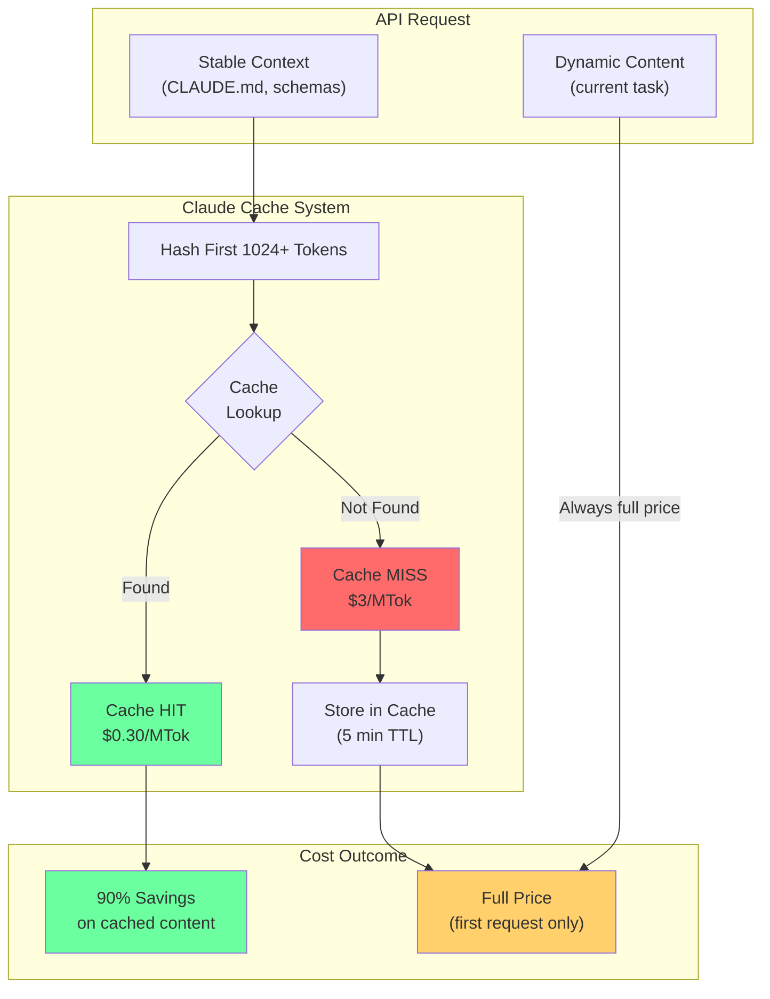
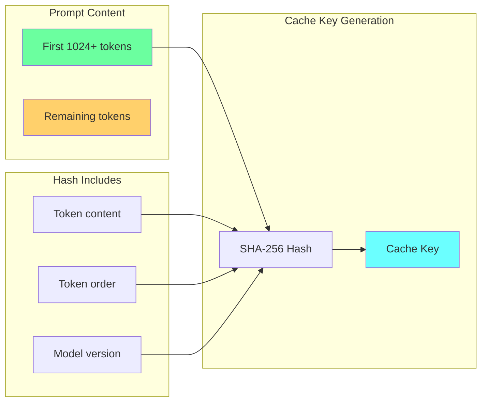

# Chapter 15: Prompt Caching Architecture

## Diagram Description
Visualizes how prompt caching works in Claude API, showing cache key composition, hit/miss flow, and cost savings structure.

## Primary Diagram: Cache Flow



## Alternative View: Cache-Friendly Prompt Structure

```mermaid
flowchart TB
    subgraph Optimal["Cache-Friendly Structure"]
        direction TB
        S1["1. Project Architecture\n(CLAUDE.md)"]
        S2["2. Schema Definitions\n(JSON schemas)"]
        S3["3. Coding Standards\n(patterns, rules)"]
        SEP["---"]
        S4["4. Current Task\n(specific request)"]
    end

    subgraph Labels[""]
        L1["CACHED\n(put first)"]
        L2["NOT CACHED\n(put last)"]
    end

    S1 --> S2
    S2 --> S3
    S3 --> SEP
    SEP --> S4

    L1 -.-|"stable content"| S1
    L2 -.-|"dynamic content"| S4

    style S1 fill:#6bff9f
    style S2 fill:#6bff9f
    style S3 fill:#6bff9f
    style S4 fill:#ffd06b
    style SEP fill:#ffffff,stroke:#000
```

## Alternative View: Cost Comparison Table

| Scenario | Input Cost | Cache Status | Effective Cost |
|----------|------------|--------------|----------------|
| First request | $3/MTok | MISS (creates cache) | $3/MTok |
| Repeat within 5 min | $0.30/MTok | HIT | 90% savings |
| Mixed (70% cached) | Weighted | Partial hits | ~75% savings |
| Restructured prompt | $3/MTok | MISS (new hash) | Full price |

## Alternative View: Cache Key Composition



## Cache Effectiveness by Prompt Design

| Design Pattern | Cache Hit Rate | Cost Impact |
|----------------|----------------|-------------|
| Stable content first, dynamic last | 80-95% | Excellent |
| Mixed stable/dynamic | 20-40% | Poor |
| Dynamic content first | 0-10% | Worst |
| Single static prompt | 95%+ | Best |

## Implementation Checklist

- [ ] Place CLAUDE.md content at prompt start
- [ ] Add schemas and standards before task
- [ ] Use `cache_control: { type: 'ephemeral' }` marker
- [ ] Monitor `cache_read_input_tokens` in responses
- [ ] Target 80%+ cache hit rate

## Usage

This diagram appears in Chapter 15, section "Prompt Caching for 90% Cost Reduction" (lines 353-431). It illustrates:
1. How cache keys are computed from initial tokens
2. The hit/miss flow and cost implications
3. Optimal prompt structure for maximum cache hits

## Context from Chapter

> "Claude automatically caches the first 1024+ tokens of identical content for 5 minutes. Cached tokens cost 10x less ($0.30/MTok vs $3/MTok for Sonnet input). Structure your prompts to maximize cache hits."

> "The key: stable content goes at the beginning. Dynamic content goes at the end. If you mix them, caching breaks."
