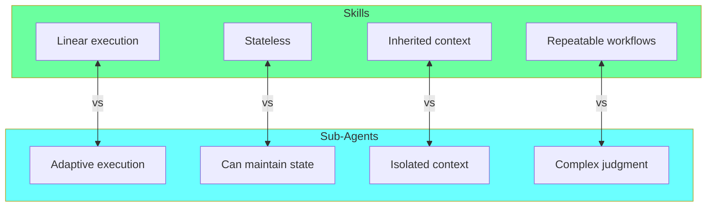
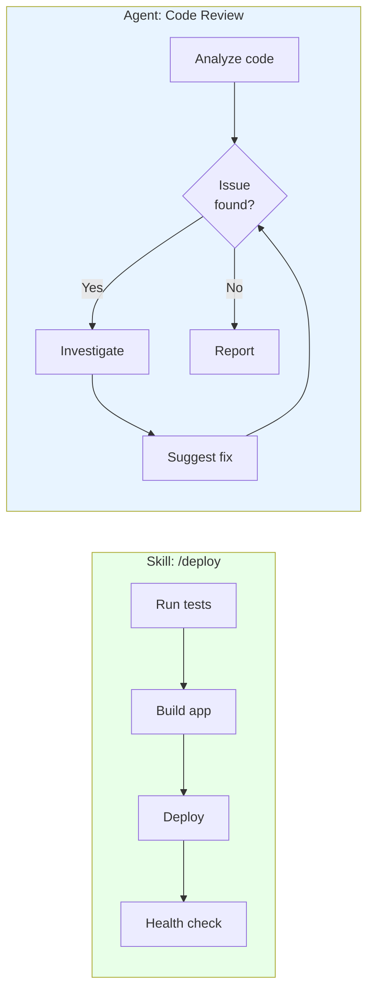
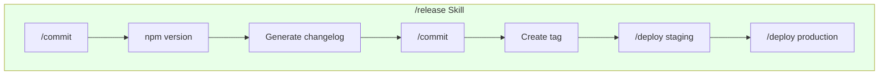

# Chapter 15: Skills vs Sub-Agents Decision Framework

## Diagram Description
Decision framework for choosing between Skills and Sub-Agents in Claude Code workflows. Skills handle linear, repeatable workflows while Sub-Agents handle tasks requiring judgment or parallel execution.

## Primary Diagram: Decision Tree

```mermaid
flowchart TB
    A["Need to automate\na workflow?"]

    A --> B{"Same steps\nevery time?"}

    B -->|"Yes"| C{"Requires\njudgment?"}
    B -->|"No"| AGENT["Use Sub-Agent\n(adaptive execution)"]

    C -->|"No"| SKILL["Use Skill\n(deterministic)"]
    C -->|"Yes"| D{"Parallel\nexecution?"}

    D -->|"Yes"| AGENT
    D -->|"No"| E{"Maintains\nstate?"}

    E -->|"Yes"| AGENT
    E -->|"No"| SKILL

    subgraph Examples[""]
        EX1["Skills:\n/commit, /deploy,\n/release"]
        EX2["Sub-Agents:\ncode reviewer,\narchitect agent"]
    end

    SKILL -.- EX1
    AGENT -.- EX2

    style SKILL fill:#6bff9f
    style AGENT fill:#6bffff
```

## Alternative View: Comparison Matrix



## Detailed Comparison Table

| Characteristic | Skills | Sub-Agents |
|----------------|--------|------------|
| **Execution pattern** | Linear, deterministic | Adaptive, iterative |
| **State management** | Stateless | Can maintain state |
| **Context scope** | Inherited from parent | Isolated context |
| **Best for** | Repeatable workflows | Complex judgment tasks |
| **Predictability** | High (same output for same input) | Variable (depends on context) |
| **Cost** | Lower (fewer tokens) | Higher (full context per agent) |
| **Composability** | Skills can call skills | Agents can spawn agents |
| **Error handling** | Fail fast | Can retry and adapt |

## When to Use Each

### Use Skills When:
- [ ] Steps are the same every time
- [ ] No judgment required during execution
- [ ] Output is deterministic
- [ ] Workflow is well-defined
- [ ] Speed matters more than flexibility

**Examples:**
- `/commit` - stage and commit changes
- `/deploy staging` - run tests, build, deploy
- `/release patch` - version bump, changelog, tag

### Use Sub-Agents When:
- [ ] Task requires analysis or judgment
- [ ] Different inputs need different approaches
- [ ] Parallel execution improves performance
- [ ] State needs to persist across steps
- [ ] Quality varies by context

**Examples:**
- Code reviewer agent (different feedback per codebase)
- Architect agent (designs vary by requirements)
- Test generator (adapts to code complexity)

## Alternative View: Execution Patterns



## Cost Comparison

| Workflow Type | Skill Cost | Sub-Agent Cost | Recommendation |
|---------------|------------|----------------|----------------|
| Simple deploy | ~$0.01 | ~$0.05 | Skill |
| Code review (small) | ~$0.02 | ~$0.08 | Skill may suffice |
| Code review (large) | N/A | ~$0.15 | Sub-Agent needed |
| Architecture decision | N/A | ~$0.30 | Sub-Agent needed |
| Routine commit | ~$0.005 | ~$0.03 | Skill |

## Skill Composition Pattern



## Usage

This diagram appears in Chapter 15, section "Skills vs Sub-Agents" (lines 592-603). It helps readers decide:
1. When to use Skills for linear, repeatable workflows
2. When to use Sub-Agents for judgment-heavy tasks
3. How to compose Skills for complex workflows

## Context from Chapter

> "Use skills for linear, repeatable workflows. Use sub-agents for tasks requiring judgment or parallel execution. A deploy skill runs the same steps every time. A code review sub-agent applies judgment to different codebases."

> "Skills compound over time. Each workflow you automate saves minutes per day. Those minutes accumulate into hours per month."
