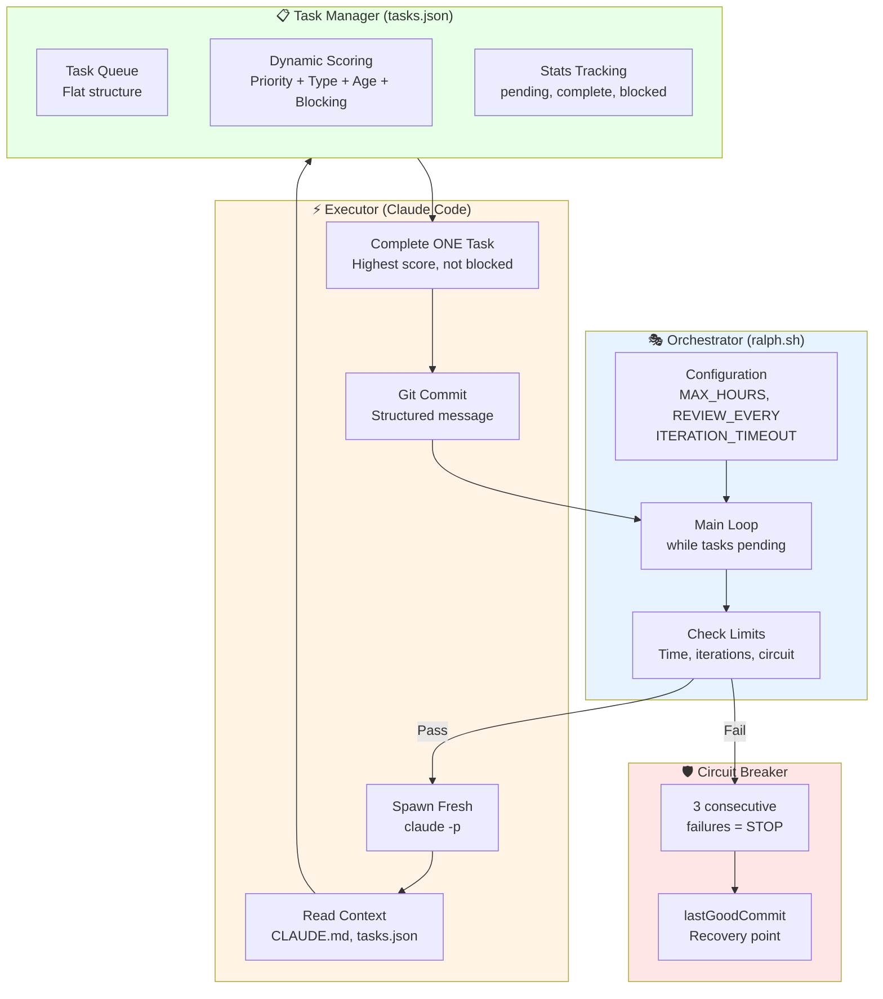
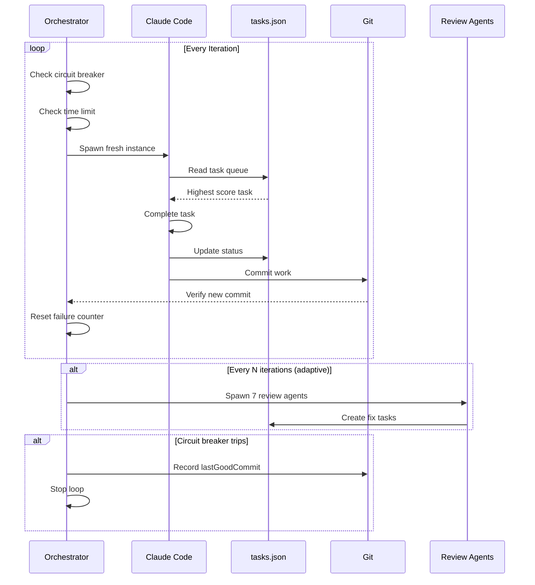
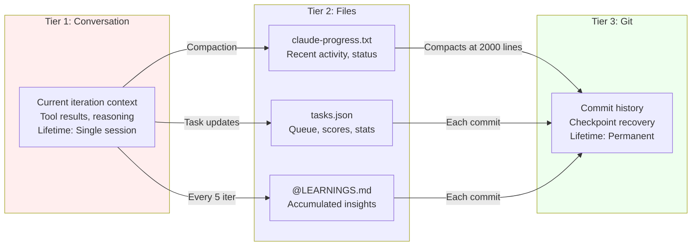
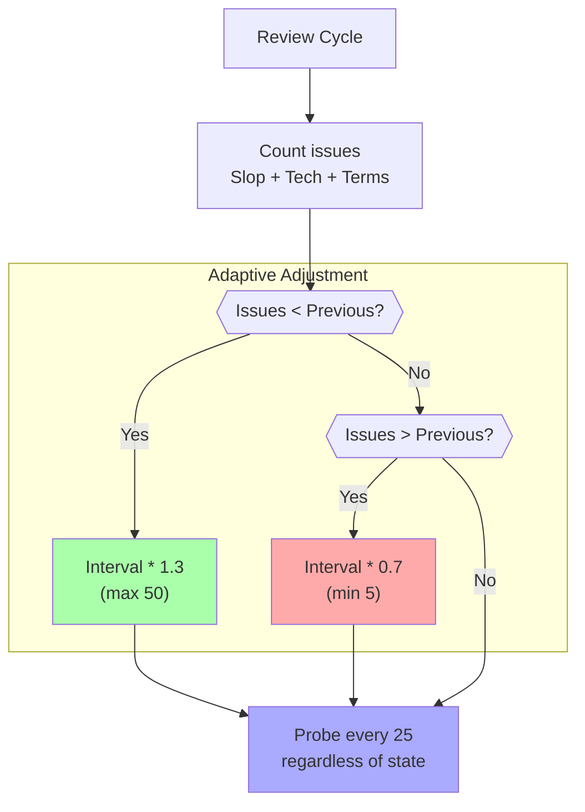

# Chapter 16: RALPH Architecture

## Diagram Description

Visualizes the complete RALPH (Recursive Agent Loop with Progress Handoffs) system architecture as implemented for this book. Shows the orchestrator, executor, and task manager components, along with the circuit breaker, review cycle triggers, and three-tier memory system.

## Primary View: System Architecture

## Alternative View: Iteration Flow

## Alternative View: Memory Tier System

## Alternative View: Task Scoring Algorithm

| Factor | Values | Purpose |
|--------|--------|---------|
| Priority | critical: 1000, high: 750, medium: 500, normal: 250, low: 100 | Business importance |
| Type | blocker: 200, chapter: 100, fix: 80, diagram: 40 | Work category |
| Chapter Sequence | (20 - chapterNum) * 5 | Earlier = higher |
| Blocking Bonus | +25 per blocked task | Unblock dependencies |
| Age Bonus | +50 at 24h, +100 at 48h | Prevent starvation |

## Alternative View: Adaptive Review Interval

## Alternative View: Component Summary Table

| Component | File/Script | Responsibility | Key Methods |
|-----------|-------------|----------------|-------------|
| Orchestrator | ralph.sh | Spawn iterations, enforce limits | check_circuit_breaker, should_review |
| Executor | Claude Code | Complete one task per iteration | Read context, update queue, commit |
| Task Manager | tasks.json | Score tasks, track status | calculateScore, sortByScore |
| Memory | claude-progress.txt | Track recent activity | Auto-compact at 2000 lines |
| Learnings | @LEARNINGS.md | Preserve insights | Capture every 5 iterations |
| Safety | Circuit breaker | Prevent runaway loops | 3 failures = stop |

## Usage

**Chapter reference**: Lines 38-185, "The RALPH Loop Architecture" section

**Key passages from chapter**:
> "The RALPH loop has three components: an orchestrator script that spawns iterations, an executor that completes one task per iteration, and a task manager that tracks progress."

> "The circuit breaker prevents runaway failures. After three consecutive iterations without progress (no new commit), the loop stops."

**Where to use this diagram**:
- After line 40, to provide visual overview before code examples
- Primary architecture view shows component relationships
- Iteration flow shows runtime behavior
- Memory tiers explain state persistence

## Related Diagrams

- ch10-ralph-loop.md - Basic RALPH acronym explanation
- ch10-memory-architecture.md - Detailed memory tier design
- ch13-harness-architecture.md - Four-layer harness context
- ch16-review-agents.md - Adversarial review system detail
