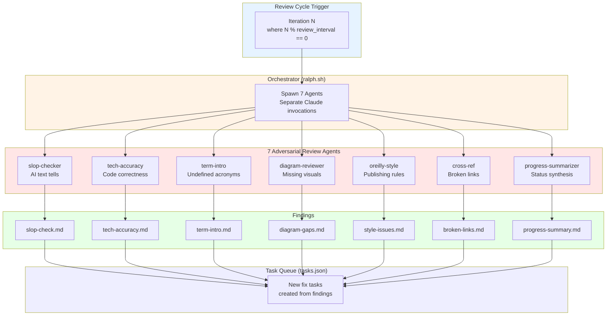
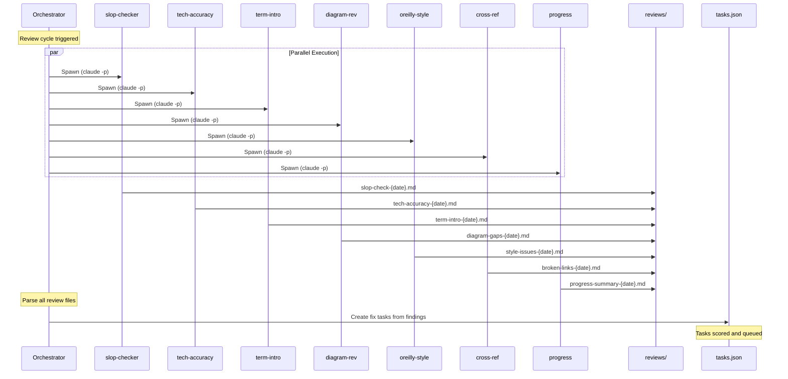
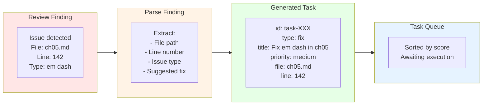
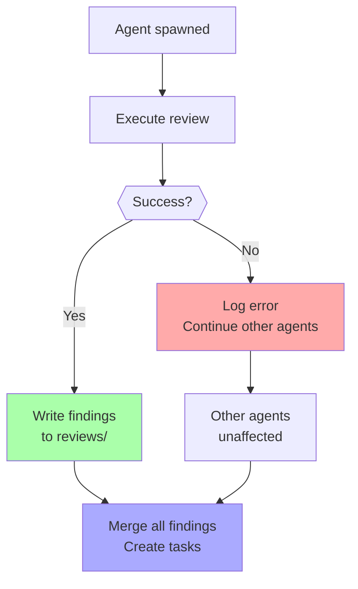
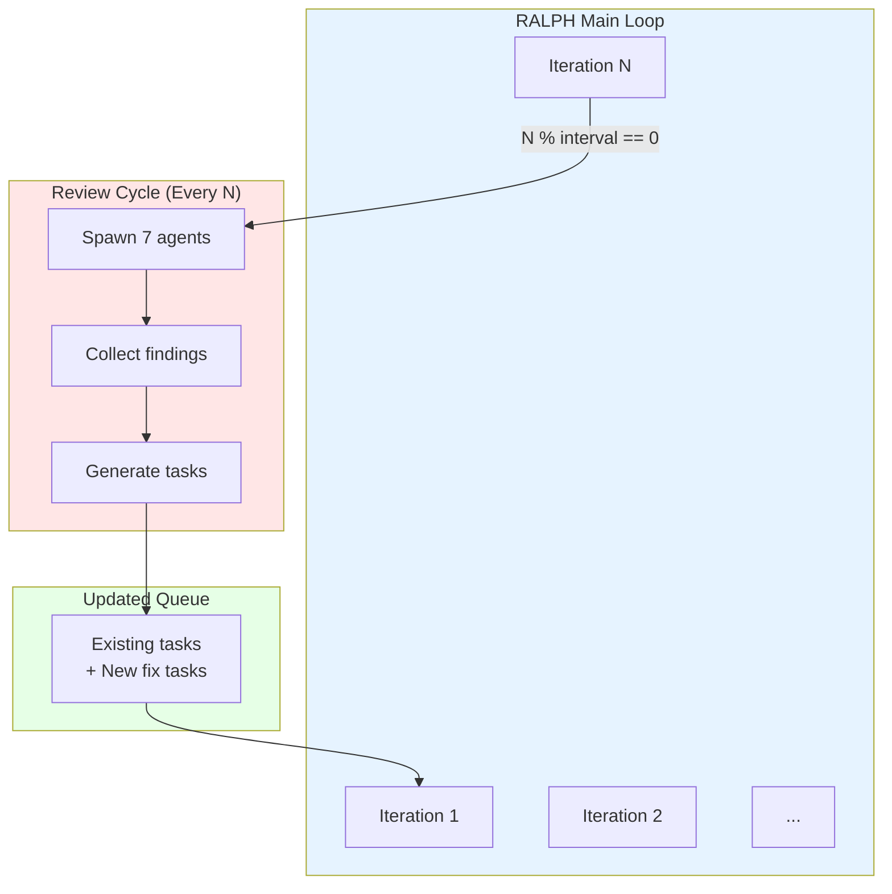

# Chapter 16: Review Agent Parallel Execution

## Diagram Description

Visualizes the adversarial review system with 7 specialized agents running in parallel during review cycles. Each agent focuses on a narrow quality dimension, producing findings that feed back into the task queue as actionable fix tasks. The parallel execution pattern avoids API concurrency issues by using separate Claude invocations.

## Primary View: Parallel Agent Execution

## Alternative View: Agent Specialization Grid

| Agent | Model | Focus Area | Detection Pattern | Output Format |
|-------|-------|------------|-------------------|---------------|
| slop-checker | haiku | AI text tells | "delve", "crucial", em dashes | Markdown list with line refs |
| tech-accuracy | haiku | Code correctness | Syntax errors, wrong tool names | Error list with fixes |
| term-intro-checker | haiku | Undefined terms | All-caps 3+ chars without definition | Acronym list with suggested defs |
| diagram-reviewer | haiku | Missing visuals | Processes with 3+ steps | Opportunity list with Mermaid drafts |
| oreilly-style | haiku | Publishing rules | Heading case, terminology | Style violations with corrections |
| cross-ref-validator | haiku | Broken links | Markdown links to missing files | Broken link list with targets |
| progress-summarizer | haiku | Status synthesis | Metrics, completion rates | Summary report with recommendations |

## Alternative View: Agent Execution Sequence

## Alternative View: Finding to Task Pipeline

## Alternative View: Agent Error Handling

## Alternative View: Issue Severity Classification

| Severity | Source Agents | Action | Example |
|----------|---------------|--------|---------|
| Critical | slop-checker, tech-accuracy | Fix before commit | Syntax error in code block |
| High | term-intro-checker, cross-ref | Fix in next iteration | Undefined acronym on first use |
| Medium | diagram-reviewer, oreilly-style | Queue for later | Missing diagram opportunity |
| Low | progress-summarizer | Informational | Velocity tracking note |

## Alternative View: Review Cycle Integration

## Usage

**Chapter reference**: Lines 299-373, "Adversarial Review Agents" section

**Key passages from chapter**:
> "The agent that writes content cannot objectively review it. Adversarial review agents solve this problem by specializing in different error categories."

> "Each agent runs as a separate Claude invocation. This avoids EPIPE errors from large outputs and allows independent failure handling. If one agent fails, the others continue."

> "Review findings become tasks. When slop-checker finds em dashes, a task appears in the queue."

**Where to use this diagram**:
- After line 314, to visualize the seven agent system
- Primary view shows parallel execution and data flow
- Specialization grid provides quick reference for each agent
- Sequence diagram shows runtime behavior

## Related Diagrams

- ch16-ralph-architecture.md - Overall RALPH loop context
- ch10-memory-architecture.md - How findings persist in memory
- ch13-harness-architecture.md - Where review agents fit in harness layers
- ch08-circuit-breaker.md - Error handling patterns used by agents
