# Chapter 16: Skill Anatomy

## Diagram Description

Visualizes the anatomy of a Claude skill, using the epub-review skill as a concrete example. Shows the SKILL.md structure (frontmatter + instructions), integration with external tools (Playwright, Gemini), and the output flow from invocation to structured findings that become tasks.

## Primary View: Skill Architecture

## Alternative View: SKILL.md File Structure

```mermaid
flowchart TB
    subgraph FileStructure["📁 .claude/skills/epub-review/"]
        SKILL["skill.md<br/>Main definition"]
        SCRIPT["scripts/epub-review.ts<br/>Execution logic"]
        DEPS["package.json<br/>playwright, etc."]
    end

    subgraph Frontmatter["⚙️ YAML Frontmatter"]
        direction LR
        NAME["name: epub-review"]
        DESC["description: Visual EPUB review"]
    end

    subgraph Body["📝 Instruction Body"]
        direction TB
        QS["## Quick Start<br/>Command to run"]
        WF["## Workflow<br/>Step-by-step process"]
        OUT["## Output<br/>Where findings go"]
    end

    FileStructure --> Frontmatter
    Frontmatter --> Body
    SKILL --> Frontmatter
    SCRIPT -.-> WF

    style FileStructure fill:#f0f0ff
    style Frontmatter fill:#fff0f0
    style Body fill:#f0fff0
```

## Alternative View: Tool Integration Sequence

## Alternative View: Skill Decision Flowchart

## Alternative View: epub-review Skill Breakdown

| Component | Purpose | Implementation |
|-----------|---------|----------------|
| **Trigger** | User invocation | `/epub-review` or manual command |
| **Extraction** | Access EPUB content | Unzip to `.epub-review/` directory |
| **Rendering** | Visual representation | Playwright + headless Chromium |
| **Analysis** | Issue detection | Gemini 2.5 Flash vision API |
| **Reporting** | Structured output | Markdown with severity, location |
| **Integration** | Task creation | Findings become tasks.json entries |

## Alternative View: Skill Composition Pattern

```mermaid
flowchart LR
    subgraph BaseCapabilities["🔧 Base Capabilities"]
        direction TB
        B1["Screenshot capture<br/>(Playwright)"]
        B2["Vision analysis<br/>(Gemini)"]
        B3["Report writing<br/>(File system)"]
    end

    subgraph Skill1["📚 epub-review"]
        S1["Extract EPUB<br/>Render chapters<br/>Check formatting"]
    end

    subgraph Skill2["🌐 web-review"]
        S2["Navigate URLs<br/>Render pages<br/>Check responsive"]
    end

    subgraph Skill3["📊 diagram-review"]
        S3["Render Mermaid<br/>Check labels<br/>Verify flow"]
    end

    B1 --> S1
    B1 --> S2
    B1 --> S3
    B2 --> S1
    B2 --> S2
    B2 --> S3
    B3 --> S1
    B3 --> S2
    B3 --> S3

    style BaseCapabilities fill:#e6e6ff
    style Skill1 fill:#ffe6e6
    style Skill2 fill:#e6ffe6
    style Skill3 fill:#fff6e6
```

## Alternative View: Output to Task Pipeline

```mermaid
flowchart LR
    subgraph SkillOutput["📊 Skill Output"]
        direction TB
        FIND["Finding detected<br/>Code block overflow"]
        SEV["Severity assigned<br/>Minor/Major/Critical"]
        LOC["Location captured<br/>Chapter 5, line 142"]
    end

    subgraph TaskCreation["📋 Task Creation"]
        direction TB
        PARSE["Parse report<br/>Extract issues"]
        MAP["Map to task<br/>type: fix"]
        SCORE["Calculate score<br/>priority + type"]
    end

    subgraph Queue["🎯 Task Queue"]
        direction TB
        ADD["Add to tasks.json"]
        BLOCK["Set dependencies<br/>if any"]
        READY["Ready for<br/>next iteration"]
    end

    FIND --> SEV --> LOC
    LOC --> PARSE
    PARSE --> MAP --> SCORE
    SCORE --> ADD --> BLOCK --> READY

    style SkillOutput fill:#fff0f0
    style TaskCreation fill:#f0fff0
    style Queue fill:#f0f0ff
```

## Alternative View: Skill Elements Summary

| Element | Location | Purpose | Example (epub-review) |
|---------|----------|---------|----------------------|
| **Frontmatter** | Top of skill.md | Metadata | `name: epub-review` |
| **Quick Start** | Instruction body | Usage command | `npx tsx scripts/epub-review.ts` |
| **Workflow** | Instruction body | Step sequence | 1. Extract 2. Render 3. Analyze |
| **External Tools** | scripts/ directory | Heavy lifting | Playwright, Gemini API |
| **Output Format** | Instruction body | Report structure | Severity, location, fix suggestion |
| **Integration Point** | Task creation | Queue feedback | Issues become pending tasks |

## Usage

**Chapter reference**: Lines 374-449, "Custom Agentic Skills" section

**Key passages from chapter**:
> "Custom skills extend Claude's capabilities for domain-specific work."

> "The epub-review skill solves this by combining Playwright (browser automation) with Gemini (vision API)."

> "Build a skill when: (1) You encounter a repetitive verification pattern, (2) Standard tools cannot access the required information, (3) Domain-specific knowledge improves detection quality, (4) The skill will run multiple times."

**Where to use this diagram**:
- After line 378, to introduce skill architecture before the epub-review example
- Primary architecture view shows component relationships
- File structure view explains what goes in a skill directory
- Tool integration sequence shows runtime behavior
- Decision flowchart helps readers decide when to build skills

## Related Diagrams

- ch16-ralph-architecture.md - Overall RALPH loop context
- ch16-review-agents.md - Adversarial review agent system
- ch11-sub-agent-hierarchy.md - Agent composition patterns
- ch13-harness-architecture.md - Four-layer infrastructure context
