# Diagram Review - Chapters 12-15
**Date**: 2026-01-28

## Summary

- **Files scanned**: 4 chapters (ch12-ch15)
- **Existing diagrams reviewed**: 8 diagrams found
- **Diagram opportunities identified**: 14 (High: 5, Medium: 9)

---

## Opportunities by Chapter

### Chapter 12: Development Workflows

**Status**: Well-covered. Five key diagrams already exist (plan mode, worktrees, incremental development, script evolution, playwright).

#### Opportunity 1: AST-Grep Pattern Matching Guide
- **Location**: Lines 448-514
- **Type**: Comparison table with visual pattern examples
- **Priority**: Medium
- **Description**: Section 12.5 provides detailed syntax for AST-grep pattern matching (`$VAR`, `$$$`, destructuring examples). Currently shown as text examples only. Would benefit from a visual showing:
  - Pattern syntax hierarchy (metavariable vs ellipsis)
  - Before/after refactoring example visualization
  - False positive comparison (text grep vs AST grep)

**Draft Mermaid:**

```mermaid
graph LR
    A["Text Search<br/>grep 'fetchUserData'<br/><br/>Results:<br/>✗ Comments<br/>✗ Strings<br/>✗ Docs<br/>✓ Function calls<br/>Only 1/5 correct"] -->|"Switch to"| B["AST-Grep Search<br/>ast-grep 'fetchUserData($$$)'<br/><br/>Results:<br/>✓ Exact matches only<br/>✓ Structural accuracy<br/>✓ Safe refactoring<br/>5/5 correct"]

    style A fill:#ff6b6b
    style B fill:#6bff9f
```

**Suggested filename**: `assets/diagrams/ch12-astgrep-precision.mmd`

---

#### Opportunity 2: Skills vs Sub-Agents Architecture
- **Location**: Lines 516-545
- **Type**: Architecture comparison diagram
- **Priority**: Low-Medium
- **Description**: Introduces skills system and compares to sub-agents. Currently only text description. Could visualize:
  - Skills as stateless command wrappers
  - Sub-agents as specialized context-aware entities
  - Skill composition chains
  - Decision tree for when to use each

**Suggested filename**: `assets/diagrams/ch12-skills-architecture.mmd`

---

### Chapter 13: Building the Harness

**Status**: Partial coverage. Two diagrams exist but core concepts lack visualization.

#### Opportunity 1: Signal Processing Model - Noise Filtering (HIGH PRIORITY)
- **Location**: Lines 7-17
- **Type**: Signal flow / process diagram
- **Priority**: High
- **Description**: Core conceptual foundation for entire chapter. Explains how harness layers filter noise and amplify signal. Currently only prose. Needs visualization showing:
  - Raw LLM output as noisy signal
  - Each layer acting as a filter/amplifier
  - Output quality improving through layers
  - Noise/variance reduction at each stage

**Draft Mermaid:**

```mermaid
flowchart TB
    subgraph Input["Raw LLM<br/>High Variance<br/>Unpredictable"]
        L0["Noisy Output<br/>⚡ Needs verification<br/>30-50% failure rate"]
    end

    subgraph Layer1["Layer 1: Claude Code<br/>CLAUDE.md + Hooks<br/>Signal: 3x"]
        L1["Configuration<br/>✓ Constraints applied<br/>✓ Pattern reinforced<br/>15-25% failure rate"]
    end

    subgraph Layer2["Layer 2: Repository<br/>Testing + Structure<br/>Signal: 2x"]
        L2["Clear Feedback<br/>✓ Tests run automatically<br/>✓ Architecture enforced<br/>8-12% failure rate"]
    end

    subgraph Layer3["Layer 3: Meta-Engineering<br/>Automation + Tools<br/>Signal: 2x"]
        L3["Self-Correcting<br/>✓ Failures isolated quickly<br/>✓ Patterns automated<br/>3-5% failure rate"]
    end

    subgraph Layer4["Layer 4: Closed-Loop<br/>Constraints + Optimization<br/>Signal: 2-5x"]
        L4["Self-Optimizing<br/>✓ Violations trigger fixes<br/>✓ Converges to solution<br/><1% failure rate"]
    end

    L0 --> L1 --> L2 --> L3 --> L4

    style Input fill:#ff6b6b
    style Layer1 fill:#ffd06b
    style Layer2 fill:#6bffff
    style Layer3 fill:#6bff9f
    style Layer4 fill:#9f6bff
```

**Suggested filename**: `assets/diagrams/ch13-signal-processing-harness.mmd`

---

#### Opportunity 2: Four Levels of Automation Progression (HIGH PRIORITY)
- **Location**: Lines 433-450 (preview) and 546-580 (detailed)
- **Type**: Progression/pyramid diagram with ROI metrics
- **Priority**: High
- **Description**: Progression from manual coding (1x) to meta-infrastructure (100-500x). Currently text table. Would benefit from visual showing:
  - Productivity multiplier at each level
  - Time investment vs payoff
  - Example at each level
  - Where most developers stop (Level 1)
  - Where exponential growth begins (Level 3)

**Draft Mermaid:**

```mermaid
graph TB
    L0["Level 0: Manual<br/>You write everything<br/>Productivity: 1x<br/>⏱ Hours per feature"]

    L1["Level 1: AI-Assisted<br/>Claude Code writes code<br/>Productivity: 5-10x<br/>⏱ Minutes per feature"]

    L2["Level 2: Tools with AI<br/>Build generators<br/>Productivity: 20-50x<br/>⏱ Seconds per feature"]

    L3["Level 3: Meta-Infrastructure<br/>Tools build tools<br/>Productivity: 100-500x<br/>⏱ Automatic generation"]

    L0 --> L1 --> L2 --> L3

    style L0 fill:#ff6b6b
    style L1 fill:#ffd06b
    style L2 fill:#6bffff
    style L3 fill:#6bff9f
```

**Suggested filename**: `assets/diagrams/ch13-four-automation-levels.mmd`

---

#### Opportunity 3: MCP Server Dynamic Context Architecture
- **Location**: Lines 472-551
- **Type**: Architecture diagram with query examples
- **Priority**: Medium
- **Description**: MCP servers provide queryable project knowledge on-demand instead of static CLAUDE.md. Needs visualization showing:
  - Agent querying `architecture-graph://auth`
  - Server handlers responding with dynamic data
  - Comparison to static context loading
  - Query examples for different resource types

**Suggested filename**: `assets/diagrams/ch13-mcp-dynamic-context.mmd`

---

#### Opportunity 4: Closed-Loop Optimization Feedback Cycle
- **Location**: Lines 291-374 (Layer 4 detail)
- **Type**: Feedback loop / cycle diagram
- **Priority**: Medium
- **Description**: How telemetry drives automatic optimization. Lines 299-311 show basic cycle but needs more detail including:
  - Constraint violation detection
  - Root cause inference from profiler
  - Agent-generated fixes
  - Re-verification loop
  - Escalation to human on failure

**Suggested filename**: `assets/diagrams/ch13-optimization-feedback-loop.mmd`

---

### Chapter 14: The Meta-Engineer Playbook

**Status**: Partial coverage. Timeline and meta-engineer evolution exist, but key frameworks lack visualization.

#### Opportunity 1: The Leverage Stack - Skill Preservation Pyramid (HIGH PRIORITY)
- **Location**: Lines 250-266
- **Type**: Stacked pyramid/hierarchy diagram
- **Priority**: High
- **Description**: Already shows as ASCII art representation. Needs Mermaid visualization showing:
  - What to keep sharp (top: problem understanding, solution design, verification)
  - What to delegate (middle: implementation patterns)
  - What to forget (bottom: syntax, boilerplate)
  - Career risk at each level

**Draft Mermaid:**

```mermaid
graph TB
    subgraph Keep["KEEP SHARP"]
        K1["🧠 Understanding the Problem<br/>What are we solving? Constraints? Success criteria?"]
        K2["🎨 Designing the Solution<br/>Right abstraction? Tradeoffs? Complexity?"]
        K3["✅ Verification & Correctness<br/>Does it work? Edge cases? Match spec?"]
    end

    subgraph Delegate["OK TO DELEGATE"]
        D1["📋 Implementation Patterns<br/>Framework-specific approaches"]
    end

    subgraph Forget["OK TO FORGET"]
        F1["🔤 Syntax & API Recall<br/>Can look it up"]
        F2["🛠️ Boilerplate<br/>Repetitive, low-value typing"]
    end

    K1 --> K2 --> K3 --> D1 --> F1 --> F2

    style Keep fill:#6bff9f
    style Delegate fill:#6bffff
    style Forget fill:#ffd06b
```

**Suggested filename**: `assets/diagrams/ch14-leverage-stack.mmd`

---

#### Opportunity 2: The Atrophy Ladder - Career Ceiling Levels (HIGH PRIORITY)
- **Location**: Lines 281-300
- **Type**: Ladder/levels with career implications
- **Priority**: High
- **Description**: Shows 5 career levels based on skill retention during AI-assisted development. Already in text format. Needs visualization showing:
  - Each level's capability (can specify, verify, derive?)
  - Career ceiling at each level
  - Minimum safe level (Level 4)
  - How to stay at Level 4-5

**Draft Mermaid:**

```mermaid
graph TB
    L5["🌟 Level 5: Architect / Staff+<br/>Specify AND verify AND derive from scratch<br/>👑 No ceiling"]
    L4["✅ Level 4: Senior Engineer (SAFE)<br/>Specify AND verify, could derive if needed<br/>💼 Mid-level to Staff"]
    L3["📊 Level 3: Mid-level with AI<br/>Specify AND verify, couldn't derive<br/>⚠️ Limited growth"]
    L2["🤖 Level 2: Junior with Tools<br/>Verify but can't specify well<br/>⛔ Stalled growth"]
    L1["⚙️ Level 1: Prompt Operator<br/>Can't verify, just accepts output<br/>🔴 CEILING REACHED"]

    L5 ---|Maintain| L4
    L4 ---|Prevent| L3
    L3 ---|Avoid| L2
    L2 ---|Don't| L1

    style L5 fill:#6bff9f
    style L4 fill:#6bffff
    style L3 fill:#ffd06b
    style L2 fill:#ff9f6b
    style L1 fill:#ff6b6b
```

**Suggested filename**: `assets/diagrams/ch14-atrophy-ladder.mmd`

---

#### Opportunity 3: Task Decomposition for Agent Success (HIGH PRIORITY)
- **Location**: Lines 333-356
- **Type**: Before/after comparison flowchart
- **Priority**: High
- **Description**: Shows bad (monolithic) vs good (decomposed) task sizing. Currently text comparison. Needs visualization showing:
  - Bad task as single 15-step block (agent failure)
  - Good task as 8 smaller tasks with clear boundaries (agent success)
  - Size limits (3-20 steps per task)
  - Dependencies between tasks

**Draft Mermaid:**

**Suggested filename**: `assets/diagrams/ch14-task-decomposition.mmd`

---

#### Opportunity 4: Fleet Model Evolution (Waves 5-6)
- **Location**: Lines 371-381
- **Type**: Organizational hierarchy evolution diagram
- **Priority**: Medium
- **Description**: Shows how human-agent relationships evolve from Wave 4 → Wave 6. Currently text comparison. Could visualize:
  - Traditional: Human → Code
  - Wave 4: Human → Agent → Code
  - Wave 6: Human → Supervisor → Agents → Code
  - Scalability at each level

**Suggested filename**: `assets/diagrams/ch14-fleet-organizational-evolution.mmd`

---

### Chapter 15: Model Strategy and Cost Optimization

**Status**: Good coverage. Decision tree, cost protection, and savings pie exist. But model tier selection needs more detail.

#### Opportunity 1: Three-Tier Model Hierarchy with Task Routing
- **Location**: Lines 44-114
- **Type**: Decision matrix / routing diagram
- **Priority**: Medium
- **Description**: Detailed breakdown of Haiku/Sonnet/Opus capabilities and use cases. Chapter has extensive table but needs visual showing:
  - Tier cost/speed/capability tradeoffs
  - Task examples for each tier
  - When to escalate vs when each tier succeeds
  - The "start cheap, escalate on failure" strategy

**Draft Mermaid:**

```mermaid
graph TD
    A["Task arrives"]

    A --> B{"Security or<br/>Performance<br/>critical?"}
    B -->|Yes| OPUS["🔷 OPUS<br/>$15/MTok<br/>4-8s latency<br/>Max capability<br/><br/>Use for:<br/>• Architecture decisions<br/>• Security implementations<br/>• Complex debugging<br/>• Large refactors 6+ files"]

    B -->|No| C{"Affects<br/>6+ files?"}
    C -->|Yes| OPUS

    C -->|No| D{"Simple operation?<br/>grep, rename,<br/>read file"}
    D -->|Yes| HAIKU["🔹 HAIKU<br/>$0.25/MTok<br/>1-2s latency<br/>60-80% of requests<br/><br/>Use for:<br/>• File reads<br/>• Pattern matching<br/>• Documentation<br/>• Type annotations"]

    D -->|No| E{"Single file<br/>only?"}
    E -->|Yes| HAIKU

    E -->|No| SONNET["🔶 SONNET<br/>$3/MTok<br/>2-4s latency<br/>The workhorse<br/><br/>Use for:<br/>• Feature implementation<br/>• Refactoring<br/>• Bug fixes<br/>• Code review"]

    style HAIKU fill:#6bffff
    style SONNET fill:#ffd06b
    style OPUS fill:#ff6b6b
```

**Suggested filename**: `assets/diagrams/ch15-model-tier-routing.mmd`

---

#### Opportunity 2: Progressive Model Escalation with Quality Gates
- **Location**: Lines 169-208
- **Type**: Flowchart with decision points
- **Priority**: Medium
- **Description**: Algorithm for starting cheap (Haiku) and escalating to Sonnet/Opus only if quality gates fail. Currently shown as code. Needs visualization showing:
  - Start with Haiku
  - Run quality gates (syntax, types, tests)
  - Escalate if fail
  - Try Sonnet
  - If still fail, escalate to Opus
  - Cost savings tracking

**Suggested filename**: `assets/diagrams/ch15-escalation-with-gates.mmd`

---

#### Opportunity 3: Prompt Caching Structure - Cache Hits vs Misses
- **Location**: Lines 353-431
- **Type**: Comparison / before-after diagram
- **Priority**: Medium
- **Description**: Explains how prompt structure affects cache performance. Currently text with code example. Needs visualization showing:
  - Stable content first (gets cached)
  - Dynamic content last (not cached)
  - Cache hit rate impact
  - Cost reduction from 10x on cached tokens
  - Examples of good vs bad structure

**Draft Mermaid:**

**Suggested filename**: `assets/diagrams/ch15-prompt-caching-structure.mmd`

---

#### Opportunity 4: Multi-Layer Defense - Cost Protection (Detailed Expansion)
- **Location**: Lines 238-351
- **Type**: Defense-in-depth architecture diagram
- **Priority**: Low-Medium
- **Description**: Already has a cost protection diagram, but this could expand to show:
  - All four layers and how they interact
  - What each layer catches (infinite loops, verbose output, file explosion, cost overflow)
  - Layering redundancy (belt and suspenders)
  - Example failure modes for each layer

**Note**: There's already a "Cost Protection Layers" diagram, but it could be enhanced to show more detail about what each layer prevents and how they interact.

**Suggested filename**: `assets/diagrams/ch15-defense-in-depth.mmd`

---

## Summary Table

| Chapter | Opportunity | Type | Priority | Exists? |
|---------|-------------|------|----------|---------|
| 12 | AST-grep pattern matching | Comparison | Medium | No |
| 12 | Skills vs Sub-agents | Architecture | Low-Medium | No |
| 13 | Signal Processing - Noise Filtering | Process flow | High | No |
| 13 | Four Levels of Automation | Progression | High | No |
| 13 | MCP Server Dynamic Context | Architecture | Medium | No |
| 13 | Closed-Loop Optimization | Cycle | Medium | No |
| 14 | Leverage Stack | Pyramid | High | No |
| 14 | Atrophy Ladder | Levels | High | No |
| 14 | Task Decomposition | Comparison | High | No |
| 14 | Fleet Evolution (Waves 5-6) | Evolution | Medium | No |
| 15 | Model Tier Routing | Decision matrix | Medium | No |
| 15 | Model Escalation with Gates | Flowchart | Medium | No |
| 15 | Prompt Caching Structure | Comparison | Medium | No |
| 15 | Multi-Layer Defense (Enhanced) | Architecture | Low-Medium | Partial |

---

## Recommendations

### Immediate Priorities (Create These First)

1. **ch13-signal-processing-harness.mmd** - Core conceptual foundation for entire chapter
2. **ch13-four-automation-levels.mmd** - ROI progression essential for business case
3. **ch14-leverage-stack.mmd** - Skill preservation is critical for career longevity
4. **ch14-atrophy-ladder.mmd** - Career ceiling impacts developer decisions
5. **ch14-task-decomposition.mmd** - Directly impacts Wave 4 agent success rates

### Secondary Priorities (Create Next)

6. **ch15-model-tier-routing.mmd** - Core cost optimization decision logic
7. **ch15-prompt-caching-structure.mmd** - 90% cost reduction opportunity
8. **ch13-optimization-feedback-loop.mmd** - Shows closed-loop optimization mechanics
9. **ch12-astgrep-precision.mmd** - Precision code transformation guide

### Lower Priority (Create if Time Permits)

10. **ch15-escalation-with-gates.mmd** - Quality gate automation
11. **ch14-fleet-organizational-evolution.mmd** - Future-focused content
12. **ch13-mcp-dynamic-context.mmd** - Advanced pattern
13. **ch12-skills-architecture.mmd** - Lower adoption pattern

---

## Notes for Content Integration

- **Chapter 13** needs the most diagram work - signal processing and automation levels are foundational
- **Chapter 14** has critical "keep sharp" and "ladder" concepts already as ASCII art - easy conversion wins
- **Chapter 14** task decomposition directly impacts section 14.3 (Six Waves) - agents fail without proper task sizing
- **Chapter 15** already has good foundational diagrams but needs model routing details for decision-making
- All diagrams should include usage notes tying back to specific chapter sections (line numbers)

