# Diagram Opportunities Status - 2026-01-27 (v2)

## Summary
- Files scanned: 15 chapters
- Existing diagrams: 21 files in `assets/diagrams/`
- Total opportunities identified: 63
- Diagrams completed: 21
- Diagrams remaining: 42
- High priority remaining: 17
- Medium priority remaining: 25

---

## Completed Diagrams (21)

The following diagrams have been created in `assets/diagrams/`:

### Chapter 1 (4 diagrams)
- [x] `ch01-compound-flywheel.md` - Compound effect cycle
- [x] `ch01-three-levels-pyramid.md` - L1 Builder / L2 System / L3 Meta
- [x] `ch01-portfolio-vs-single-bet.md` - Risk distribution comparison
- [x] `ch01-feedback-loop-observability.md` - Constraint feedback loop

### Chapter 2 (3 diagrams)
- [x] `ch02-agent-vs-chat.md` - Mental model comparison
- [x] `ch02-tool-ecosystem-radial.md` - Tool ecosystem overview
- [x] `ch02-two-mode-mental-model.md` - Explore vs implement modes

### Chapter 3 (1 diagram)
- [x] `ch03-prompt-anatomy.md` - Prompt structure breakdown

### Chapter 4 (1 diagram)
- [x] `ch04-claudemd-hierarchy.md` - Hierarchical CLAUDE.md structure

### Chapter 5 (1 diagram)
- [x] `ch05-12factor-overview.md` - 12 factors overview

### Chapter 6 (1 diagram)
- [x] `ch06-verification-ladder.md` - Six verification levels

### Chapter 7 (1 diagram)
- [x] `ch07-quality-gates.md` - Quality gate architecture

### Chapter 8 (1 diagram)
- [x] `ch08-error-diagnostic.md` - Error diagnostic framework

### Chapter 9 (1 diagram)
- [x] `ch09-context-window.md` - Context window anatomy

### Chapter 10 (1 diagram)
- [x] `ch10-ralph-loop.md` - RALPH loop cycle

### Chapter 11 (1 diagram)
- [x] `ch11-subagent-architecture.md` - Sub-agent team structure

### Chapter 12 (1 diagram)
- [x] `ch12-workflows.md` - Development workflow patterns

### Chapter 13 (1 diagram)
- [x] `ch13-harness-architecture.md` - Four-layer harness + factory concept

### Chapter 14 (1 diagram)
- [x] `ch14-six-waves.md` - Six waves timeline + meta-engineer evolution

### Chapter 15 (1 diagram)
- [x] `ch15-model-selection.md` - Model decision tree + cost protection layers

---

## Remaining Opportunities (42 total)

### HIGH PRIORITY - Still Needed (17 diagrams)

#### Chapter 3: Prompting Fundamentals
**Opportunity 1: Constraint Funnel**
- **Location**: Line 207-224
- **Type**: funnel diagram
- **Description**: Shows how constraints progressively narrow the solution space from infinite possibilities to correct output

**Draft Mermaid:**
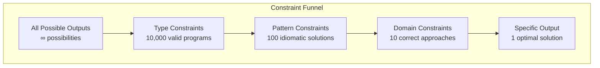
**Filename**: `assets/diagrams/ch03-constraint-funnel.mmd`

---

#### Chapter 4: Writing Your First CLAUDE.md
**Opportunity 2: WHY-WHAT-HOW Framework**
- **Location**: Line 44-86
- **Type**: layered diagram
- **Description**: Three-layer framework showing context purpose hierarchy

**Draft Mermaid:**
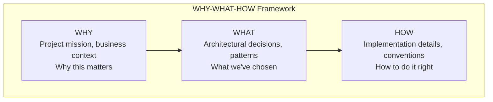
**Filename**: `assets/diagrams/ch04-why-what-how.mmd`

---

#### Chapter 5: The 12-Factor Agent
**Opportunity 3: Reliability Cascade (0.95^N)**
- **Location**: Line 11-23
- **Type**: decay curve
- **Description**: Shows how 95% reliability per step compounds to unacceptable reliability over N steps

**Draft Mermaid:**
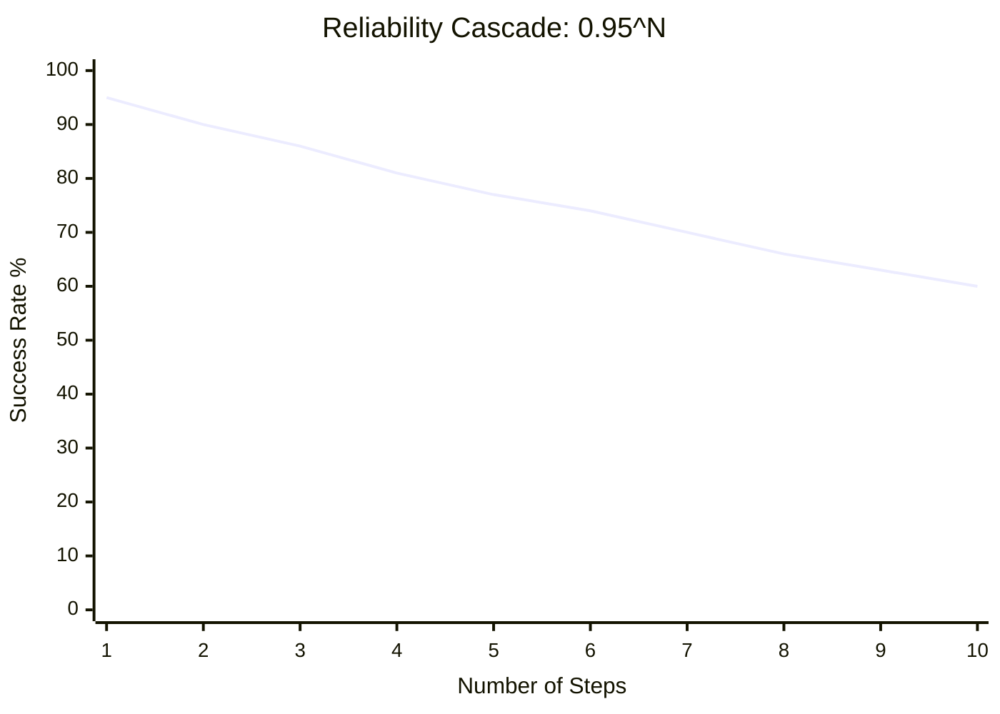
**Filename**: `assets/diagrams/ch05-reliability-cascade.mmd`

---

**Opportunity 4: Four-Turn Framework**
- **Location**: Line 26-36
- **Type**: cycle diagram
- **Description**: The understand-plan-act-observe agent loop

**Draft Mermaid:**
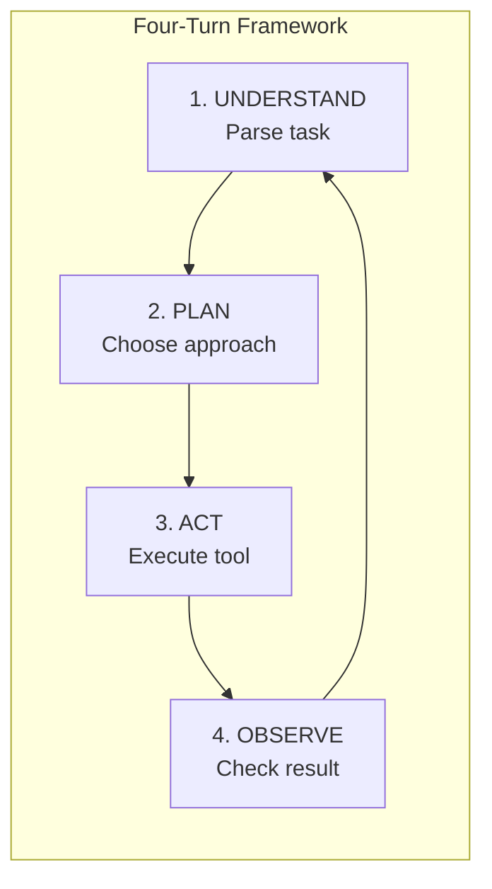
**Filename**: `assets/diagrams/ch05-four-turn-framework.mmd`

---

#### Chapter 6: The Verification Ladder
**Opportunity 5: Verification Sandwich**
- **Location**: Line 286-332
- **Type**: layered sandwich diagram
- **Description**: Pre-conditions on top, operation in middle, post-conditions below

**Draft Mermaid:**
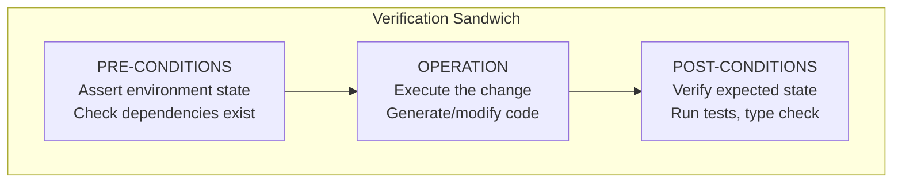
**Filename**: `assets/diagrams/ch06-verification-sandwich.mmd`

---

#### Chapter 7: Quality Gates That Compound
**Opportunity 6: State Space Reduction**
- **Location**: Line 9-39
- **Type**: set intersection diagram
- **Description**: Shows how each gate reduces the state space (valid AND type-safe AND tested)

**Draft Mermaid:**
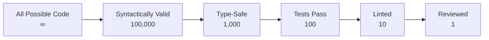
**Filename**: `assets/diagrams/ch07-state-space-reduction.mmd`

---

**Opportunity 7: Compounding Formula Visualization**
- **Location**: Line 139-177
- **Description**: Shows how 1% improvements compound: 1.01^365 = 37x

**Draft Mermaid:**
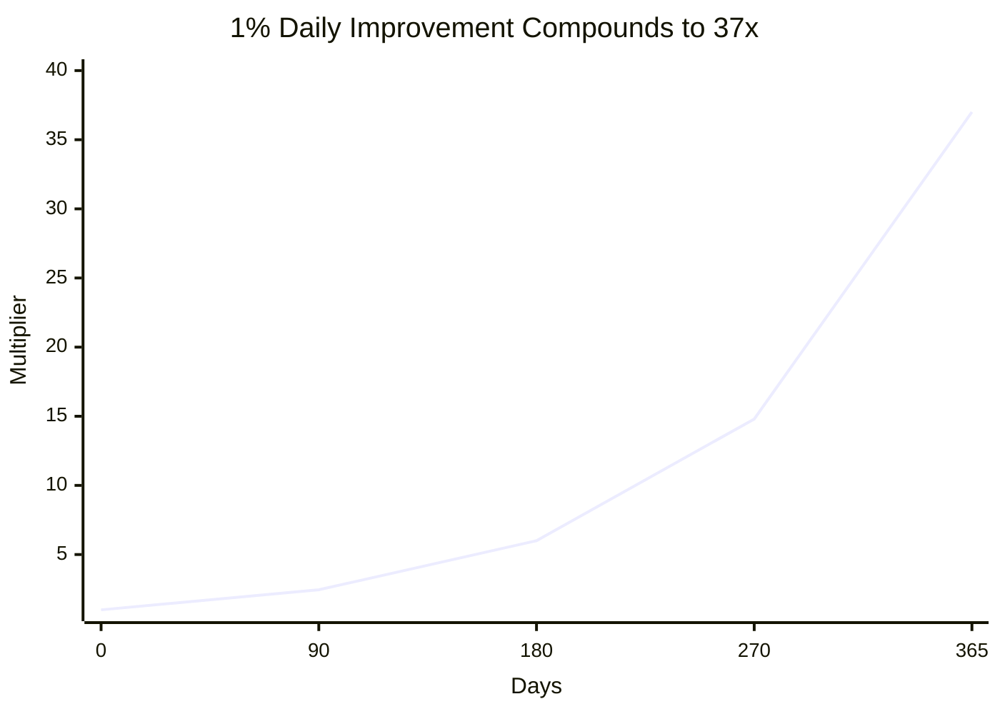
**Filename**: `assets/diagrams/ch07-compounding-formula.mmd`

---

**Opportunity 8: Six-Gate Architecture**
- **Location**: Line 460-476
- **Description**: The six gates in sequence: Lint, Type, Unit, Integration, Coverage, Security

**Draft Mermaid:**
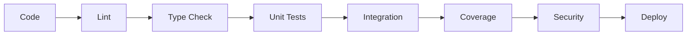
**Filename**: `assets/diagrams/ch07-six-gate-architecture.mmd`

---

#### Chapter 8: Error Handling and Debugging
**Opportunity 9: Error Classification (5-category)**
- **Location**: Line 9-50
- **Type**: categorization diagram
- **Description**: Five error types: syntax, type, runtime, logic, integration

**Draft Mermaid:**
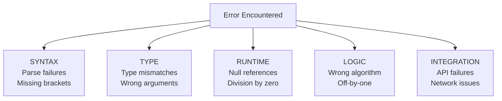
**Filename**: `assets/diagrams/ch08-error-classification.mmd`

---

#### Chapter 9: Context Engineering Deep Dive
**Opportunity 10: Progressive Disclosure Architecture**
- **Location**: Line 182-259
- **Type**: layered architecture
- **Description**: Three tiers: Summary (always), Details (on-demand), Full (never upfront)

**Draft Mermaid:**
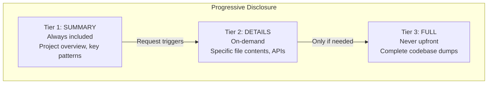
**Filename**: `assets/diagrams/ch09-progressive-disclosure.mmd`

---

#### Chapter 10: The RALPH Loop
**Opportunity 11: Memory Architecture (3 layers)**
- **Location**: Line 143-219
- **Type**: layered memory diagram
- **Description**: Working memory, session memory, persistent memory

**Draft Mermaid:**
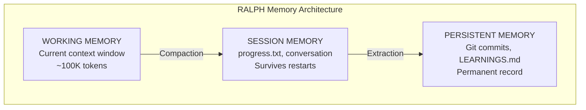
**Filename**: `assets/diagrams/ch10-memory-architecture.mmd`

---

#### Chapter 11: Sub-Agent Architecture
**Opportunity 12: Context Hierarchy (3 layers)**
- **Location**: Line 46-135
- **Type**: hierarchy diagram
- **Description**: Root CLAUDE.md → Agent flows → Package-specific context

**Draft Mermaid:**
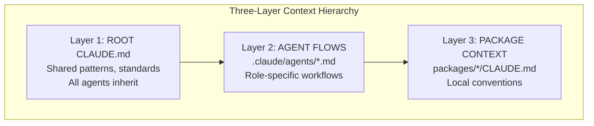
**Filename**: `assets/diagrams/ch11-context-hierarchy.mmd`

---

**Opportunity 13: Actor-Critic Loop**
- **Location**: Line 502-583
- **Type**: adversarial loop diagram
- **Description**: Actor generates, Critic reviews, repeat until approved

**Draft Mermaid:**
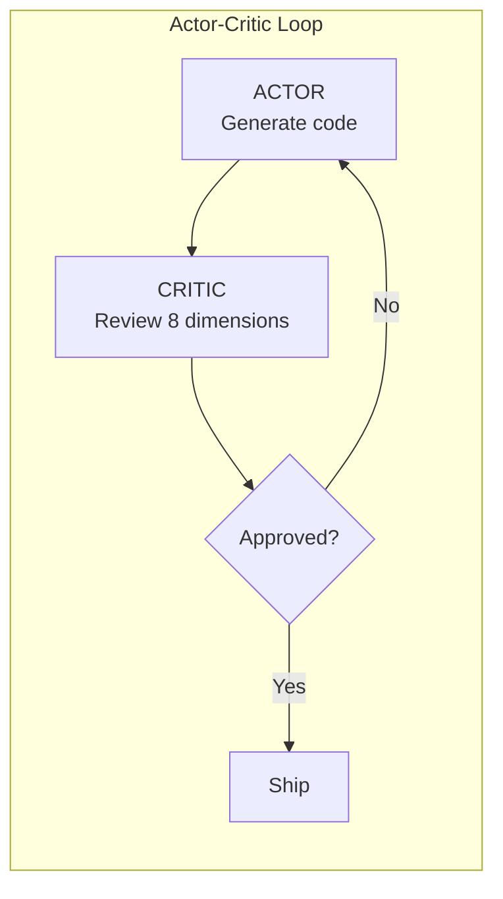
**Filename**: `assets/diagrams/ch11-actor-critic-loop.mmd`

---

#### Chapter 12: Development Workflows
**Opportunity 14: Plan Mode Two-Phase**
- **Location**: Line 12-28
- **Type**: two-phase flowchart
- **Description**: Phase 1 (Planning) → Phase 2 (Execution)

**Draft Mermaid:**
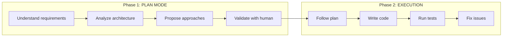
**Filename**: `assets/diagrams/ch12-plan-mode-phases.mmd`

---

**Opportunity 15: Git Worktrees Parallel**
- **Location**: Line 79-170
- **Type**: parallel structure diagram
- **Description**: Main repo + multiple worktrees for parallel development

**Draft Mermaid:**
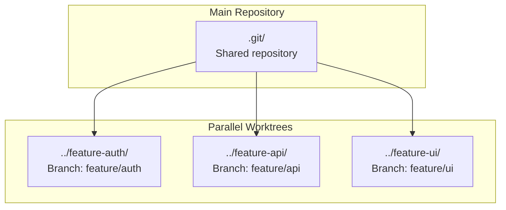
**Filename**: `assets/diagrams/ch12-git-worktrees.mmd`

---

#### Chapter 13: Building the Harness
**Opportunity 16: Closed-Loop Optimization Cycle**
- **Location**: Line 293-345
- **Type**: control loop diagram
- **Description**: Service → Telemetry → Constraints → Agent fix → Re-test → Loop

**Draft Mermaid:**
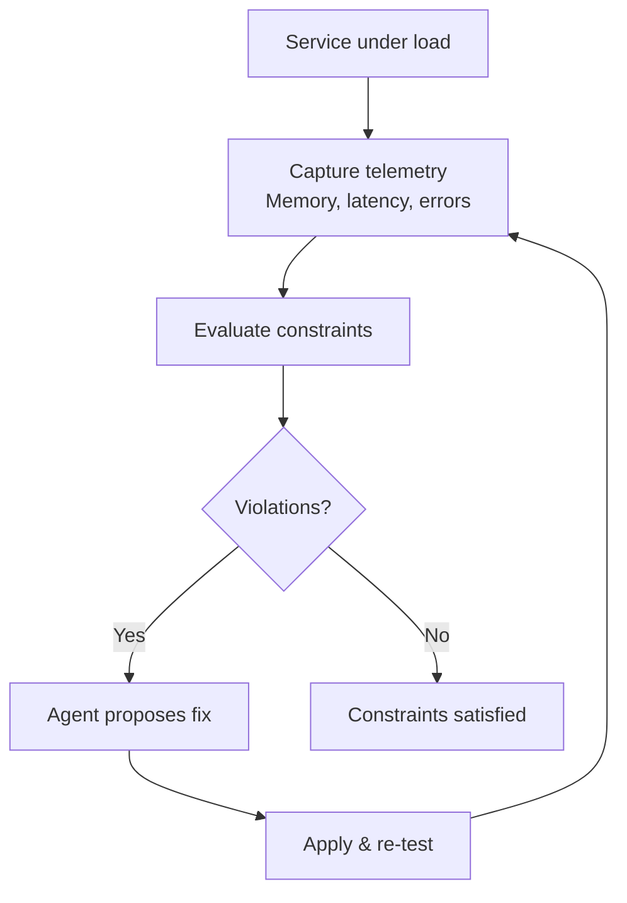
**Filename**: `assets/diagrams/ch13-closed-loop-optimization.mmd`

---

#### Chapter 14: The Meta-Engineer Playbook
**Opportunity 17: Four Automation Levels**
- **Location**: Line 546-581
- **Type**: stacked progression
- **Description**: L0 Manual (1x) → L1 AI-Assisted (5-10x) → L2 Tools (20-50x) → L3 Meta (100-500x)

**Draft Mermaid:**
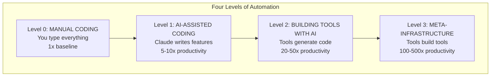
**Filename**: `assets/diagrams/ch14-four-automation-levels.mmd`

---

### MEDIUM PRIORITY - Still Needed (25 diagrams)

| # | Chapter | Diagram | Type |
|---|---------|---------|------|
| 1 | ch01 | Builder vs Meta-Builder comparison | comparison table |
| 2 | ch01 | Cost Curve by Engineering Level | line chart |
| 3 | ch03 | Chain-of-Thought Flow | sequential flow |
| 4 | ch03 | Few-Shot Accuracy Curve | line chart |
| 5 | ch04 | Context Relevance Comparison | bar chart |
| 6 | ch04 | Instruction-Following Degradation | decay curve |
| 7 | ch05 | Reliability Stack Layers | stacked layers |
| 8 | ch05 | Agent Loop with Tool Classification | flowchart |
| 9 | ch06 | Test-Driven Search Space | funnel |
| 10 | ch07 | Hook Workflow Cycle | cycle |
| 11 | ch08 | Learning Loop | cycle |
| 12 | ch08 | Clean Slate Recovery | flowchart |
| 13 | ch09 | Signal Degradation over context length | decay |
| 14 | ch09 | Entropy Reduction visualization | funnel |
| 15 | ch10 | Four-Phase Pie chart | pie |
| 16 | ch10 | Multi-Agent Coordination | network |
| 17 | ch11 | Parallel vs Sequential comparison | comparison |
| 18 | ch12 | Incremental Development pattern | sequential |
| 19 | ch13 | Linear vs Exponential Productivity | line chart |
| 20 | ch13 | MCP Resource Query Flow | sequence |
| 21 | ch14 | Leverage Stack (skill hierarchy) | stacked |
| 22 | ch14 | ROI Calculation Flow | decision tree |
| 23 | ch15 | YOLO Safety Hierarchy | tiered |
| 24 | ch15 | Progressive Model Escalation | flowchart |
| 25 | ch15 | Prompt Caching Structure | structural |

---

## New Opportunities Identified (This Scan)

### Chapter 11: Generalist vs Specialist Comparison
- **Location**: Line 7-29
- **Type**: comparison table/chart
- **Priority**: Medium
- **Description**: Metrics showing generalist (6/10 quality, 40% coverage, 3-4 cycles) vs specialist (9/10 quality, 85% coverage, 1-2 cycles)

**Draft Mermaid:**
```mermaid
xychart-beta
    title "Generalist vs Specialist Quality"
    x-axis ["Backend", "Frontend", "Tests", "Review"]
    y-axis "Score" 0 --> 10
    bar "Generalist" [6, 5, 4, 3]
    bar "Specialist" [9, 8, 8.5, 8]
```
**Filename**: `assets/diagrams/ch11-generalist-vs-specialist.mmd`

---

### Chapter 12: Playwright Script vs MCP Comparison
- **Location**: Line 377-444
- **Type**: comparison diagram
- **Priority**: Medium
- **Description**: Time comparison: MCP (2-3 min, 1 issue at a time) vs Script (12 sec, all issues at once)

**Draft Mermaid:**
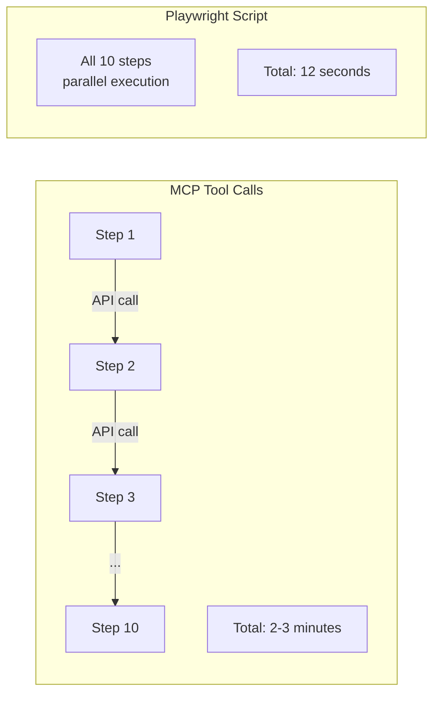
**Filename**: `assets/diagrams/ch12-playwright-vs-mcp.mmd`

---

### Chapter 15: Combined Savings Formula
- **Location**: Line 429-432
- **Type**: calculation diagram
- **Priority**: Medium
- **Description**: Shows how model switching (44%) + caching (90%) = 94-97% total savings

**Draft Mermaid:**
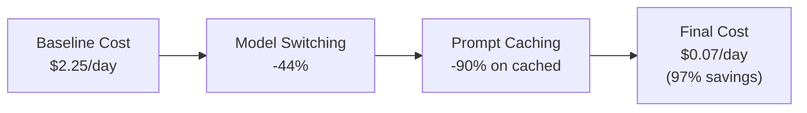
**Filename**: `assets/diagrams/ch15-combined-savings.mmd`

---

## Recommended Implementation Order

### Phase 1: Critical Gaps (8 diagrams)
Focus on completing high-priority diagrams for chapters 3-9 where only 1 diagram exists per chapter:

1. `ch03-constraint-funnel.mmd`
2. `ch04-why-what-how.mmd`
3. `ch05-reliability-cascade.mmd`
4. `ch05-four-turn-framework.mmd`
5. `ch06-verification-sandwich.mmd`
6. `ch07-state-space-reduction.mmd`
7. `ch07-compounding-formula.mmd`
8. `ch07-six-gate-architecture.mmd`

### Phase 2: Advanced Chapters (9 diagrams)
Complete remaining high-priority diagrams for advanced chapters:

9. `ch08-error-classification.mmd`
10. `ch09-progressive-disclosure.mmd`
11. `ch10-memory-architecture.mmd`
12. `ch11-context-hierarchy.mmd`
13. `ch11-actor-critic-loop.mmd`
14. `ch12-plan-mode-phases.mmd`
15. `ch12-git-worktrees.mmd`
16. `ch13-closed-loop-optimization.mmd`
17. `ch14-four-automation-levels.mmd`

### Phase 3: Medium Priority (25 diagrams)
Fill in supporting diagrams as time permits.

---

## Coverage Summary by Chapter

| Chapter | Existing | High Priority Remaining | Medium Priority Remaining | Total Needed |
|---------|----------|------------------------|--------------------------|--------------|
| ch01 | 4 | 0 | 2 | 2 |
| ch02 | 3 | 0 | 0 | 0 |
| ch03 | 1 | 1 | 2 | 3 |
| ch04 | 1 | 1 | 2 | 3 |
| ch05 | 1 | 2 | 2 | 4 |
| ch06 | 1 | 1 | 1 | 2 |
| ch07 | 1 | 3 | 1 | 4 |
| ch08 | 1 | 1 | 2 | 3 |
| ch09 | 1 | 1 | 2 | 3 |
| ch10 | 1 | 1 | 2 | 3 |
| ch11 | 1 | 2 | 1 | 3 |
| ch12 | 1 | 2 | 1 | 3 |
| ch13 | 1 | 1 | 2 | 3 |
| ch14 | 1 | 1 | 2 | 3 |
| ch15 | 1 | 0 | 3 | 3 |
| **Total** | **21** | **17** | **25** | **42** |

---

## Notes

- Chapters 1-2 are well-covered with 7 diagrams total
- Chapters 3-15 each have only 1 diagram despite having 3-4 opportunities each
- Priority should be completing the "critical path" diagrams that visualize core concepts
- Consider using `.mmd` extension for raw Mermaid files, `.md` for documented diagrams
- All diagram files should follow the existing structure: Description, Mermaid code, Alternative views, Usage notes
