# Diagram Opportunities - 2026-01-27 (v3)

## Summary
- Files scanned: 15 chapters
- Existing diagrams: 21 files in `assets/diagrams/`
- Diagram opportunities identified: 18 (High: 10, Medium: 8)

## Current Coverage

| Chapter | Existing Diagrams | Coverage |
|---------|------------------|----------|
| ch01 | 4 (flywheel, pyramid, feedback-loop, portfolio) | Excellent |
| ch02 | 3 (agent-vs-chat, tool-ecosystem, two-mode) | Excellent |
| ch03 | 1 (prompt-anatomy) | Good |
| ch04 | 1 (claudemd-hierarchy) | Good |
| ch05 | 1 (12factor-overview) | Good |
| ch06 | 1 (verification-ladder) | Good |
| ch07 | 1 (quality-gates) | Needs More |
| ch08 | 1 (error-diagnostic) | Needs More |
| ch09 | 1 (context-window) | Needs More |
| ch10 | 1 (ralph-loop) | Good |
| ch11 | 1 (subagent-architecture) | Good |
| ch12 | 1 (workflows) | Needs More |
| ch13 | 1 (harness-architecture) | Needs More |
| ch14 | 1 (six-waves) | Needs More |
| ch15 | 1 (model-selection) | Needs More |

---

## Opportunities by Chapter

### ch03-prompting-fundamentals.md

#### Opportunity 1: RISEN Framework Visual
- **Location**: Lines 26-60
- **Type**: flowchart/component
- **Priority**: High
- **Description**: The RISEN framework (Role, Instructions, Situation, Examples, Next Steps) is a core teaching concept described in detail but only shown as text. A visual breakdown would reinforce learning.

**Draft Mermaid:**
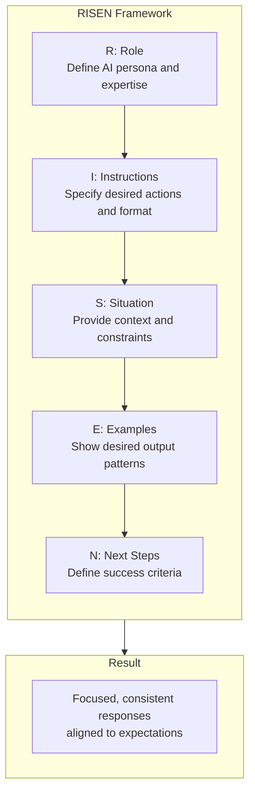

**Suggested filename**: `assets/diagrams/ch03-risen-framework.md`

---

### ch07-quality-gates-that-compound.md

#### Opportunity 2: Quality Gate Pipeline Flow
- **Location**: Lines 80-150
- **Type**: flowchart/pipeline
- **Priority**: High
- **Description**: The chapter describes pre-commit hooks, post-edit hooks, and gate sequences but lacks a unified visual showing how gates flow together in the development pipeline.

**Draft Mermaid:**
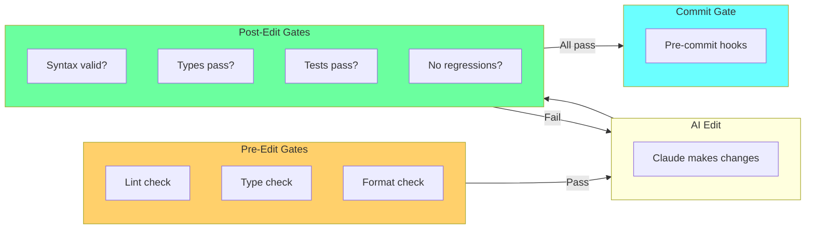

**Suggested filename**: `assets/diagrams/ch07-gate-pipeline.md`

#### Opportunity 3: Speed Gates vs Depth Gates
- **Location**: Lines 200-280
- **Type**: comparison chart
- **Priority**: Medium
- **Description**: The chapter contrasts fast gates (syntax, lint) vs slow gates (integration tests, E2E). A visual comparison would clarify when to use each.

**Draft Mermaid:**
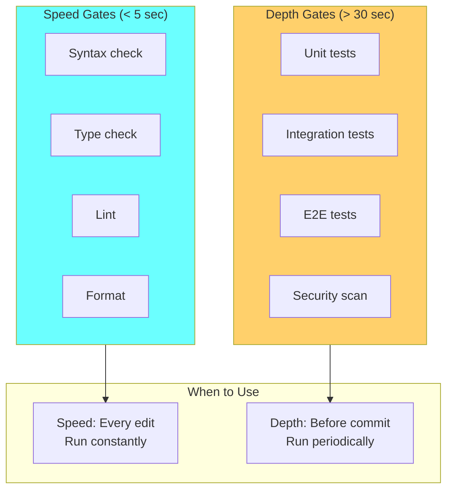

**Suggested filename**: `assets/diagrams/ch07-gate-types.md`

---

### ch08-error-handling-and-debugging.md

#### Opportunity 4: Error Recovery Decision Tree
- **Location**: Lines 200-300
- **Type**: decision flowchart
- **Priority**: High
- **Description**: The chapter describes a systematic approach to diagnosing errors (syntax, runtime, logic, environment) but lacks a decision tree for practitioners to follow.

**Draft Mermaid:**
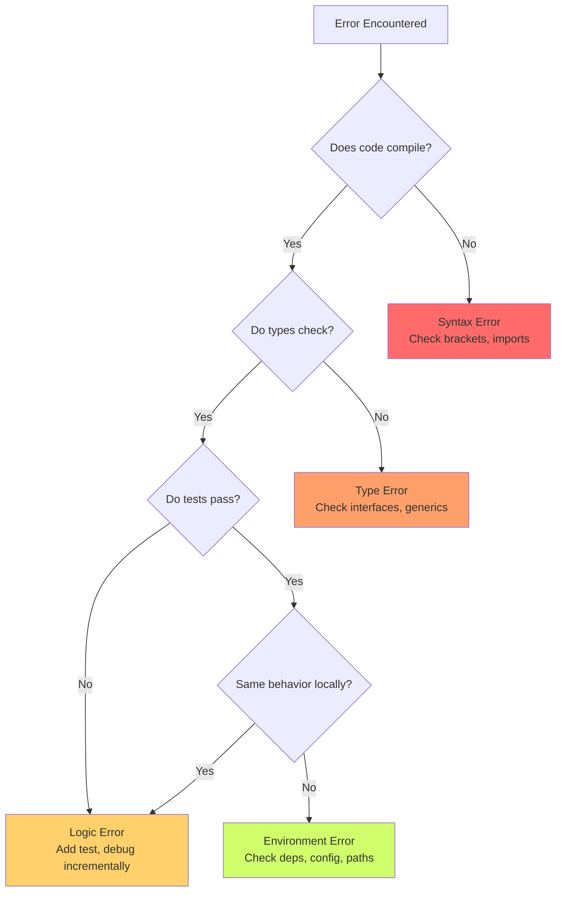

**Suggested filename**: `assets/diagrams/ch08-error-decision-tree.md`

---

### ch09-context-engineering-deep-dive.md

#### Opportunity 5: Backpressure Pattern
- **Location**: Lines 250-320
- **Type**: flowchart
- **Priority**: High
- **Description**: The backpressure pattern (suppress output on success, verbose on failure) is a key concept for context management but only described in prose.

**Draft Mermaid:**
```mermaid
flowchart TB
    subgraph Input["Operation Input"]
        I["Run command/test"]
    end

    subgraph Result{"Result?"}
        R["Check outcome"]
    end

    subgraph Success["On Success"]
        S1["Minimal output"]
        S2["'All tests passed'"]
        S3["Context preserved"]
    end

    subgraph Failure["On Failure"]
        F1["Full error output"]
        F2["Stack traces"]
        F3["Diagnostic info"]
    end

    Input --> Result
    Result -->|"Pass"| Success
    Result -->|"Fail"| Failure

    style Success fill:#6bff9f
    style Failure fill:#ff6b6b
```

**Suggested filename**: `assets/diagrams/ch09-backpressure-pattern.md`

#### Opportunity 6: Information Theory Model
- **Location**: Lines 50-120
- **Type**: conceptual diagram
- **Priority**: Medium
- **Description**: The chapter opens with Shannon's information theory applied to AI context (signal vs noise). A visual would reinforce the mental model.

**Draft Mermaid:**
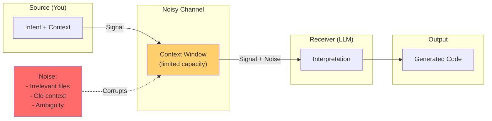

**Suggested filename**: `assets/diagrams/ch09-information-theory.md`

---

### ch10-the-ralph-loop.md

#### Opportunity 7: Circuit Breaker State Machine
- **Location**: Lines 420-480
- **Type**: state diagram
- **Priority**: Medium
- **Description**: The circuit breaker pattern (open/closed/half-open states) is discussed but not visualized.

**Draft Mermaid:**
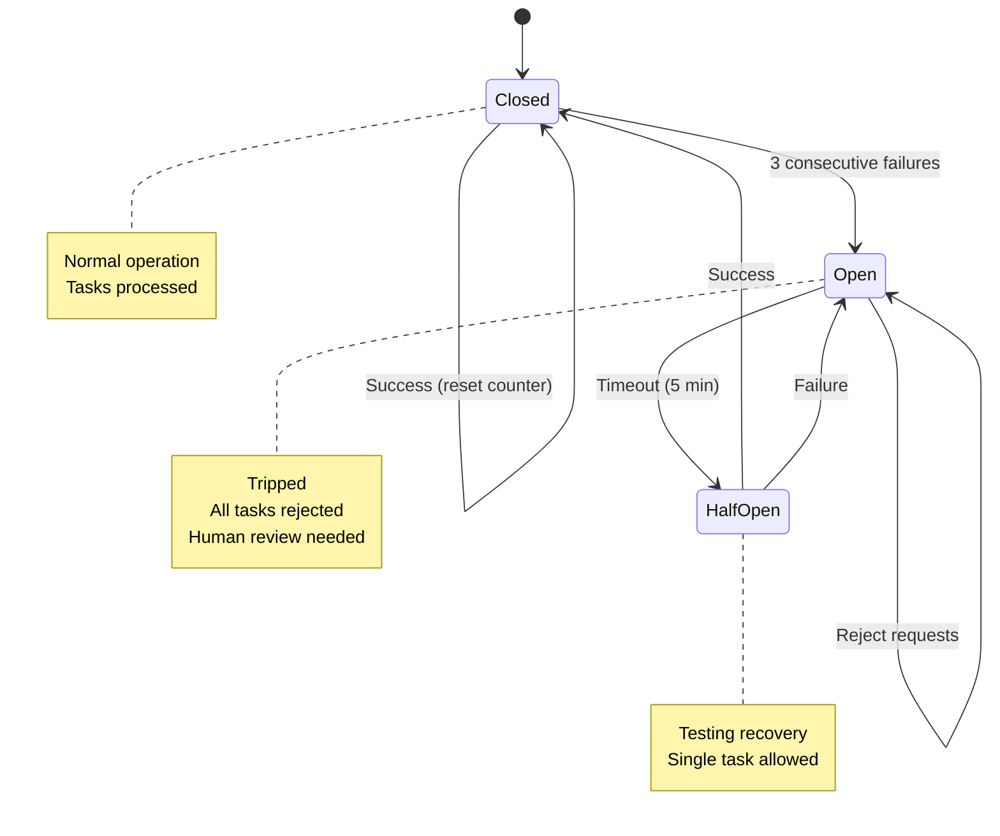

**Suggested filename**: `assets/diagrams/ch10-circuit-breaker.md`

---

### ch11-sub-agent-architecture.md

#### Opportunity 8: Context Isolation Diagram
- **Location**: Lines 150-220
- **Type**: architecture diagram
- **Priority**: High
- **Description**: The chapter explains that sub-agents have isolated context from the parent agent. A visual showing the boundary and what crosses it would clarify this key concept.

**Draft Mermaid:**
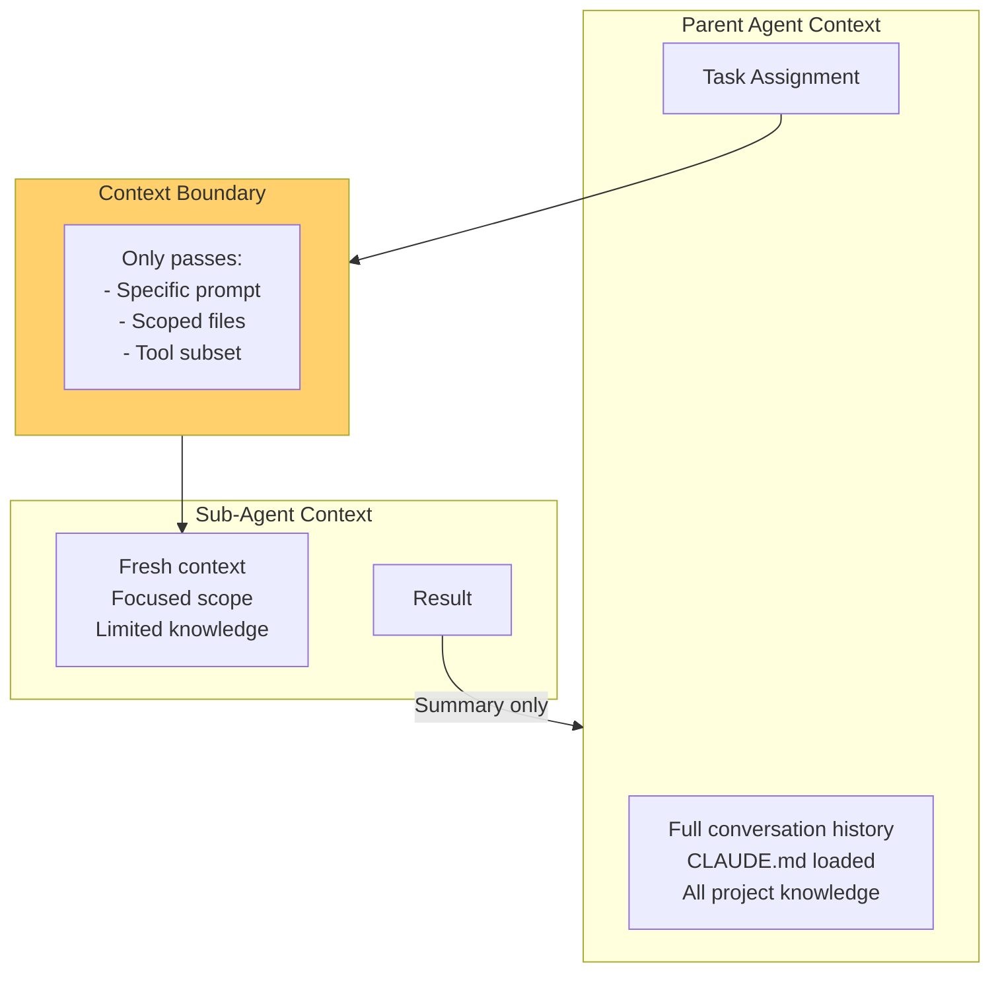

**Suggested filename**: `assets/diagrams/ch11-context-isolation.md`

---

### ch12-development-workflows.md

#### Opportunity 9: Plan Mode Two-Phase Pattern
- **Location**: Lines 12-28
- **Type**: flowchart
- **Priority**: High
- **Description**: The chapter shows an ASCII diagram of Plan Mode phases. A proper Mermaid diagram would be more readable.

**Draft Mermaid:**
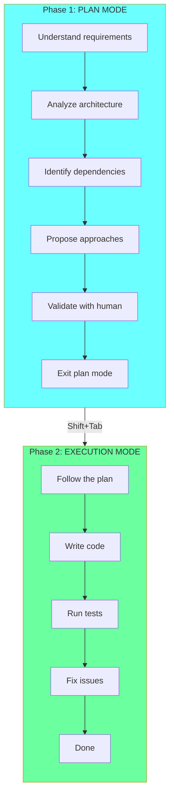

**Suggested filename**: `assets/diagrams/ch12-plan-mode.md`

#### Opportunity 10: Git Worktrees Parallel Development
- **Location**: Lines 76-140
- **Type**: architecture diagram
- **Priority**: High
- **Description**: Git worktrees enabling parallel AI development is a key concept. The chapter describes it with ASCII but a visual would show the parallel nature better.

**Draft Mermaid:**
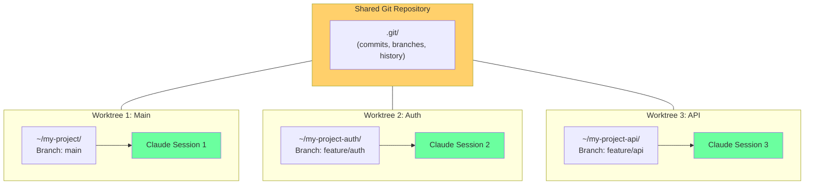

**Suggested filename**: `assets/diagrams/ch12-git-worktrees.md`

#### Opportunity 11: Incremental Development Pattern
- **Location**: Lines 172-258
- **Type**: flowchart
- **Priority**: Medium
- **Description**: The incremental development pattern (small steps, validate each) is explained but a visual loop would reinforce the pattern.

**Draft Mermaid:**
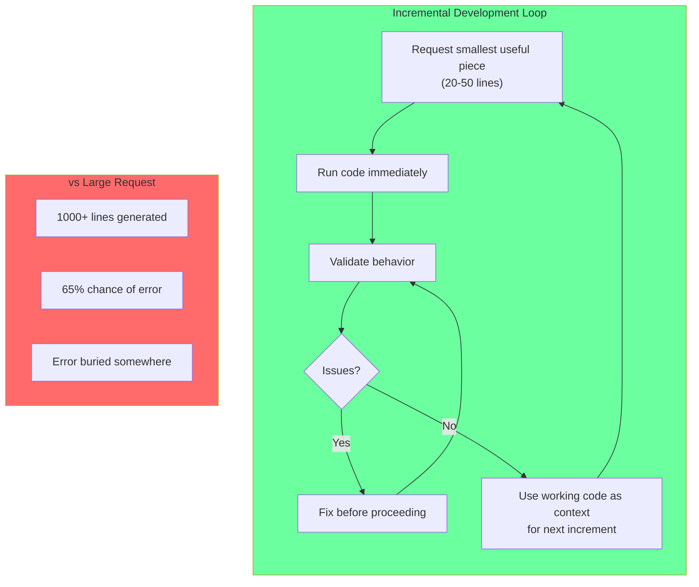

**Suggested filename**: `assets/diagrams/ch12-incremental-development.md`

---

### ch13-building-the-harness.md

#### Opportunity 12: Closed-Loop Optimization Cycle
- **Location**: Lines 291-340
- **Type**: cycle diagram
- **Priority**: High
- **Description**: The closed-loop optimization pattern (telemetry -> constraints -> agent fix -> verify) is central to Layer 4 but only described in prose and ASCII.

**Draft Mermaid:**
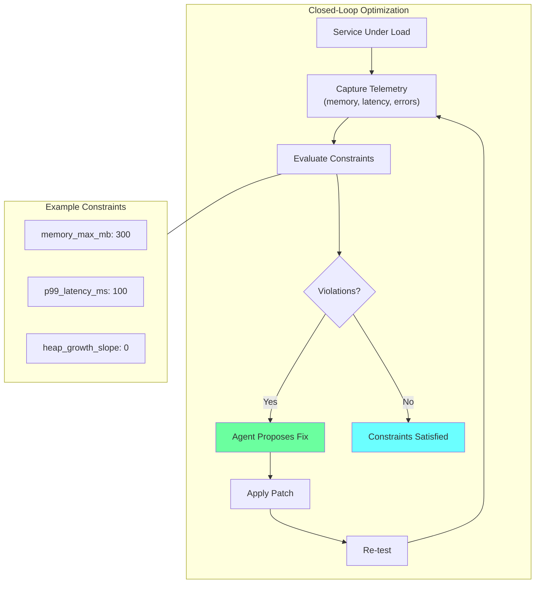

**Suggested filename**: `assets/diagrams/ch13-closed-loop.md`

---

### ch14-the-meta-engineer-playbook.md

#### Opportunity 13: Skill Atrophy Ladder
- **Location**: Lines 225-301
- **Type**: vertical hierarchy
- **Priority**: High
- **Description**: The skill atrophy framework (what to keep sharp vs let atrophy) is a key career insight that deserves visualization.

**Draft Mermaid:**
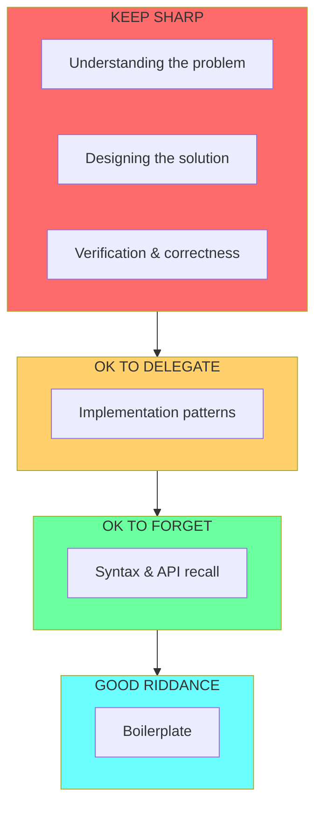

**Suggested filename**: `assets/diagrams/ch14-skill-atrophy.md`

#### Opportunity 14: Four Levels of Automation
- **Location**: Lines 434-471
- **Type**: progression diagram
- **Priority**: Medium
- **Description**: The four levels (Manual -> AI-Assisted -> Building Tools -> Meta-Infrastructure) show career progression but are only in prose.

**Draft Mermaid:**
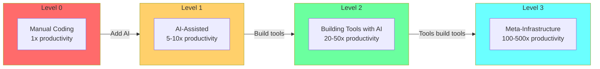

**Suggested filename**: `assets/diagrams/ch14-automation-levels.md`

---

### ch15-model-strategy-and-cost-optimization.md

#### Opportunity 15: Progressive Model Escalation
- **Location**: Lines 169-209
- **Type**: flowchart
- **Priority**: High
- **Description**: The escalation pattern (start cheap, escalate on quality gate failure) is a key cost optimization strategy.

**Draft Mermaid:**
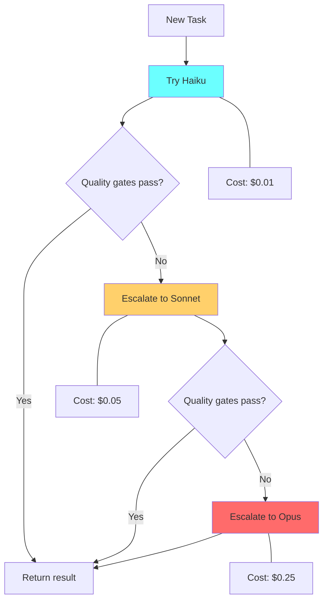

**Suggested filename**: `assets/diagrams/ch15-model-escalation.md`

#### Opportunity 16: Multi-Layer Timeout Protection
- **Location**: Lines 238-350
- **Type**: stack diagram
- **Priority**: Medium
- **Description**: The four layers of cost protection (job timeout, request token cap, input size limit, budget alerts) form a defense-in-depth strategy.

**Draft Mermaid:**
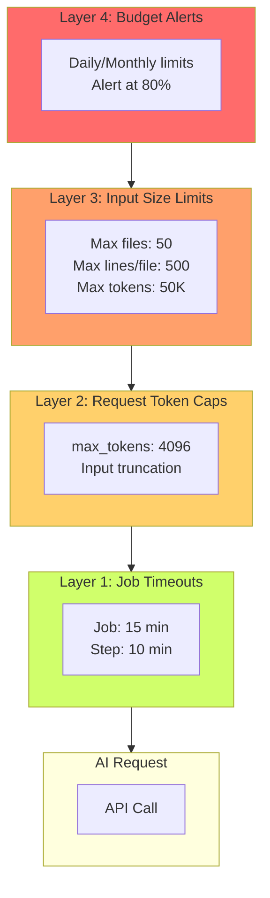

**Suggested filename**: `assets/diagrams/ch15-timeout-layers.md`

#### Opportunity 17: Three-Tier Model Hierarchy
- **Location**: Lines 46-112
- **Type**: comparison diagram
- **Priority**: Medium
- **Description**: The Haiku/Sonnet/Opus hierarchy with use cases could be a quick reference visual.

**Draft Mermaid:**
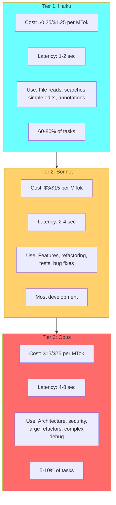

**Suggested filename**: `assets/diagrams/ch15-model-tiers.md`

#### Opportunity 18: YOLO Mode Safety Hierarchy
- **Location**: Lines 432-530
- **Type**: hierarchy diagram
- **Priority**: Medium
- **Description**: The four safety levels (prompts -> YOLO+Git -> YOLO+Git+Gates -> YOLO+Git+Gates+Review) show a progression.

**Draft Mermaid:**
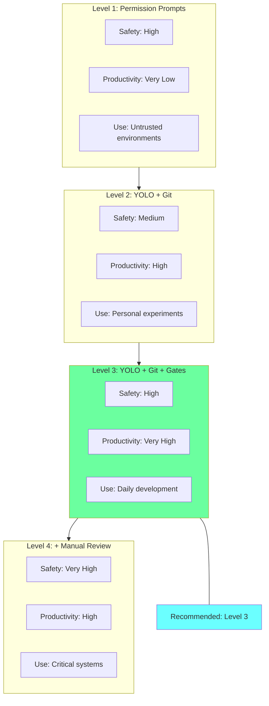

**Suggested filename**: `assets/diagrams/ch15-yolo-safety.md`

---

## Priority Summary

### High Priority (10)
1. ch03: RISEN Framework Visual
2. ch07: Quality Gate Pipeline Flow
3. ch08: Error Recovery Decision Tree
4. ch09: Backpressure Pattern
5. ch11: Context Isolation Diagram
6. ch12: Plan Mode Two-Phase Pattern
7. ch12: Git Worktrees Parallel Development
8. ch13: Closed-Loop Optimization Cycle
9. ch14: Skill Atrophy Ladder
10. ch15: Progressive Model Escalation

### Medium Priority (8)
1. ch07: Speed Gates vs Depth Gates
2. ch09: Information Theory Model
3. ch10: Circuit Breaker State Machine
4. ch12: Incremental Development Pattern
5. ch14: Four Levels of Automation
6. ch15: Multi-Layer Timeout Protection
7. ch15: Three-Tier Model Hierarchy
8. ch15: YOLO Mode Safety Hierarchy

---

## Recommendations

1. **Chapters needing most attention**: ch07, ch12, ch14, ch15 each have multiple opportunities
2. **Quick wins**: ch03 RISEN and ch14 Skill Atrophy are high-value, straightforward diagrams
3. **Consider merging**: ch15 has 4 opportunities that could potentially be combined into 2 comprehensive diagrams
