# Diagram Opportunities - 2026-01-27

## Summary
- Files scanned: 7 chapters (ch01-ch07)
- Diagram opportunities: 28 (High: 14, Medium: 14)

---

## Opportunities by Chapter

### ch01-the-compound-systems-engineer.md

#### Opportunity 1: Three Levels of Engineering Pyramid
- **Location**: Line 55-66
- **Type**: pyramid/hierarchy
- **Priority**: High
- **Description**: The three levels (write code, write systems, write systems that write systems) are a core concept that would benefit from visual hierarchy showing progression and leverage multipliers.

**Draft Mermaid:**
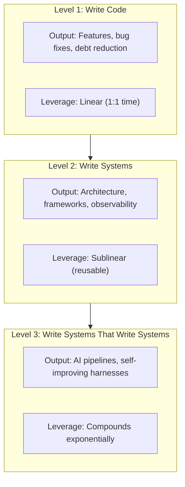

**Suggested filename**: `assets/diagrams/ch01-three-levels-pyramid.mmd`

---

#### Opportunity 2: Builder vs Meta-Builder Comparison
- **Location**: Line 69-79
- **Type**: comparison/parallel flow
- **Priority**: Medium
- **Description**: The table contrasts builder vs meta-builder mindset. A visual comparison with arrows showing the cognitive shift would reinforce the concept.

**Draft Mermaid:**
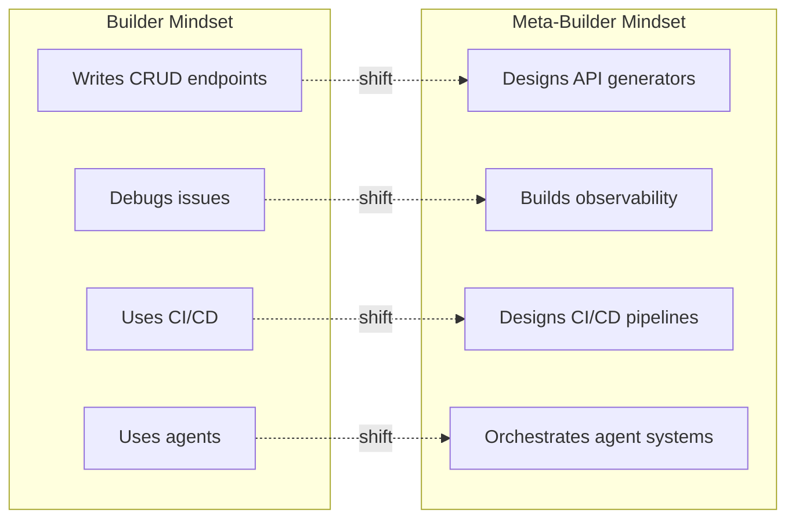

**Suggested filename**: `assets/diagrams/ch01-builder-metabuilder.mmd`

---

#### Opportunity 3: Single-Bet vs Portfolio Game
- **Location**: Line 98-105
- **Type**: comparison flowchart
- **Priority**: High
- **Description**: The mental model difference between single-bet (existential each failure) vs portfolio (failure = data) is critical to the chapter's message.

**Draft Mermaid:**
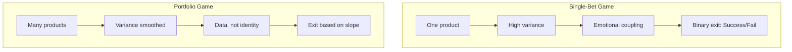

**Suggested filename**: `assets/diagrams/ch01-portfolio-vs-single-bet.mmd`

---

#### Opportunity 4: Cost Curve by Engineering Level
- **Location**: Line 122-138
- **Type**: line graph/comparison
- **Priority**: Medium
- **Description**: Shows how cost per project changes at each level. Level 1 stays flat, Level 2 declines gradually, Level 3 drops exponentially.

**Draft Mermaid:**
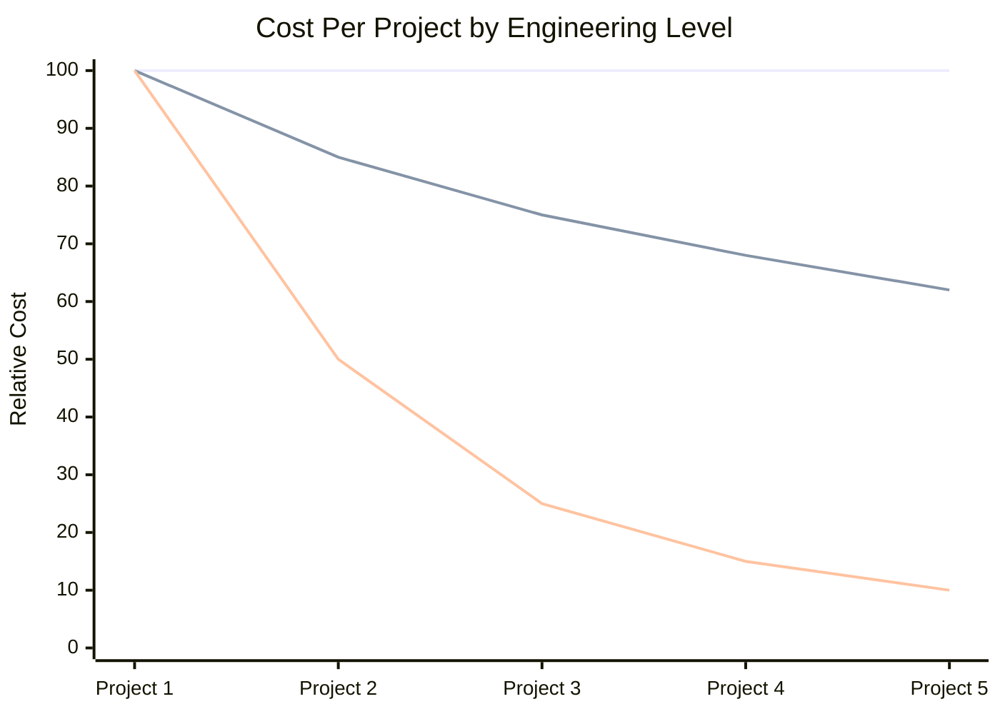

**Suggested filename**: `assets/diagrams/ch01-cost-curve-levels.mmd`

---

#### Opportunity 5: Constraint Feedback Loop
- **Location**: Line 248-255
- **Type**: cycle diagram
- **Priority**: High
- **Description**: The feedback loop showing how constraints lead to automated verification is a key compound engineering pattern.

**Draft Mermaid:**
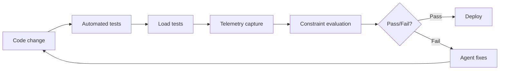

**Suggested filename**: `assets/diagrams/ch01-constraint-feedback-loop.mmd`

---

### ch02-getting-started-with-claude-code.md

#### Opportunity 6: Agent vs Chat Mental Model
- **Location**: Line 1-8
- **Type**: comparison flowchart
- **Priority**: High
- **Description**: The distinction between ChatGPT (copy-paste) vs Claude Code (direct action) is foundational. Visual would clarify the paradigm shift.

**Draft Mermaid:**
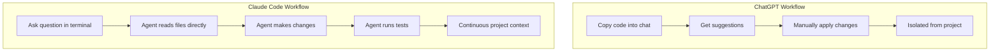

**Suggested filename**: `assets/diagrams/ch02-agent-vs-chat.mmd`

---

#### Opportunity 7: Tool Ecosystem Overview
- **Location**: Line 149-217
- **Type**: radial/hub diagram
- **Priority**: High
- **Description**: The seven core tools (Read, Write, Edit, Glob, Grep, Bash, Observability) need a visual showing their relationships and purposes.

**Draft Mermaid:**
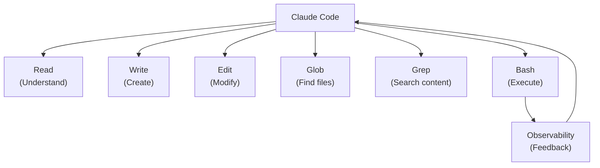

**Suggested filename**: `assets/diagrams/ch02-tool-ecosystem.mmd`

---

#### Opportunity 8: Two-Mode Mental Model
- **Location**: Line 337-399
- **Type**: dual flowchart
- **Priority**: High
- **Description**: Exploration mode vs Implementation mode is the key pattern. Visual would show when to use each and their different goals.

**Draft Mermaid:**
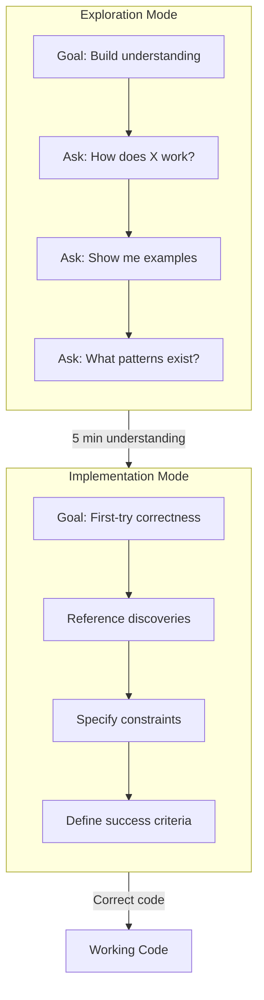

**Suggested filename**: `assets/diagrams/ch02-two-mode-mental-model.mmd`

---

### ch03-prompting-fundamentals.md

#### Opportunity 9: Prompt Anatomy (Context/Instruction/Constraints)
- **Location**: Line 9-49
- **Type**: layered block diagram
- **Priority**: High
- **Description**: The three components (Context, Instruction, Constraints) are foundational. A visual showing how they stack would aid comprehension.

**Draft Mermaid:**
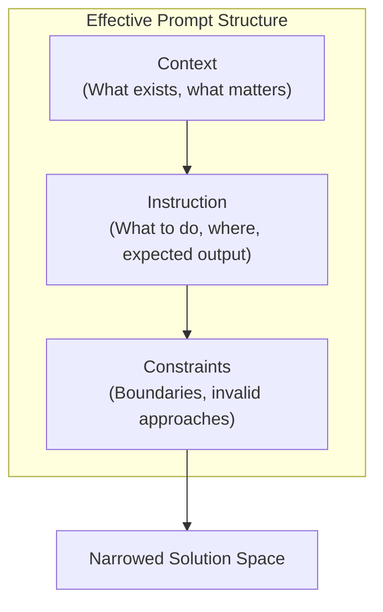

**Suggested filename**: `assets/diagrams/ch03-prompt-anatomy.mmd`

---

#### Opportunity 10: The Constraint Funnel
- **Location**: Line 207-224
- **Type**: funnel diagram
- **Priority**: High
- **Description**: This is explicitly described as a funnel in the text. Shows how each constraint layer reduces possibilities by an order of magnitude.

**Draft Mermaid:**
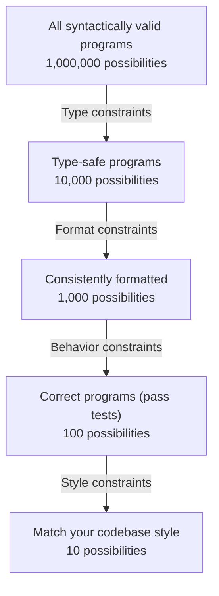

**Suggested filename**: `assets/diagrams/ch03-constraint-funnel.mmd`

---

#### Opportunity 11: Chain-of-Thought Flow
- **Location**: Line 52-149
- **Type**: sequence/flow diagram
- **Priority**: Medium
- **Description**: Shows the reasoning steps before implementation: steps, failure modes, error handling, state transitions, logging.

**Draft Mermaid:**
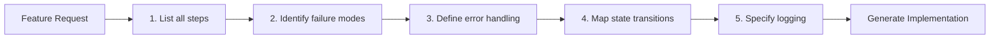

**Suggested filename**: `assets/diagrams/ch03-chain-of-thought.mmd`

---

#### Opportunity 12: Few-Shot Accuracy Curve
- **Location**: Line 231-244
- **Type**: bar chart
- **Priority**: Medium
- **Description**: Shows accuracy improvement: 0 examples (40-60%), 1 example (60-75%), 2-3 examples (85-95%).

**Draft Mermaid:**
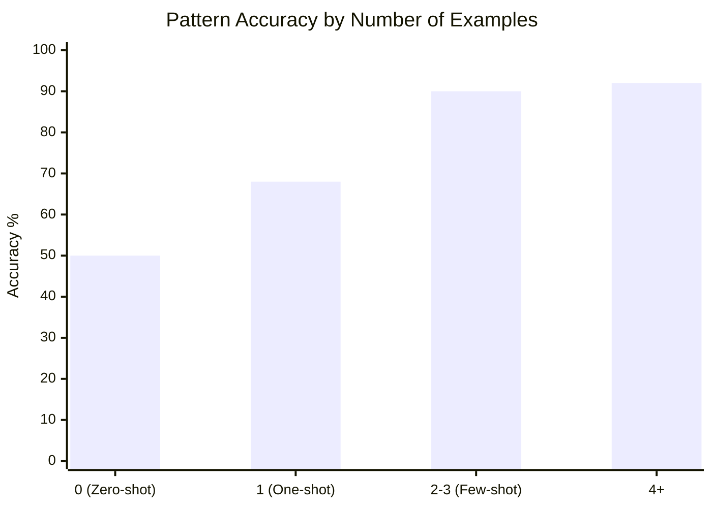

**Suggested filename**: `assets/diagrams/ch03-few-shot-accuracy.mmd`

---

### ch04-writing-your-first-claude-md.md

#### Opportunity 13: WHY-WHAT-HOW Framework
- **Location**: Line 44-86
- **Type**: three-column layout
- **Priority**: High
- **Description**: The three dimensions of effective CLAUDE.md need visual representation showing their distinct purposes.

**Draft Mermaid:**
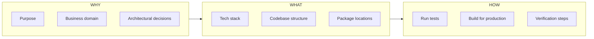

**Suggested filename**: `assets/diagrams/ch04-why-what-how.mmd`

---

#### Opportunity 14: Hierarchical CLAUDE.md Structure
- **Location**: Line 165-218
- **Type**: tree diagram
- **Priority**: High
- **Description**: Shows how CLAUDE.md files distribute across monorepo: root (30-50 lines), domain (200-300 lines), subdomain files.

**Draft Mermaid:**
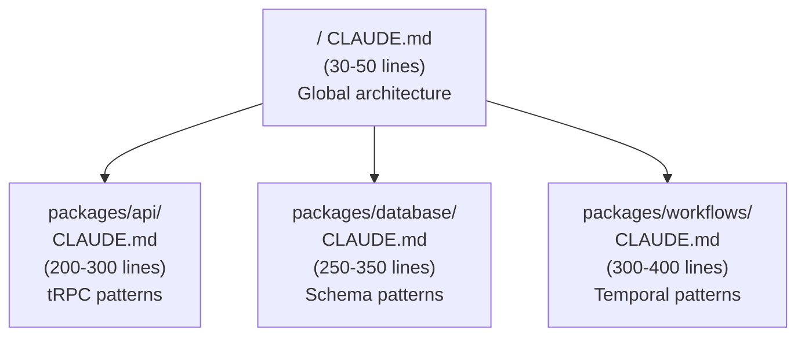

**Suggested filename**: `assets/diagrams/ch04-hierarchical-claude-md.mmd`

---

#### Opportunity 15: Context Relevance Comparison
- **Location**: Line 196-209
- **Type**: before/after comparison
- **Priority**: Medium
- **Description**: Shows monolithic (10,000 lines, 8% relevant) vs hierarchical (340 lines, 95% relevant) context loading.

**Draft Mermaid:**
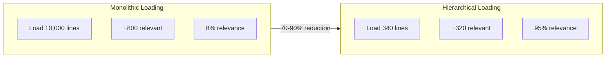

**Suggested filename**: `assets/diagrams/ch04-context-relevance.mmd`

---

#### Opportunity 16: Instruction-Following Degradation
- **Location**: Line 29-43
- **Type**: line graph
- **Priority**: Medium
- **Description**: Shows how instruction-following accuracy degrades as instruction count increases (smaller models exponential, larger models linear).

**Draft Mermaid:**
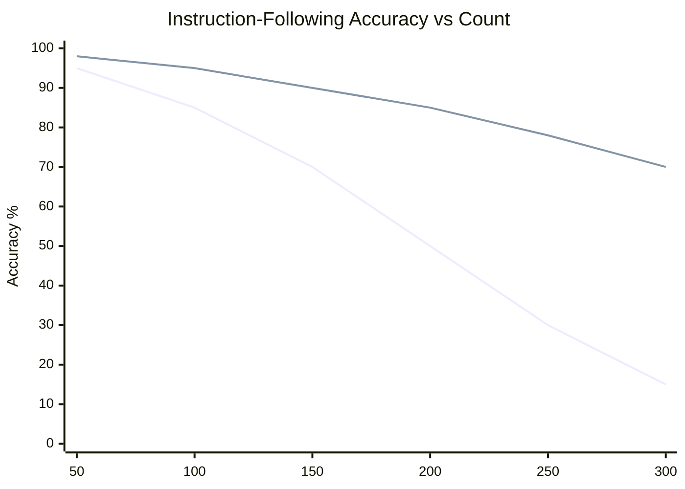

**Suggested filename**: `assets/diagrams/ch04-instruction-degradation.mmd`

---

### ch05-the-12-factor-agent.md

#### Opportunity 17: Reliability Cascade (0.95^N)
- **Location**: Line 11-23
- **Type**: line/bar chart
- **Priority**: High
- **Description**: The exponential reliability degradation (0.95^N) is the core motivation. Visual would make the math visceral.

**Draft Mermaid:**
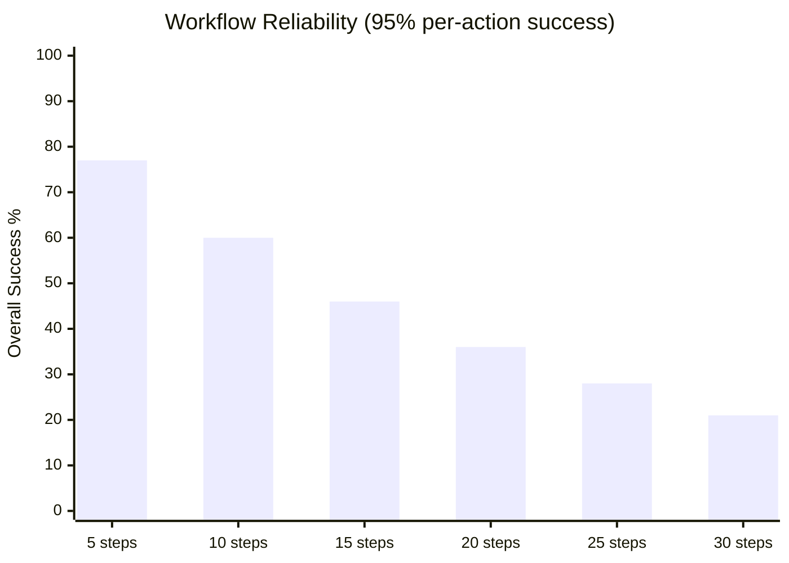

**Suggested filename**: `assets/diagrams/ch05-reliability-cascade.mmd`

---

#### Opportunity 18: Four-Turn Framework
- **Location**: Line 26-36
- **Type**: cycle diagram
- **Priority**: High
- **Description**: The four turns (Understand, Decide, Execute, Verify) that production agents need vs demo agents (just Input, LLM, Action).

**Draft Mermaid:**
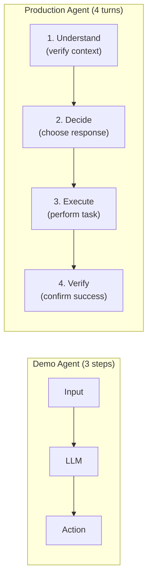

**Suggested filename**: `assets/diagrams/ch05-four-turn-framework.mmd`

---

#### Opportunity 19: Reliability Stack Layers
- **Location**: Line 38-46
- **Type**: layered stack
- **Priority**: Medium
- **Description**: The four layers: task decomposition, pre-action validation, post-action verification, human escalation.

**Draft Mermaid:**
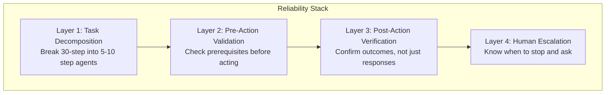

**Suggested filename**: `assets/diagrams/ch05-reliability-stack.mmd`

---

#### Opportunity 20: 12 Factors Overview
- **Location**: Line 49-459
- **Type**: grouped organization chart
- **Priority**: High
- **Description**: The 12 factors organized into Foundation (1-5), Reliability (6-9), Scale (10-12) phases.

**Draft Mermaid:**
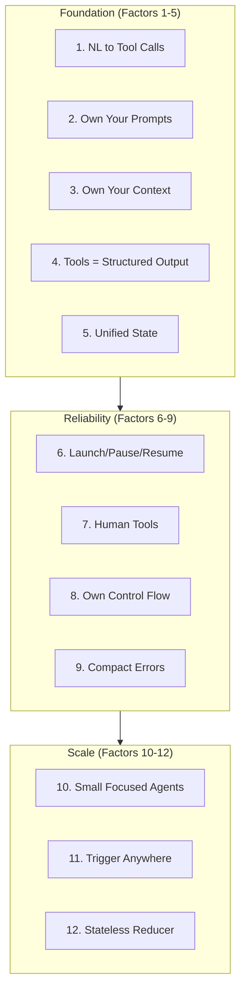

**Suggested filename**: `assets/diagrams/ch05-12-factors-overview.mmd`

---

#### Opportunity 21: Agent Loop with Tool Classification
- **Location**: Line 284-319
- **Type**: flowchart with decision nodes
- **Priority**: Medium
- **Description**: Shows how the agent loop classifies tools (immediate, requires_approval, terminal, error) and branches accordingly.

**Draft Mermaid:**
```mermaid
flowchart TB
    Start["Get Next Action"] --> Classify{"Classify Tool"}
    Classify -->|"immediate"| Execute["Execute & Continue"]
    Classify -->|"requires_approval"| Pause["Request Approval\nPause Loop"]
    Classify -->|"terminal"| Complete["Mark Complete\nEnd Loop"]
    Classify -->|"error"| Error{"Errors >= 3?"}
    Error -->|"No"| Retry["Increment & Retry"]
    Error -->|"Yes"| Escalate["Escalate to Human"]
    Execute --> Start
    Retry --> Start
```

**Suggested filename**: `assets/diagrams/ch05-agent-loop.mmd`

---

### ch06-the-verification-ladder.md

#### Opportunity 22: Verification Ladder (Enhanced)
- **Location**: Line 7-34
- **Type**: vertical ladder/stack
- **Priority**: High
- **Description**: The ladder from Level 1 (Static Types) to Level 6 (Formal Verification) is already shown in ASCII. A proper Mermaid diagram would look more polished.

**Draft Mermaid:**
```mermaid
flowchart TB
    subgraph Ladder["Verification Ladder"]
        L6["Level 6: Formal Verification\nTLA+, Z3 - Prove impossibility"]
        L5["Level 5: Property-Based Testing\nfast-check - 1000s of inputs"]
        L4["Level 4: Integration Tests\nComponents working together"]
        L3["Level 3: Unit Tests\nIndividual functions"]
        L2["Level 2: Runtime Validation\nZod, io-ts - Boundary validation"]
        L1["Level 1: Static Types\nTypeScript - Compile-time errors"]
    end
    L1 --> L2 --> L3 --> L4 --> L5 --> L6
```

**Suggested filename**: `assets/diagrams/ch06-verification-ladder.mmd`

---

#### Opportunity 23: Verification Sandwich Pattern
- **Location**: Line 286-332
- **Type**: three-layer sandwich
- **Priority**: High
- **Description**: Pre-verification (baseline) -> Generation -> Post-verification (delta) is a key pattern.

**Draft Mermaid:**
```mermaid
flowchart TB
    subgraph Pre["1. PRE-VERIFICATION (Baseline)"]
        P1["Run tests -> All pass"]
        P2["Type check -> Clean"]
        P3["Linter -> Clean"]
    end
    subgraph Gen["2. GENERATION"]
        G1["Make the code change"]
    end
    subgraph Post["3. POST-VERIFICATION (Delta)"]
        O1["Run tests -> Detect failures"]
        O2["Type check -> Find errors"]
        O3["Linter -> Catch issues"]
    end
    Pre --> Gen --> Post
    Post -->|"Failures = new code"| Fix["Fix Issues"]
```

**Suggested filename**: `assets/diagrams/ch06-verification-sandwich.mmd`

---

#### Opportunity 24: Test-Driven Prompting Search Space
- **Location**: Line 334-402
- **Type**: comparison/funnel
- **Priority**: Medium
- **Description**: Shows how tests narrow the search space from millions of implementations to tens.

**Draft Mermaid:**
```mermaid
flowchart LR
    subgraph Without["Without Tests"]
        W1["~1,000,000 implementations"]
        W2["~10 correct"]
        W3["0.001% success"]
    end
    subgraph With["With 5 Tests"]
        T1["~50 implementations"]
        T2["~30 correct"]
        T3["60% success"]
    end
    Without -->|"600x improvement"| With
```

**Suggested filename**: `assets/diagrams/ch06-test-driven-search-space.mmd`

---

### ch07-quality-gates-that-compound.md

#### Opportunity 25: State Space Reduction (Set Intersection)
- **Location**: Line 9-39
- **Type**: Venn diagram/funnel
- **Priority**: High
- **Description**: Shows how S0 ∩ G1 ∩ G2 ∩ G3 progressively reduces the valid program set.

**Draft Mermaid:**
```mermaid
flowchart TB
    S0["S0: 1,000,000\nAll syntactically valid"]
    S1["S1: 50,000\nAfter type checker (95% eliminated)"]
    S2["S2: 5,000\nAfter linter (99.5% eliminated)"]
    S3["S3: 200\nAfter unit tests (99.98% eliminated)"]
    S0 -->|"∩ G1"| S1
    S1 -->|"∩ G2"| S2
    S2 -->|"∩ G3"| S3
```

**Suggested filename**: `assets/diagrams/ch07-state-space-reduction.mmd`

---

#### Opportunity 26: Compounding Formula Visual
- **Location**: Line 139-177
- **Type**: comparison bar chart
- **Priority**: High
- **Description**: Shows linear thinking (105%) vs multiplicative reality (165%) with the 60% compounding bonus.

**Draft Mermaid:**
```mermaid
xychart-beta
    title "Quality Improvement: Linear vs Compound"
    x-axis ["Linear Sum", "Compound Product", "Bonus"]
    y-axis "Improvement %" 0 --> 180
    bar [105, 165, 60]
```

**Suggested filename**: `assets/diagrams/ch07-compounding-visual.mmd`

---

#### Opportunity 27: Six-Gate Architecture
- **Location**: Line 460-476
- **Type**: pipeline/stack diagram
- **Priority**: High
- **Description**: The six gates (Types, Tests, Linting, CI/CD, DDD, CLAUDE.md) and their relationships.

**Draft Mermaid:**
```mermaid
flowchart LR
    subgraph Gates["Six-Gate Architecture"]
        G1["1. Types\nFoundation"]
        G2["2. Tests\nValidation"]
        G3["3. Linting\nConsistency"]
        G4["4. CI/CD\nAutomation"]
        G5["5. DDD\nArchitecture"]
        G6["6. CLAUDE.md\nContext"]
    end
    G1 --> G2 --> G3 --> G4 --> G5 --> G6
    G6 -.->|"Feedback"| G1
```

**Suggested filename**: `assets/diagrams/ch07-six-gate-architecture.mmd`

---

#### Opportunity 28: Hook Workflow Cycle
- **Location**: Line 217-330
- **Type**: cycle/sequence diagram
- **Priority**: Medium
- **Description**: Shows how hooks create automatic feedback: Claude writes -> Hook runs -> Error shown -> Claude fixes -> Hook re-runs.

**Draft Mermaid:**
```mermaid
flowchart TB
    A["Claude writes file"] --> B["Post-write hook triggers"]
    B --> C["ESLint + tsc + tests run"]
    C --> D{"Pass?"}
    D -->|"Yes"| E["Continue to next task"]
    D -->|"No"| F["Error shown to Claude"]
    F --> G["Claude reads error"]
    G --> H["Claude fixes code"]
    H --> A
```

**Suggested filename**: `assets/diagrams/ch07-hook-workflow.mmd`

---

## Priority Summary

### High Priority (Should Have) - 14 diagrams
1. ch01: Three Levels Pyramid
2. ch01: Single-Bet vs Portfolio Game
3. ch01: Constraint Feedback Loop
4. ch02: Agent vs Chat Mental Model
5. ch02: Tool Ecosystem Overview
6. ch02: Two-Mode Mental Model
7. ch03: Prompt Anatomy
8. ch03: Constraint Funnel
9. ch04: WHY-WHAT-HOW Framework
10. ch04: Hierarchical CLAUDE.md Structure
11. ch05: Reliability Cascade (0.95^N)
12. ch05: Four-Turn Framework
13. ch05: 12 Factors Overview
14. ch06: Verification Ladder
15. ch06: Verification Sandwich
16. ch07: State Space Reduction
17. ch07: Compounding Formula
18. ch07: Six-Gate Architecture

### Medium Priority (Nice to Have) - 14 diagrams
1. ch01: Builder vs Meta-Builder Comparison
2. ch01: Cost Curve by Engineering Level
3. ch03: Chain-of-Thought Flow
4. ch03: Few-Shot Accuracy Curve
5. ch04: Context Relevance Comparison
6. ch04: Instruction-Following Degradation
7. ch05: Reliability Stack Layers
8. ch05: Agent Loop with Tool Classification
9. ch06: Test-Driven Prompting Search Space
10. ch07: Hook Workflow Cycle

---

## Recommended Implementation Order

1. **Week 1**: Chapters 1-2 High Priority (6 diagrams)
2. **Week 2**: Chapters 3-4 High Priority (4 diagrams)
3. **Week 3**: Chapters 5-7 High Priority (8 diagrams)
4. **Week 4**: Medium Priority diagrams as time permits

---

## Notes

- All Mermaid diagrams use flowchart TB/LR or xychart-beta for charts
- Some diagrams may need refinement after implementation
- Consider SVG export for print publication
- Cross-reference diagrams in chapter text using ``
