# Diagram Opportunities - 2026-01-27 (Updated)

## Summary
- Files scanned: 13 chapters (ch01-ch13)
- Diagram opportunities: 47 (High: 28, Medium: 19)

---

## Opportunities by Chapter

### ch01-the-compound-systems-engineer.md

#### Opportunity 1: Three Levels of Engineering Pyramid
- **Location**: Line 55-66
- **Type**: pyramid/hierarchy
- **Priority**: High
- **Description**: The three levels (write code, write systems, write systems that write systems) are a core concept that would benefit from visual hierarchy showing progression and leverage multipliers.

**Draft Mermaid:**
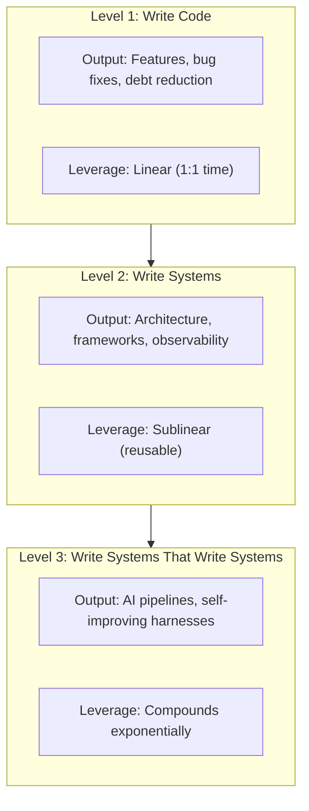

**Suggested filename**: `assets/diagrams/ch01-three-levels-pyramid.mmd`

---

#### Opportunity 2: Meta-Engineer Skill Stack Pyramid
- **Location**: Lines 82-92
- **Type**: Hierarchy/Pyramid diagram
- **Priority**: High
- **Status**: ADDITIONAL (not in original review)
- **Description**: The chapter lists 7 layers of skills that meta-engineers develop over time. The text notes: "Most engineers develop only the bottom two or three layers. Meta-engineers develop the full stack over time." This needs a visual hierarchy showing how the layers build on each other.

  Layers (bottom to top):
  1. Core programming (TypeScript, Python, SQL)
  2. Infrastructure as code (Terraform, Docker, Kubernetes)
  3. Observability engineering (OpenTelemetry, metrics, traces)
  4. Agent orchestration (prompts, tools, verification)
  5. Architectural design (DDD, boundaries, contracts)
  6. Systems thinking (feedback loops, emergent behavior)
  7. Mathematical reasoning (invariants, complexity, optimization)

**Draft Mermaid:**
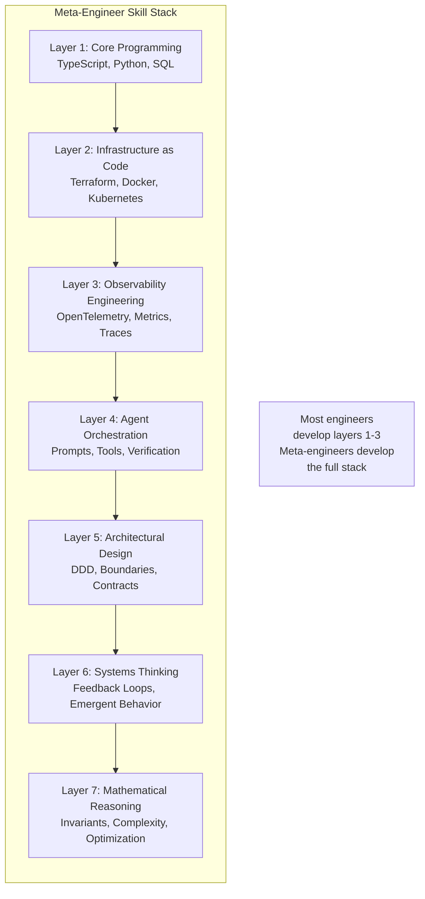

**Suggested filename**: `assets/diagrams/ch01-meta-engineer-skill-stack.mmd`

---

#### Opportunity 3: Builder vs Meta-Builder Comparison
- **Location**: Line 69-79
- **Type**: comparison/parallel flow
- **Priority**: Medium
- **Description**: The table contrasts builder vs meta-builder mindset. A visual comparison with arrows showing the cognitive shift would reinforce the concept.

**Draft Mermaid:**
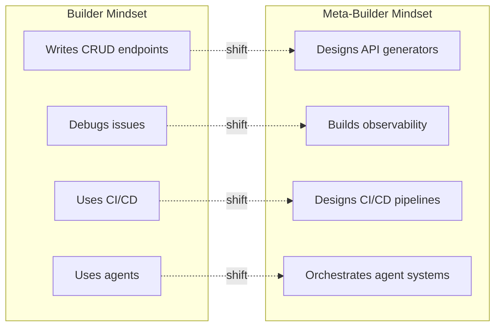

**Suggested filename**: `assets/diagrams/ch01-builder-metabuilder.mmd`

---

#### Opportunity 4: Single-Bet vs Portfolio Game
- **Location**: Line 98-105
- **Type**: comparison flowchart
- **Priority**: High
- **Description**: The mental model difference between single-bet (existential each failure) vs portfolio (failure = data) is critical to the chapter's message.

**Draft Mermaid:**
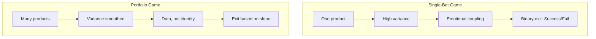

**Suggested filename**: `assets/diagrams/ch01-portfolio-vs-single-bet.mmd`

---

#### Opportunity 5: Cost Curve by Engineering Level
- **Location**: Line 122-138
- **Type**: line graph/comparison
- **Priority**: Medium
- **Description**: Shows how cost per project changes at each level. Level 1 stays flat, Level 2 declines gradually, Level 3 drops exponentially.

**Draft Mermaid:**
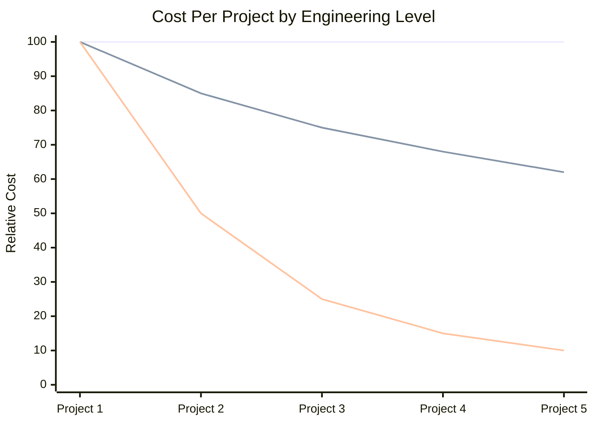

**Suggested filename**: `assets/diagrams/ch01-cost-curve-levels.mmd`

---

#### Opportunity 6: Engineer A vs Engineer B Trajectory (10x Advantage)
- **Location**: Lines 287-293
- **Type**: Comparative timeline/cost curve
- **Priority**: High
- **Status**: ADDITIONAL (not in original review)
- **Description**: Two engineers building 10 payment processing features:
  - Engineer A (Level 1): 3 days per feature × 10 = 30 days total
  - Engineer B (Level 3): 4 hours first + 2 hours each = 22 hours total

  This concrete example shows the "10x output" concept in action. The diagram should show diverging cost curves over time.

**Draft Mermaid:**
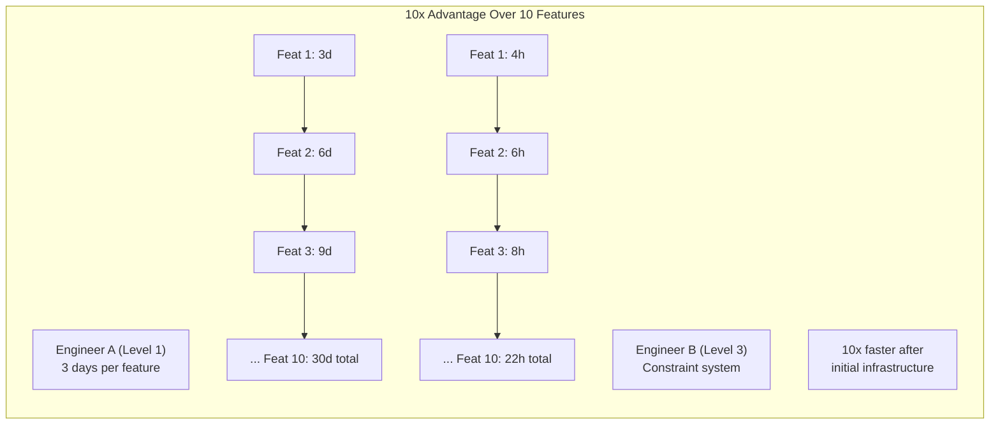

**Suggested filename**: `assets/diagrams/ch01-engineer-trajectory-10x.mmd`

---

#### Opportunity 7: Slope vs Intercept Decision Framework
- **Location**: Lines 152-154
- **Type**: Decision framework / 2x2 decision matrix
- **Priority**: Medium
- **Status**: ADDITIONAL (not in original review)
- **Description**: The chapter introduces a critical decision framework distinguishing between:
  - **Intercept**: "How much traction do you have right now?" (Usually low)
  - **Slope**: "Is leverage increasing?" (This is what matters)

  Rule: "If slope is positive and downside is capped, continue."

**Draft Mermaid:**
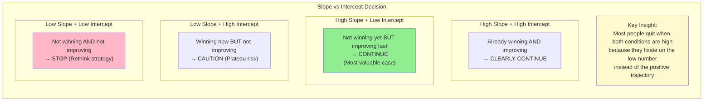

**Suggested filename**: `assets/diagrams/ch01-slope-vs-intercept.mmd`

---

#### Opportunity 8: When to Get a Job - Decision Tree
- **Location**: Lines 168-176
- **Type**: Decision tree / Decision logic
- **Priority**: Medium
- **Status**: ADDITIONAL (not in original review)
- **Description**: The chapter provides explicit decision criteria for when to stop pursuing independent work and take a job. Five key conditions that trigger job search:
  - Runway drops below safety
  - Learning slope flattens
  - Infrastructure stops generalizing
  - Avoided shipping for 6+ months
  - A job would increase future leverage

**Draft Mermaid:**
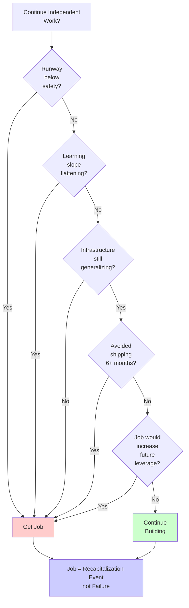

**Suggested filename**: `assets/diagrams/ch01-when-to-get-job.mmd`

---

#### Opportunity 9: Constraint Feedback Loop
- **Location**: Line 248-255
- **Type**: cycle diagram
- **Priority**: High
- **Description**: The feedback loop showing how constraints lead to automated verification is a key compound engineering pattern.

**Draft Mermaid:**
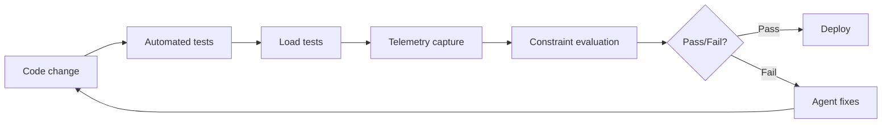

**Suggested filename**: `assets/diagrams/ch01-constraint-feedback-loop.mmd`

---

### ch02-getting-started-with-claude-code.md

#### Opportunity 10: Agent vs Chat Mental Model
- **Location**: Line 1-8
- **Type**: comparison flowchart
- **Priority**: High
- **Description**: The distinction between ChatGPT (copy-paste) vs Claude Code (direct action) is foundational. Visual would clarify the paradigm shift.

**Draft Mermaid:**
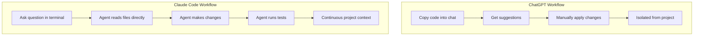

**Suggested filename**: `assets/diagrams/ch02-agent-vs-chat.mmd`

---

#### Opportunity 11: Tool Ecosystem Overview
- **Location**: Line 149-217
- **Type**: radial/hub diagram
- **Priority**: High
- **Description**: The seven core tools (Read, Write, Edit, Glob, Grep, Bash, Observability) need a visual showing their relationships and purposes.

**Draft Mermaid:**
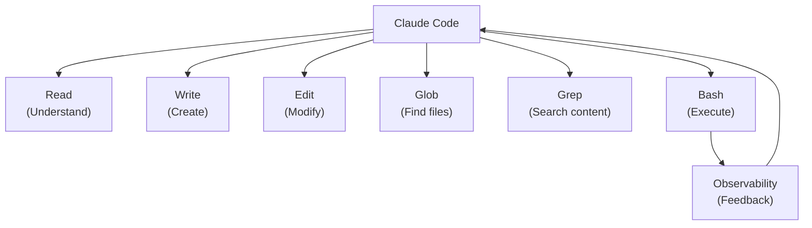

**Suggested filename**: `assets/diagrams/ch02-tool-ecosystem.mmd`

---

#### Opportunity 12: Two-Mode Mental Model
- **Location**: Line 337-399
- **Type**: dual flowchart
- **Priority**: High
- **Description**: Exploration mode vs Implementation mode is the key pattern. Visual would show when to use each and their different goals.

**Draft Mermaid:**
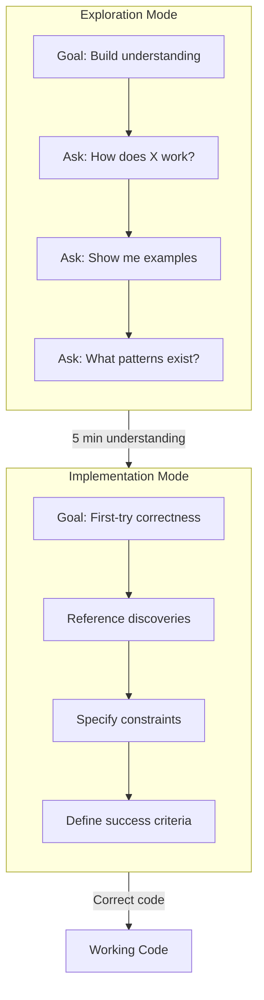

**Suggested filename**: `assets/diagrams/ch02-two-mode-mental-model.mmd`

---

### ch03-prompting-fundamentals.md

#### Opportunity 13: Prompt Anatomy (Context/Instruction/Constraints)
- **Location**: Line 9-49
- **Type**: layered block diagram
- **Priority**: High
- **Description**: The three components (Context, Instruction, Constraints) are foundational. A visual showing how they stack would aid comprehension.

**Draft Mermaid:**
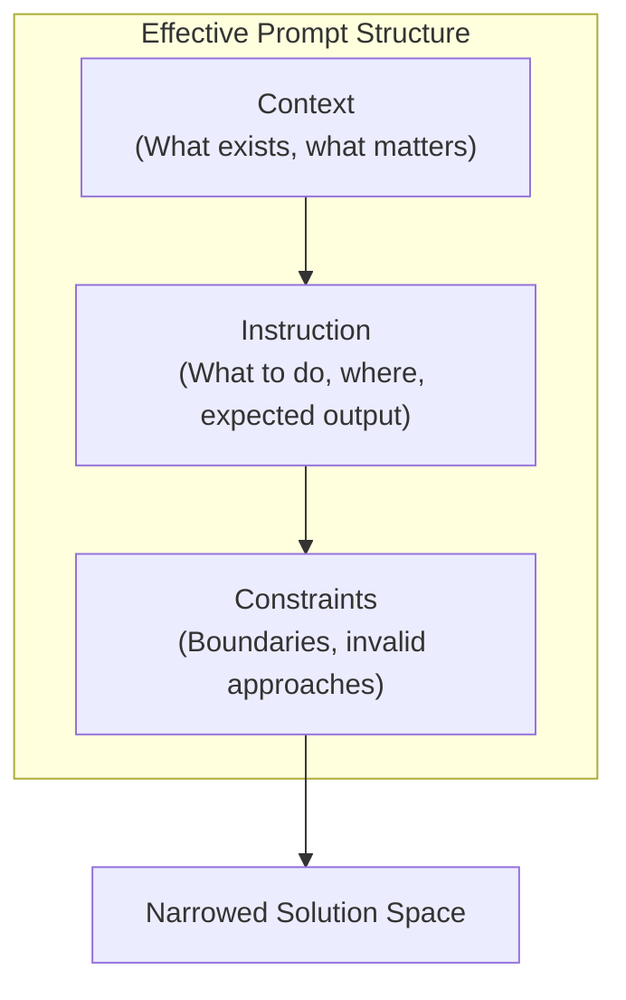

**Suggested filename**: `assets/diagrams/ch03-prompt-anatomy.mmd`

---

#### Opportunity 14: The Constraint Funnel
- **Location**: Line 207-224
- **Type**: funnel diagram
- **Priority**: High
- **Description**: This is explicitly described as a funnel in the text. Shows how each constraint layer reduces possibilities by an order of magnitude.

**Draft Mermaid:**
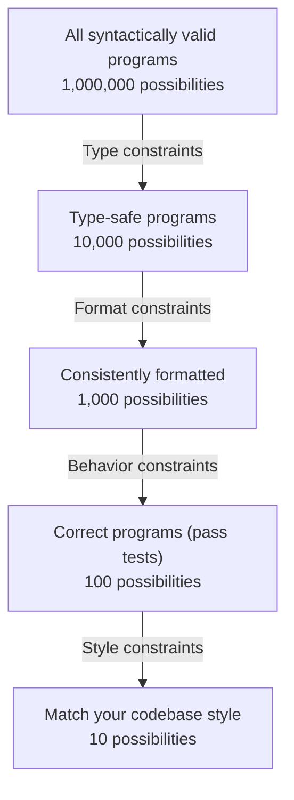

**Suggested filename**: `assets/diagrams/ch03-constraint-funnel.mmd`

---

#### Opportunity 15: Chain-of-Thought Flow
- **Location**: Line 52-149
- **Type**: sequence/flow diagram
- **Priority**: Medium
- **Description**: Shows the reasoning steps before implementation: steps, failure modes, error handling, state transitions, logging.

**Draft Mermaid:**
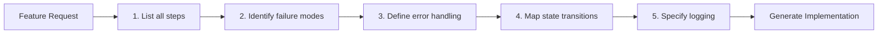

**Suggested filename**: `assets/diagrams/ch03-chain-of-thought.mmd`

---

#### Opportunity 16: Few-Shot Accuracy Curve
- **Location**: Line 231-244
- **Type**: bar chart
- **Priority**: Medium
- **Description**: Shows accuracy improvement: 0 examples (40-60%), 1 example (60-75%), 2-3 examples (85-95%).

**Draft Mermaid:**
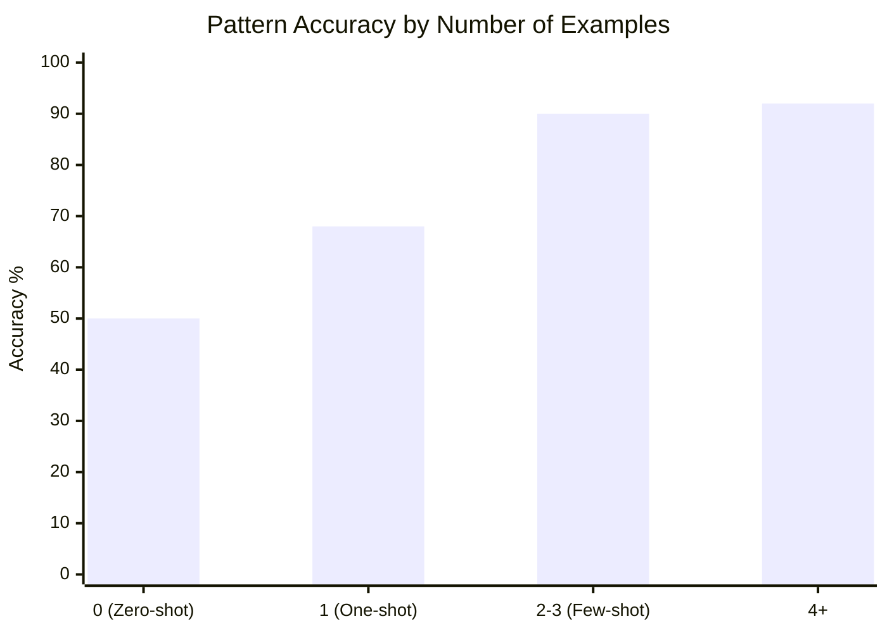

**Suggested filename**: `assets/diagrams/ch03-few-shot-accuracy.mmd`

---

### ch04-writing-your-first-claude-md.md

#### Opportunity 17: WHY-WHAT-HOW Framework
- **Location**: Line 44-86
- **Type**: three-column layout
- **Priority**: High
- **Description**: The three dimensions of effective CLAUDE.md need visual representation showing their distinct purposes.

**Draft Mermaid:**
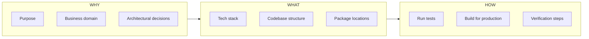

**Suggested filename**: `assets/diagrams/ch04-why-what-how.mmd`

---

#### Opportunity 18: Hierarchical CLAUDE.md Structure
- **Location**: Line 165-218
- **Type**: tree diagram
- **Priority**: High
- **Description**: Shows how CLAUDE.md files distribute across monorepo: root (30-50 lines), domain (200-300 lines), subdomain files.

**Draft Mermaid:**
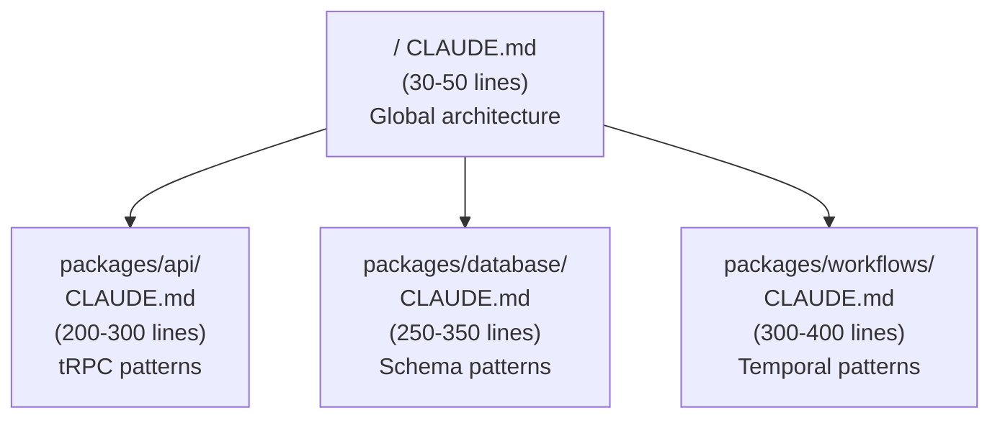

**Suggested filename**: `assets/diagrams/ch04-hierarchical-claude-md.mmd`

---

#### Opportunity 19: Context Relevance Comparison
- **Location**: Line 196-209
- **Type**: before/after comparison
- **Priority**: Medium
- **Description**: Shows monolithic (10,000 lines, 8% relevant) vs hierarchical (340 lines, 95% relevant) context loading.

**Draft Mermaid:**
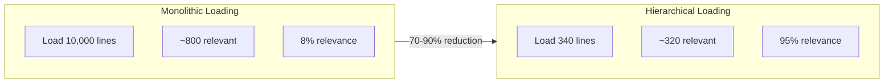

**Suggested filename**: `assets/diagrams/ch04-context-relevance.mmd`

---

#### Opportunity 20: Instruction-Following Degradation
- **Location**: Line 29-43
- **Type**: line graph
- **Priority**: Medium
- **Description**: Shows how instruction-following accuracy degrades as instruction count increases (smaller models exponential, larger models linear).

**Draft Mermaid:**
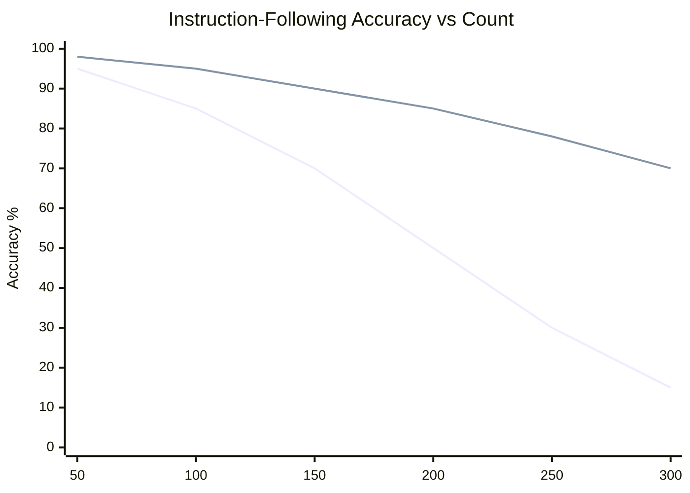

**Suggested filename**: `assets/diagrams/ch04-instruction-degradation.mmd`

---

### ch05-the-12-factor-agent.md

#### Opportunity 21: Reliability Cascade (0.95^N)
- **Location**: Line 11-23
- **Type**: line/bar chart
- **Priority**: High
- **Description**: The exponential reliability degradation (0.95^N) is the core motivation. Visual would make the math visceral.

**Draft Mermaid:**
```mermaid
xychart-beta
    title "Workflow Reliability (95% per-action success)"
    x-axis ["5 steps", "10 steps", "15 steps", "20 steps", "25 steps", "30 steps"]
    y-axis "Overall Success %" 0 --> 100
    bar [77, 60, 46, 36, 28, 21]
```

**Suggested filename**: `assets/diagrams/ch05-reliability-cascade.mmd`

---

#### Opportunity 22: Four-Turn Framework
- **Location**: Line 26-36
- **Type**: cycle diagram
- **Priority**: High
- **Description**: The four turns (Understand, Decide, Execute, Verify) that production agents need vs demo agents (just Input, LLM, Action).

**Draft Mermaid:**
```mermaid
flowchart LR
    subgraph Demo["Demo Agent (3 steps)"]
        D1["Input"] --> D2["LLM"] --> D3["Action"]
    end
    subgraph Production["Production Agent (4 turns)"]
        P1["1. Understand\n(verify context)"] --> P2["2. Decide\n(choose response)"]
        P2 --> P3["3. Execute\n(perform task)"]
        P3 --> P4["4. Verify\n(confirm success)"]
    end
```

**Suggested filename**: `assets/diagrams/ch05-four-turn-framework.mmd`

---

#### Opportunity 23: Reliability Stack Layers
- **Location**: Line 38-46
- **Type**: layered stack
- **Priority**: Medium
- **Description**: The four layers: task decomposition, pre-action validation, post-action verification, human escalation.

**Draft Mermaid:**
```mermaid
flowchart TB
    subgraph Stack["Reliability Stack"]
        L4["Layer 4: Human Escalation\nKnow when to stop and ask"]
        L3["Layer 3: Post-Action Verification\nConfirm outcomes, not just responses"]
        L2["Layer 2: Pre-Action Validation\nCheck prerequisites before acting"]
        L1["Layer 1: Task Decomposition\nBreak 30-step into 5-10 step agents"]
    end
    L1 --> L2 --> L3 --> L4
```

**Suggested filename**: `assets/diagrams/ch05-reliability-stack.mmd`

---

#### Opportunity 24: 12 Factors Overview
- **Location**: Line 49-459
- **Type**: grouped organization chart
- **Priority**: High
- **Description**: The 12 factors organized into Foundation (1-5), Reliability (6-9), Scale (10-12) phases.

**Draft Mermaid:**
```mermaid
flowchart TB
    subgraph Foundation["Foundation (Factors 1-5)"]
        F1["1. NL to Tool Calls"]
        F2["2. Own Your Prompts"]
        F3["3. Own Your Context"]
        F4["4. Tools = Structured Output"]
        F5["5. Unified State"]
    end
    subgraph Reliability["Reliability (Factors 6-9)"]
        F6["6. Launch/Pause/Resume"]
        F7["7. Human Tools"]
        F8["8. Own Control Flow"]
        F9["9. Compact Errors"]
    end
    subgraph Scale["Scale (Factors 10-12)"]
        F10["10. Small Focused Agents"]
        F11["11. Trigger Anywhere"]
        F12["12. Stateless Reducer"]
    end
    Foundation --> Reliability --> Scale
```

**Suggested filename**: `assets/diagrams/ch05-12-factors-overview.mmd`

---

#### Opportunity 25: Agent Loop with Tool Classification
- **Location**: Line 284-319
- **Type**: flowchart with decision nodes
- **Priority**: Medium
- **Description**: Shows how the agent loop classifies tools (immediate, requires_approval, terminal, error) and branches accordingly.

**Draft Mermaid:**
```mermaid
flowchart TB
    Start["Get Next Action"] --> Classify{"Classify Tool"}
    Classify -->|"immediate"| Execute["Execute & Continue"]
    Classify -->|"requires_approval"| Pause["Request Approval\nPause Loop"]
    Classify -->|"terminal"| Complete["Mark Complete\nEnd Loop"]
    Classify -->|"error"| Error{"Errors >= 3?"}
    Error -->|"No"| Retry["Increment & Retry"]
    Error -->|"Yes"| Escalate["Escalate to Human"]
    Execute --> Start
    Retry --> Start
```

**Suggested filename**: `assets/diagrams/ch05-agent-loop.mmd`

---

### ch06-the-verification-ladder.md

#### Opportunity 26: Verification Ladder (Enhanced)
- **Location**: Line 7-34
- **Type**: vertical ladder/stack
- **Priority**: High
- **Description**: The ladder from Level 1 (Static Types) to Level 6 (Formal Verification) is already shown in ASCII. A proper Mermaid diagram would look more polished.

**Draft Mermaid:**
```mermaid
flowchart TB
    subgraph Ladder["Verification Ladder"]
        L6["Level 6: Formal Verification\nTLA+, Z3 - Prove impossibility"]
        L5["Level 5: Property-Based Testing\nfast-check - 1000s of inputs"]
        L4["Level 4: Integration Tests\nComponents working together"]
        L3["Level 3: Unit Tests\nIndividual functions"]
        L2["Level 2: Runtime Validation\nZod, io-ts - Boundary validation"]
        L1["Level 1: Static Types\nTypeScript - Compile-time errors"]
    end
    L1 --> L2 --> L3 --> L4 --> L5 --> L6
```

**Suggested filename**: `assets/diagrams/ch06-verification-ladder.mmd`

---

#### Opportunity 27: Verification Sandwich Pattern
- **Location**: Line 286-332
- **Type**: three-layer sandwich
- **Priority**: High
- **Description**: Pre-verification (baseline) -> Generation -> Post-verification (delta) is a key pattern.

**Draft Mermaid:**
```mermaid
flowchart TB
    subgraph Pre["1. PRE-VERIFICATION (Baseline)"]
        P1["Run tests -> All pass"]
        P2["Type check -> Clean"]
        P3["Linter -> Clean"]
    end
    subgraph Gen["2. GENERATION"]
        G1["Make the code change"]
    end
    subgraph Post["3. POST-VERIFICATION (Delta)"]
        O1["Run tests -> Detect failures"]
        O2["Type check -> Find errors"]
        O3["Linter -> Catch issues"]
    end
    Pre --> Gen --> Post
    Post -->|"Failures = new code"| Fix["Fix Issues"]
```

**Suggested filename**: `assets/diagrams/ch06-verification-sandwich.mmd`

---

#### Opportunity 28: Test-Driven Prompting Search Space
- **Location**: Line 334-402
- **Type**: comparison/funnel
- **Priority**: Medium
- **Description**: Shows how tests narrow the search space from millions of implementations to tens.

**Draft Mermaid:**
```mermaid
flowchart LR
    subgraph Without["Without Tests"]
        W1["~1,000,000 implementations"]
        W2["~10 correct"]
        W3["0.001% success"]
    end
    subgraph With["With 5 Tests"]
        T1["~50 implementations"]
        T2["~30 correct"]
        T3["60% success"]
    end
    Without -->|"600x improvement"| With
```

**Suggested filename**: `assets/diagrams/ch06-test-driven-search-space.mmd`

---

### ch07-quality-gates-that-compound.md

#### Opportunity 29: State Space Reduction (Set Intersection)
- **Location**: Line 9-39
- **Type**: Venn diagram/funnel
- **Priority**: High
- **Description**: Shows how S0 ∩ G1 ∩ G2 ∩ G3 progressively reduces the valid program set.

**Draft Mermaid:**
```mermaid
flowchart TB
    S0["S0: 1,000,000\nAll syntactically valid"]
    S1["S1: 50,000\nAfter type checker (95% eliminated)"]
    S2["S2: 5,000\nAfter linter (99.5% eliminated)"]
    S3["S3: 200\nAfter unit tests (99.98% eliminated)"]
    S0 -->|"∩ G1"| S1
    S1 -->|"∩ G2"| S2
    S2 -->|"∩ G3"| S3
```

**Suggested filename**: `assets/diagrams/ch07-state-space-reduction.mmd`

---

#### Opportunity 30: Compounding Formula Visual
- **Location**: Line 139-177
- **Type**: comparison bar chart
- **Priority**: High
- **Description**: Shows linear thinking (105%) vs multiplicative reality (165%) with the 60% compounding bonus.

**Draft Mermaid:**
```mermaid
xychart-beta
    title "Quality Improvement: Linear vs Compound"
    x-axis ["Linear Sum", "Compound Product", "Bonus"]
    y-axis "Improvement %" 0 --> 180
    bar [105, 165, 60]
```

**Suggested filename**: `assets/diagrams/ch07-compounding-visual.mmd`

---

#### Opportunity 31: Six-Gate Architecture
- **Location**: Line 460-476
- **Type**: pipeline/stack diagram
- **Priority**: High
- **Description**: The six gates (Types, Tests, Linting, CI/CD, DDD, CLAUDE.md) and their relationships.

**Draft Mermaid:**
```mermaid
flowchart LR
    subgraph Gates["Six-Gate Architecture"]
        G1["1. Types\nFoundation"]
        G2["2. Tests\nValidation"]
        G3["3. Linting\nConsistency"]
        G4["4. CI/CD\nAutomation"]
        G5["5. DDD\nArchitecture"]
        G6["6. CLAUDE.md\nContext"]
    end
    G1 --> G2 --> G3 --> G4 --> G5 --> G6
    G6 -.->|"Feedback"| G1
```

**Suggested filename**: `assets/diagrams/ch07-six-gate-architecture.mmd`

---

#### Opportunity 32: Hook Workflow Cycle
- **Location**: Line 217-330
- **Type**: cycle/sequence diagram
- **Priority**: Medium
- **Description**: Shows how hooks create automatic feedback: Claude writes -> Hook runs -> Error shown -> Claude fixes -> Hook re-runs.

**Draft Mermaid:**
```mermaid
flowchart TB
    A["Claude writes file"] --> B["Post-write hook triggers"]
    B --> C["ESLint + tsc + tests run"]
    C --> D{"Pass?"}
    D -->|"Yes"| E["Continue to next task"]
    D -->|"No"| F["Error shown to Claude"]
    F --> G["Claude reads error"]
    G --> H["Claude fixes code"]
    H --> A
```

**Suggested filename**: `assets/diagrams/ch07-hook-workflow.mmd`

---

### ch08-error-handling-and-debugging.md

#### Opportunity 33: Five-Point Error Classification
- **Location**: Line 9-50
- **Type**: pie/category diagram
- **Priority**: High
- **Description**: Error classification distribution: Context (60%), Rules (15%), Model (10%), Testing (10%), Quality Gate (5%).

**Draft Mermaid:**
```mermaid
pie title "Error Classification Distribution"
    "Context Problem" : 60
    "Rules Problem" : 15
    "Model Problem" : 10
    "Testing Problem" : 10
    "Quality Gate Problem" : 5
```

**Suggested filename**: `assets/diagrams/ch08-error-classification.mmd`

---

#### Opportunity 34: Context Debugging Hierarchy
- **Location**: Line 119-140
- **Type**: pyramid/hierarchy
- **Priority**: High
- **Description**: Four layers for systematic debugging: Context (60%) -> Prompting (25%) -> Model Power (10%) -> Manual Override (5%).

**Draft Mermaid:**
```mermaid
flowchart TB
    L1["Layer 1: CONTEXT\n60% of issues\nAdd missing info, files, examples"]
    L2["Layer 2: PROMPTING\n25% of issues\nRefine instructions, add examples"]
    L3["Layer 3: MODEL POWER\n10% of issues\nEscalate to stronger model"]
    L4["Layer 4: MANUAL OVERRIDE\n5% of issues\nHuman intuition needed"]

    L1 -->|Not fixed| L2
    L2 -->|Not fixed| L3
    L3 -->|Not fixed| L4
```

**Suggested filename**: `assets/diagrams/ch08-context-debugging-hierarchy.mmd`

---

#### Opportunity 35: Learning Loop Cycle
- **Location**: Line 579-622
- **Type**: cycle diagram
- **Priority**: Medium
- **Description**: Problem -> Fix -> Ask "How to prevent?" -> Encode -> Future problems prevented.

**Draft Mermaid:**
```mermaid
flowchart LR
    P["Problem occurs"] --> F["Fix it"]
    F --> Q{"How to prevent<br/>this class?"}
    Q --> E["Encode answer"]
    E --> D{Destination}
    D --> CLAUDE["CLAUDE.md"]
    D --> HOOK["Hook"]
    D --> TEST["Test"]
    D --> LINT["Linter rule"]
```

**Suggested filename**: `assets/diagrams/ch08-learning-loop.mmd`

---

#### Opportunity 36: Clean Slate Recovery Process
- **Location**: Line 514-575
- **Type**: flowchart
- **Priority**: Medium
- **Description**: Recognize stuck pattern -> Document failures -> Start fresh -> Frame with constraints.

**Draft Mermaid:**
```mermaid
flowchart TB
    R["Recognize stuck pattern<br/>(3+ failed attempts)"]
    D["Document what failed<br/>and root cause"]
    S["Start fresh session"]
    F["Frame with explicit<br/>constraints"]
    V["Verify new approach<br/>before implementing"]

    R --> D --> S --> F --> V
```

**Suggested filename**: `assets/diagrams/ch08-clean-slate-recovery.mmd`

---

### ch09-context-engineering-deep-dive.md

#### Opportunity 37: Context Window Anatomy
- **Location**: Line 159-180
- **Type**: capacity diagram
- **Priority**: High
- **Description**: Shows 200K token channel capacity with utilization target (60-80%), information density metrics.

**Draft Mermaid:**
```mermaid
flowchart TB
    subgraph Window["Context Window (200K tokens)"]
        USED["Utilized (60-80%)<br/>120-160K tokens"]
        BUFFER["Buffer (20-40%)<br/>40-80K tokens"]
    end

    USED --> TYPES["Types: High density<br/>~3.5 bits/token"]
    USED --> TESTS["Tests: Very high<br/>~4.3 bits/token"]
    USED --> COMMENTS["Comments: Low<br/>~0.15 bits/token"]
```

**Suggested filename**: `assets/diagrams/ch09-context-window-anatomy.mmd`

---

#### Opportunity 38: Progressive Disclosure Architecture
- **Location**: Line 182-259
- **Type**: layered tree diagram
- **Priority**: High
- **Description**: Three levels: Metadata (always loaded, ~50 tokens) -> Core (on trigger, ~1000 tokens) -> Supplementary (as needed).

**Draft Mermaid:**
```mermaid
flowchart TB
    L1["Level 1: Metadata<br/>Always loaded<br/>~50-100 tokens per skill"]
    L2["Level 2: Core Instructions<br/>Loaded when triggered<br/>~500-2000 tokens"]
    L3["Level 3: Supplementary<br/>Loaded as needed<br/>Deep-dive info"]

    L1 -->|Skill triggered| L2
    L2 -->|Reference found| L3
```

**Suggested filename**: `assets/diagrams/ch09-progressive-disclosure.mmd`

---

#### Opportunity 39: Signal-to-Noise Degradation
- **Location**: Line 261-280
- **Type**: line chart
- **Priority**: Medium
- **Description**: Shows signal degradation over conversation: 1-20 msgs (90%), 21-50 (60%), 51-100 (30%), 100+ (10%).

**Draft Mermaid:**
```mermaid
xychart-beta
    title "Signal-to-Noise Degradation in Long Sessions"
    x-axis ["1-20 msgs", "21-50 msgs", "51-100 msgs", "100+ msgs"]
    y-axis "Signal %" 0 --> 100
    line [90, 60, 30, 10]
```

**Suggested filename**: `assets/diagrams/ch09-signal-degradation.mmd`

---

#### Opportunity 40: Entropy Reduction Through Gates
- **Location**: Line 43-65
- **Type**: funnel with bits
- **Priority**: Medium
- **Description**: Shows entropy dropping: 20 bits (1M programs) -> 15 bits (32K) -> 12 bits (4K) -> 5 bits (32).

**Draft Mermaid:**
```mermaid
flowchart TB
    A["H = 20 bits<br/>1M+ programs"] -->|Type Checker| B
    B["H = 15 bits<br/>32K programs"] -->|Linter| C
    C["H = 12 bits<br/>4K programs"] -->|Tests| D
    D["H = 5 bits<br/>32 programs"]
```

**Suggested filename**: `assets/diagrams/ch09-entropy-reduction.mmd`

---

### ch10-the-ralph-loop.md

#### Opportunity 41: RALPH Loop Cycle
- **Location**: Line 66-81
- **Type**: cycle diagram
- **Priority**: High
- **Description**: 7-step cycle: Select task -> Implement -> Quality checks -> Commit -> Update status -> Document learnings -> Spawn new agent.

**Draft Mermaid:**
```mermaid
flowchart TB
    A["1. Select highest-priority<br/>incomplete task"] --> B["2. Implement the<br/>single task"]
    B --> C["3. Run quality checks<br/>(types, tests)"]
    C --> D{"4. Checks pass?"}
    D -->|No| B
    D -->|Yes| E["5. Commit changes"]
    E --> F["6. Update task status"]
    F --> G["7. Document learnings"]
    G --> H["SPAWN NEW AGENT"]
    H --> A
```

**Suggested filename**: `assets/diagrams/ch10-ralph-loop-cycle.mmd`

---

#### Opportunity 42: Four-Phase Cycle Distribution
- **Location**: Line 83-141
- **Type**: pie chart
- **Priority**: Medium
- **Description**: Plan (40%), Work (20%), Review (40%), Compound (critical).

**Draft Mermaid:**
```mermaid
pie title "RALPH Four-Phase Cycle"
    "Plan" : 40
    "Work" : 20
    "Review" : 40
```

**Suggested filename**: `assets/diagrams/ch10-four-phase-pie.mmd`

---

#### Opportunity 43: Three-Layer Memory Architecture
- **Location**: Line 143-219
- **Type**: layered diagram
- **Priority**: High
- **Description**: Git History -> Documentation Files (AGENTS.md) -> Task Files (TASKS.md).

**Draft Mermaid:**
```mermaid
flowchart TB
    subgraph Memory["Persistent Memory Layers"]
        L1["Layer 1: Git History<br/>Code changes, commits"]
        L2["Layer 2: Documentation<br/>AGENTS.md, CLAUDE.md"]
        L3["Layer 3: Task Files<br/>TASKS.md, status tracking"]
    end

    AGENT["New Agent Instance"] --> L1
    AGENT --> L2
    AGENT --> L3

    L1 -.->|Learnings| L2
    L2 -.->|Context| AGENT
    L3 -.->|Next task| AGENT
```

**Suggested filename**: `assets/diagrams/ch10-memory-architecture.mmd`

---

#### Opportunity 44: Multi-Agent Coordination
- **Location**: Line 289-320
- **Type**: org chart
- **Priority**: Medium
- **Description**: Human Engineer at top coordinating Agent 1, 2, 3 working on different tasks, sharing Git + AGENTS.md.

**Draft Mermaid:**
```mermaid
flowchart TB
    H["Human Engineer<br/>(Architecture + Strategy)"]

    H --> A1["Agent 1<br/>Task A"]
    H --> A2["Agent 2<br/>Task B"]
    H --> A3["Agent 3<br/>Task C"]

    A1 & A2 & A3 --> SHARED["Shared Memory<br/>Git + AGENTS.md"]
```

**Suggested filename**: `assets/diagrams/ch10-multi-agent-coordination.mmd`

---

### ch11-sub-agent-architecture.md

#### Opportunity 45: Sub-Agent Team Structure
- **Location**: Line 31-44
- **Type**: org chart
- **Priority**: High
- **Description**: Orchestrator coordinating Backend Engineer, Frontend Engineer, QA Engineer, Code Reviewer.

**Draft Mermaid:**
```mermaid
flowchart TB
    O["Orchestrator Agent"]

    O --> BE["Backend Engineer<br/>API, business logic, DB"]
    O --> FE["Frontend Engineer<br/>UI, state, routing"]
    O --> QA["QA Engineer<br/>Tests, coverage"]
    O --> CR["Code Reviewer<br/>(Read-Only)"]

    BE -->|Hands off| QA
    FE -->|Hands off| QA
    QA -->|Hands off| CR
```

**Suggested filename**: `assets/diagrams/ch11-sub-agent-team.mmd`

---

#### Opportunity 46: Three-Layer Context Hierarchy
- **Location**: Line 46-135
- **Type**: tree diagram
- **Priority**: High
- **Description**: Root CLAUDE.md -> Agent Behavioral Flows -> Package-Specific Context.

**Draft Mermaid:**
```mermaid
flowchart TB
    L1["Layer 1: Root CLAUDE.md<br/>Shared patterns"]

    L2A["Layer 2: backend-engineer.md<br/>API workflow"]
    L2B["Layer 2: frontend-engineer.md<br/>UI workflow"]
    L2C["Layer 2: qa-engineer.md<br/>Test workflow"]

    L3A["Layer 3: packages/api/CLAUDE.md"]
    L3B["Layer 3: packages/ui/CLAUDE.md"]

    L1 --> L2A & L2B & L2C
    L2A --> L3A
    L2B --> L3B
```

**Suggested filename**: `assets/diagrams/ch11-context-hierarchy.mmd`

---

#### Opportunity 47: Actor-Critic Loop
- **Location**: Line 502-583
- **Type**: cycle diagram
- **Priority**: High
- **Description**: Actor generates -> Critic reviews 8 dimensions -> Findings with severity -> Actor refactors -> Repeat until approved.

**Draft Mermaid:**
```mermaid
flowchart LR
    A["Actor generates<br/>implementation"]
    C["Critic reviews<br/>8 dimensions"]
    F["Findings with<br/>severity ratings"]
    R["Actor refactors<br/>to address issues"]
    CHECK{Approved?}

    A --> C --> F --> CHECK
    CHECK -->|No| R
    R --> A
    CHECK -->|Yes| DONE["Ready for human review"]
```

**Suggested filename**: `assets/diagrams/ch11-actor-critic-loop.mmd`

---

#### Opportunity 48: Parallel vs Sequential Agents
- **Location**: Line 585-634
- **Type**: comparison diagram
- **Priority**: Medium
- **Description**: Sequential (160 min) vs Parallel (9 min) for updating 20 packages.

**Draft Mermaid:**
```mermaid
flowchart LR
    subgraph Sequential["Sequential: 160 min"]
        S1["Pkg 1"] --> S2["Pkg 2"] --> S3["..."] --> S20["Pkg 20"]
    end

    subgraph Parallel["Parallel: 9 min"]
        P1["Agent 1: Pkg 1"]
        P2["Agent 2: Pkg 2"]
        P3["..."]
        P20["Agent 20: Pkg 20"]
    end
```

**Suggested filename**: `assets/diagrams/ch11-parallel-vs-sequential.mmd`

---

### ch12-development-workflows.md

#### Opportunity 49: Plan Mode Two-Phase Pattern
- **Location**: Line 12-28
- **Type**: flowchart
- **Priority**: High
- **Description**: Phase 1 (Plan Mode): Understand -> Analyze -> Propose -> Validate -> Exit. Phase 2 (Execution): Follow plan -> Write code -> Run tests -> Done.

**Draft Mermaid:**
```mermaid
flowchart TB
    subgraph Phase1["Phase 1: PLAN MODE"]
        P1["Understand requirements"]
        P2["Analyze architecture"]
        P3["Identify dependencies"]
        P4["Propose approaches"]
        P5["Validate with human"]
        P6["Exit plan mode"]
        P1 --> P2 --> P3 --> P4 --> P5 --> P6
    end

    subgraph Phase2["Phase 2: EXECUTION"]
        E1["Follow the plan"]
        E2["Write code"]
        E3["Run tests"]
        E4["Fix issues"]
        E5["Done"]
        E1 --> E2 --> E3 --> E4 --> E5
    end

    P6 --> E1
```

**Suggested filename**: `assets/diagrams/ch12-plan-mode-phases.mmd`

---

#### Opportunity 50: Git Worktrees Parallel Development
- **Location**: Line 79-170
- **Type**: parallel structure diagram
- **Priority**: High
- **Description**: Main worktree + multiple feature worktrees sharing .git repository.

**Draft Mermaid:**
```mermaid
flowchart TB
    GIT[".git/<br/>Shared Repository"]

    MAIN["my-project/<br/>Main worktree<br/>(main branch)"]
    WT1["../feature-auth/<br/>Worktree 1<br/>(feature/auth)"]
    WT2["../feature-api/<br/>Worktree 2<br/>(feature/api)"]
    WT3["../feature-ui/<br/>Worktree 3<br/>(feature/ui)"]

    MAIN --> GIT
    WT1 -.->|linked| GIT
    WT2 -.->|linked| GIT
    WT3 -.->|linked| GIT
```

**Suggested filename**: `assets/diagrams/ch12-git-worktrees.mmd`

---

#### Opportunity 51: Incremental Development Pattern
- **Location**: Line 172-256
- **Type**: iterative cycle
- **Priority**: Medium
- **Description**: Request smallest piece -> Run immediately -> Validate -> Fix issues -> Use as context for next.

**Draft Mermaid:**
```mermaid
flowchart TB
    A["Request smallest<br/>useful piece"]
    B["Run code<br/>immediately"]
    C["Validate behavior"]
    D{Issues?}
    E["Fix issues"]
    F["Use working code<br/>as context"]

    A --> B --> C --> D
    D -->|Yes| E --> B
    D -->|No| F --> A
```

**Suggested filename**: `assets/diagrams/ch12-incremental-development.mmd`

---

### ch13-building-the-harness.md

#### Opportunity 52: Four-Layer Harness Architecture
- **Location**: Line 3-16
- **Type**: concentric layers diagram
- **Priority**: High
- **Description**: LLM (center) -> Layer 1: Claude Code -> Layer 2: Repository Engineering -> Layer 3: Meta-Engineering -> Layer 4: Closed-Loop Optimization.

**Draft Mermaid:**
```mermaid
flowchart TB
    subgraph L4["Layer 4: Closed-Loop Optimization"]
        subgraph L3["Layer 3: Meta-Engineering"]
            subgraph L2["Layer 2: Repository Engineering"]
                subgraph L1["Layer 1: Claude Code"]
                    LLM["LLM"]
                end
            end
        end
    end

    L1 --> L1T["CLAUDE.md, Hooks,<br/>Constraints"]
    L2 --> L2T["Observability, Tests,<br/>DDD Structure"]
    L3 --> L3T["Workflows, Meta-tests,<br/>Agent Swarms"]
    L4 --> L4T["Constraints, Telemetry,<br/>Auto-optimization"]
```

**Suggested filename**: `assets/diagrams/ch13-four-layer-harness.mmd`

---

#### Opportunity 53: Closed-Loop Optimization Cycle
- **Location**: Line 293-345
- **Type**: control loop diagram
- **Priority**: High
- **Description**: Service under load -> Telemetry captured -> Constraints evaluated -> Violations detected? -> Agent proposes fix -> Apply -> Re-test -> Loop.

**Draft Mermaid:**
```mermaid
flowchart TB
    A["Service under load"]
    B["Telemetry captured<br/>(memory, latency, errors)"]
    C["Constraints evaluated"]
    D{Violations?}
    E["Agent proposes fix"]
    F["Apply patch"]
    G["Re-test"]
    H["Constraints satisfied"]
    I["Escalate to human"]

    A --> B --> C --> D
    D -->|No| H
    D -->|Yes| E --> F --> G --> C

    G -->|Max iterations| I
```

**Suggested filename**: `assets/diagrams/ch13-closed-loop-optimization.mmd`

---

#### Opportunity 54: Linear vs Exponential Productivity
- **Location**: Line 416-470
- **Type**: comparison diagram
- **Priority**: Medium
- **Description**: Linear productivity (build features: 8N hours saved) vs Exponential (build tools: tools build tools).

**Draft Mermaid:**
```mermaid
flowchart LR
    subgraph Linear["Linear: Build Features"]
        LF1["Day 1: Feature A"]
        LF2["Day 2: Feature B"]
        LF3["Day N: Feature N"]
        LF1 --> LF2 --> LF3
    end

    subgraph Exponential["Exponential: Build Tools"]
        ET1["Week 1: Build scaffolding tool"]
        ET2["Week 2: Build 3 more tools"]
        ET3["Week 4: Tools build tools"]
        ET1 --> ET2 --> ET3
    end
```

**Suggested filename**: `assets/diagrams/ch13-linear-vs-exponential.mmd`

---

#### Opportunity 55: MCP Resource Query Flow
- **Location**: Line 474-551
- **Type**: sequence diagram
- **Priority**: Medium
- **Description**: Agent queries MCP server for dynamic context (architecture graph, pattern examples, git history).

**Draft Mermaid:**
```mermaid
flowchart LR
    AGENT["AI Agent"] --> MCP["MCP Server"]
    MCP --> ARCH["architecture-graph://auth"]
    MCP --> PATT["pattern-examples://factory"]
    MCP --> GIT["recent-changes://last-week"]
    MCP --> COV["test-coverage://modules"]

    ARCH --> R1["Dependency graph"]
    PATT --> R2["Code examples"]
    GIT --> R3["History summary"]
    COV --> R4["Coverage metrics"]
```

**Suggested filename**: `assets/diagrams/ch13-mcp-query-flow.mmd`

---

## Priority Summary

### High Priority (Should Have) - 31 diagrams
Most impactful diagrams that significantly improve understanding of core concepts.

### Medium Priority (Nice to Have) - 24 diagrams
Supplementary diagrams that enhance specific sections.

---

## Recommended Implementation Order

### Phase 1: Foundation Concepts (Chapters 1-4)
1. ch01: Three Levels Pyramid
2. ch01: Meta-Engineer Skill Stack
3. ch01: Constraint Feedback Loop
4. ch02: Agent vs Chat Mental Model
5. ch02: Two-Mode Mental Model
6. ch03: Constraint Funnel
7. ch04: WHY-WHAT-HOW Framework
8. ch04: Hierarchical CLAUDE.md

### Phase 2: Verification & Quality (Chapters 5-7)
9. ch05: Reliability Cascade
10. ch05: 12 Factors Overview
11. ch06: Verification Ladder
12. ch06: Verification Sandwich
13. ch07: State Space Reduction
14. ch07: Compounding Formula
15. ch07: Six-Gate Architecture

### Phase 3: Advanced Patterns (Chapters 8-13)
16. ch08: Error Classification
17. ch08: Context Debugging Hierarchy
18. ch09: Context Window Anatomy
19. ch09: Progressive Disclosure
20. ch10: RALPH Loop Cycle
21. ch10: Memory Architecture
22. ch11: Sub-Agent Team
23. ch11: Actor-Critic Loop
24. ch12: Plan Mode Phases
25. ch12: Git Worktrees
26. ch13: Four-Layer Harness
27. ch13: Closed-Loop Optimization

---

## Notes

- All Mermaid diagrams use flowchart TB/LR or xychart-beta for charts
- Some diagrams may need refinement after implementation
- Consider SVG export for print publication
- Cross-reference diagrams in chapter text using ``
