# Diagram Opportunities - 2026-01-28

## Summary
- Files scanned: 15 chapters (ch01-ch15)
- Diagram opportunities: 59 (High: 35, Medium: 24)
- New since last review: 8 opportunities in ch14-ch15

---

## New Opportunities (Chapters 14-15)

### ch14-the-meta-engineer-playbook.md

#### Opportunity 52: Skill Atrophy Ladder
- **Location**: Line 281-301
- **Type**: pyramid/ladder diagram
- **Priority**: High
- **Description**: The five levels of skill atrophy from "Prompt operator" to "Architect" with career implications at each level. Critical visualization for career progression discussion.

**Draft Mermaid:**
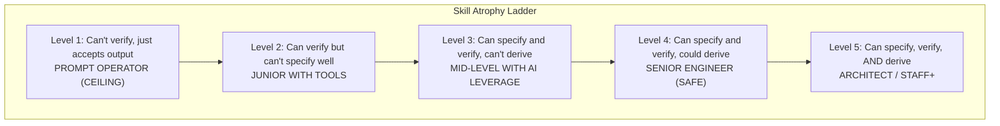

**Suggested filename**: `assets/diagrams/ch14-skill-atrophy-ladder.mmd`

---

#### Opportunity 53: Six Waves of AI Development Timeline
- **Location**: Line 314-326
- **Type**: timeline/progression diagram
- **Priority**: High
- **Description**: Shows the evolution from Wave 1 (traditional coding) to Wave 6 (agent fleets) with timing and key characteristics. Core concept for understanding the industry trajectory.

**Draft Mermaid:**
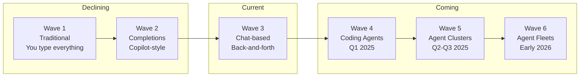

**Suggested filename**: `assets/diagrams/ch14-six-waves-timeline.mmd`

---

#### Opportunity 54: Four Automation Levels
- **Location**: Line 546-581
- **Type**: stacked progression diagram
- **Priority**: High
- **Description**: Shows Level 0 (Manual, 1x) to Level 3 (Meta-Infrastructure, 100-500x) with productivity multipliers. Key concept for understanding compound leverage.

**Draft Mermaid:**
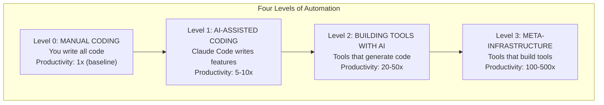

**Suggested filename**: `assets/diagrams/ch14-four-automation-levels.mmd`

---

#### Opportunity 55: Fleet Model Evolution
- **Location**: Line 371-383
- **Type**: comparison flowchart
- **Priority**: High
- **Description**: Shows the evolution of development from "Human → Code" to "Human → Supervisor → Agents → Code" across different waves.

**Draft Mermaid:**
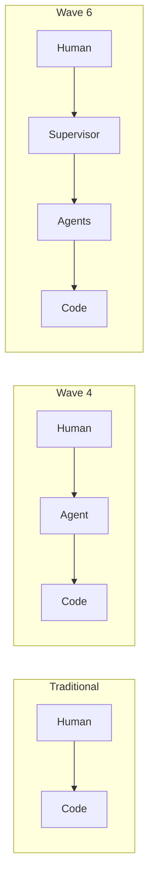

**Suggested filename**: `assets/diagrams/ch14-fleet-model-evolution.mmd`

---

#### Opportunity 56: Leverage Stack (Skill Hierarchy)
- **Location**: Line 250-266
- **Type**: layered stack diagram
- **Priority**: Medium
- **Description**: Shows skills from "Understanding the problem" (KEEP SHARP) to "Boilerplate" (GOOD RIDDANCE). Already in ASCII, would benefit from proper diagram.

**Draft Mermaid:**
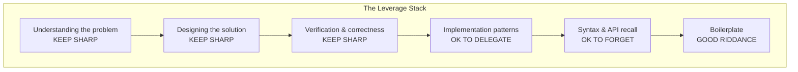

**Suggested filename**: `assets/diagrams/ch14-leverage-stack.mmd`

---

#### Opportunity 57: ROI Calculation Flow
- **Location**: Line 582-607
- **Type**: decision flowchart
- **Priority**: Medium
- **Description**: Shows the calculation for when to build a tool vs keeping workflow ad-hoc: Value calculation → Build time estimation → Payback period → Decision.

**Draft Mermaid:**
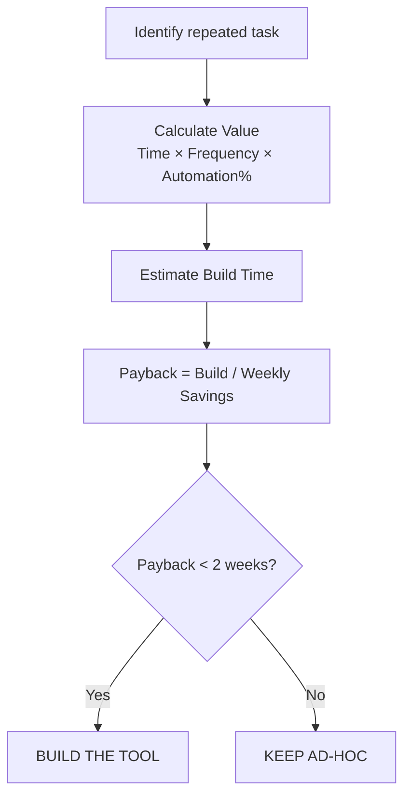

**Suggested filename**: `assets/diagrams/ch14-roi-calculation.mmd`

---

### ch15-model-strategy-and-cost-optimization.md

#### Opportunity 58: Three-Tier Model Hierarchy
- **Location**: Line 44-112
- **Type**: tiered comparison diagram
- **Priority**: High
- **Description**: Shows Haiku (Tier 1, cheap/fast), Sonnet (Tier 2, workhorse), Opus (Tier 3, maximum capability) with use cases, costs, and when to use each.

**Draft Mermaid:**
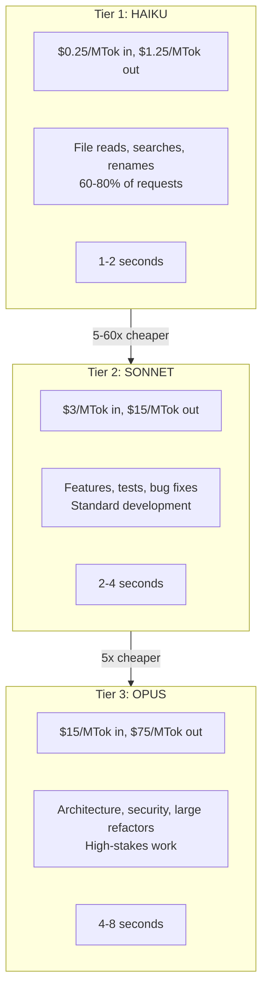

**Suggested filename**: `assets/diagrams/ch15-three-tier-model-hierarchy.mmd`

---

#### Opportunity 59: Progressive Model Escalation Flow
- **Location**: Line 169-208
- **Type**: decision flowchart with fallback
- **Priority**: High
- **Description**: Shows the escalation pattern: Start with Haiku → Quality gates → Pass/Fail → Escalate to Sonnet → Quality gates → Escalate to Opus.

**Draft Mermaid:**
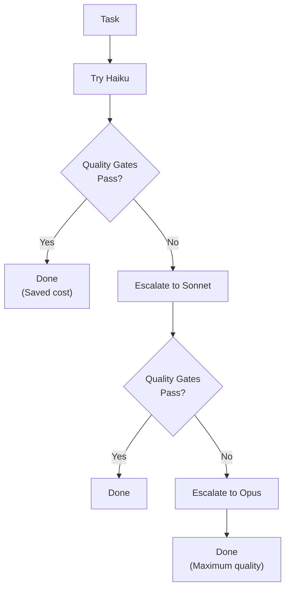

**Suggested filename**: `assets/diagrams/ch15-progressive-escalation.mmd`

---

#### Opportunity 60: Multi-Layer Timeout Protection
- **Location**: Line 238-351
- **Type**: layered defense diagram
- **Priority**: High
- **Description**: Shows 4 layers of cost protection: Job-level timeouts → Request-level token caps → Input size limits → Budget alerts/hard caps.

**Draft Mermaid:**
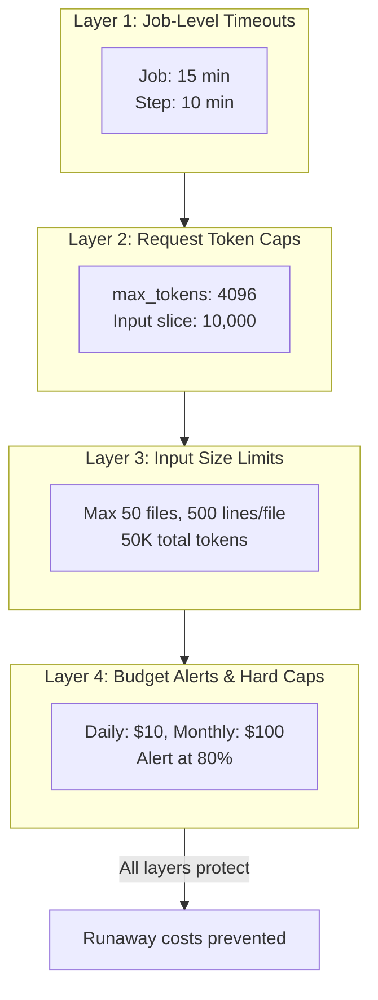

**Suggested filename**: `assets/diagrams/ch15-timeout-layers.mmd`

---

#### Opportunity 61: YOLO Safety Hierarchy
- **Location**: Line 506-530
- **Type**: tiered safety levels
- **Priority**: Medium
- **Description**: Shows 4 safety levels from "Permission prompts" (high safety, low productivity) to "YOLO + gates + review" (very high safety, high productivity).

**Draft Mermaid:**
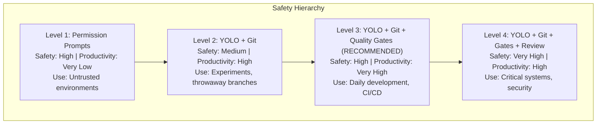

**Suggested filename**: `assets/diagrams/ch15-yolo-safety-hierarchy.mmd`

---

#### Opportunity 62: Model Selection Decision Tree
- **Location**: Line 127-167
- **Type**: decision tree
- **Priority**: Medium
- **Description**: Shows how to route tasks to the appropriate model tier based on characteristics (security critical? architecture? file count? simple pattern?).

**Draft Mermaid:**
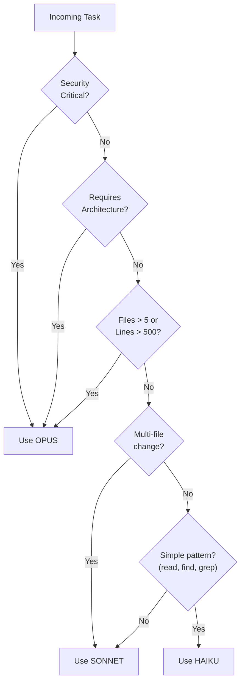

**Suggested filename**: `assets/diagrams/ch15-model-selection-tree.mmd`

---

#### Opportunity 63: Prompt Caching Structure
- **Location**: Line 353-428
- **Type**: structural diagram
- **Priority**: Medium
- **Description**: Shows cache-friendly prompt structure with stable content (CACHED) at beginning and dynamic content (NOT CACHED) at end.

**Draft Mermaid:**
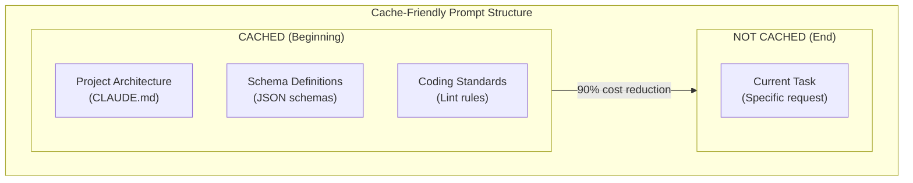

**Suggested filename**: `assets/diagrams/ch15-prompt-caching-structure.mmd`

---

## Previously Identified Opportunities (Chapters 1-13)

> The following opportunities were identified in the 2026-01-27 review.
> See `reviews/diagrams-2026-01-27.md` for full Mermaid code drafts.

### Chapter 1: The Compound Systems Engineer (5 opportunities)
1. **Three Levels Pyramid** - High - Line 55-66
2. **Builder vs Meta-Builder** - Medium - Line 69-79
3. **Single-Bet vs Portfolio Game** - High - Line 98-105
4. **Cost Curve by Engineering Level** - Medium - Line 122-138
5. **Constraint Feedback Loop** - High - Line 248-255

### Chapter 2: Getting Started with Claude Code (3 opportunities)
6. **Agent vs Chat Mental Model** - High - Line 1-8
7. **Tool Ecosystem Overview** - High - Line 149-217
8. **Two-Mode Mental Model** - High - Line 337-399

### Chapter 3: Prompting Fundamentals (4 opportunities)
9. **Prompt Anatomy** - High - Line 9-49
10. **Constraint Funnel** - High - Line 207-224
11. **Chain-of-Thought Flow** - Medium - Line 52-149
12. **Few-Shot Accuracy Curve** - Medium - Line 231-244

### Chapter 4: Writing Your First CLAUDE.md (4 opportunities)
13. **WHY-WHAT-HOW Framework** - High - Line 44-86
14. **Hierarchical CLAUDE.md Structure** - High - Line 165-218
15. **Context Relevance Comparison** - Medium - Line 196-209
16. **Instruction-Following Degradation** - Medium - Line 29-43

### Chapter 5: The 12-Factor Agent (5 opportunities)
17. **Reliability Cascade (0.95^N)** - High - Line 11-23
18. **Four-Turn Framework** - High - Line 26-36
19. **Reliability Stack Layers** - Medium - Line 38-46
20. **12 Factors Overview** - High - Line 49-459
21. **Agent Loop with Tool Classification** - Medium - Line 284-319

### Chapter 6: The Verification Ladder (3 opportunities)
22. **Verification Ladder (6 levels)** - High - Line 7-34
23. **Verification Sandwich** - High - Line 286-332
24. **Test-Driven Search Space** - Medium - Line 334-402

### Chapter 7: Quality Gates That Compound (4 opportunities)
25. **State Space Reduction** - High - Line 9-39
26. **Compounding Formula** - High - Line 139-177
27. **Six-Gate Architecture** - High - Line 460-476
28. **Hook Workflow Cycle** - Medium - Line 217-330

### Chapter 8: Error Handling and Debugging (4 opportunities)
29. **Error Classification (5-category)** - High - Line 9-50
30. **Context Debugging Hierarchy** - High - Line 119-140
31. **Learning Loop** - Medium - Line 579-622
32. **Clean Slate Recovery** - Medium - Line 514-575

### Chapter 9: Context Engineering Deep Dive (4 opportunities)
33. **Context Window Anatomy** - High - Line 159-180
34. **Progressive Disclosure Architecture** - High - Line 182-259
35. **Signal Degradation** - Medium - Line 261-280
36. **Entropy Reduction** - Medium - Line 43-65

### Chapter 10: The RALPH Loop (4 opportunities)
37. **RALPH Loop Cycle** - High - Line 66-81
38. **Four-Phase Pie** - Medium - Line 83-141
39. **Memory Architecture (3 layers)** - High - Line 143-219
40. **Multi-Agent Coordination** - Medium - Line 289-320

### Chapter 11: Sub-Agent Architecture (4 opportunities)
41. **Sub-Agent Team Structure** - High - Line 31-44
42. **Context Hierarchy (3 layers)** - High - Line 46-135
43. **Actor-Critic Loop** - High - Line 502-583
44. **Parallel vs Sequential** - Medium - Line 585-634

### Chapter 12: Development Workflows (3 opportunities)
45. **Plan Mode Two-Phase** - High - Line 12-28
46. **Git Worktrees Parallel** - High - Line 79-170
47. **Incremental Development** - Medium - Line 172-256

### Chapter 13: Building the Harness (4 opportunities)
48. **Four-Layer Harness Architecture** - High - Line 3-16
49. **Closed-Loop Optimization Cycle** - High - Line 293-345
50. **Linear vs Exponential Productivity** - Medium - Line 416-470
51. **MCP Resource Query Flow** - Medium - Line 474-551

---

## Priority Summary

### High Priority (Must Have) - 35 diagrams

**Chapters 1-7 (Foundation):**
1. ch01: Three Levels Pyramid
2. ch01: Single-Bet vs Portfolio Game
3. ch01: Constraint Feedback Loop
4. ch02: Agent vs Chat Mental Model
5. ch02: Tool Ecosystem Overview
6. ch02: Two-Mode Mental Model
7. ch03: Prompt Anatomy
8. ch03: Constraint Funnel
9. ch04: WHY-WHAT-HOW Framework
10. ch04: Hierarchical CLAUDE.md Structure
11. ch05: Reliability Cascade (0.95^N)
12. ch05: Four-Turn Framework
13. ch05: 12 Factors Overview
14. ch06: Verification Ladder
15. ch06: Verification Sandwich
16. ch07: State Space Reduction
17. ch07: Compounding Formula
18. ch07: Six-Gate Architecture

**Chapters 8-13 (Advanced):**
19. ch08: Error Classification
20. ch08: Context Debugging Hierarchy
21. ch09: Context Window Anatomy
22. ch09: Progressive Disclosure
23. ch10: RALPH Loop Cycle
24. ch10: Memory Architecture
25. ch11: Sub-Agent Team Structure
26. ch11: Context Hierarchy
27. ch11: Actor-Critic Loop
28. ch12: Plan Mode Phases
29. ch12: Git Worktrees
30. ch13: Four-Layer Harness
31. ch13: Closed-Loop Optimization

**Chapters 14-15 (NEW):**
32. ch14: Skill Atrophy Ladder
33. ch14: Six Waves Timeline
34. ch14: Four Automation Levels
35. ch14: Fleet Model Evolution
36. ch15: Three-Tier Model Hierarchy
37. ch15: Progressive Model Escalation
38. ch15: Multi-Layer Timeout Protection

### Medium Priority (Nice to Have) - 24 diagrams

**Chapters 1-7:**
1. ch01: Builder vs Meta-Builder
2. ch01: Cost Curve by Engineering Level
3. ch03: Chain-of-Thought Flow
4. ch03: Few-Shot Accuracy Curve
5. ch04: Context Relevance Comparison
6. ch04: Instruction-Following Degradation
7. ch05: Reliability Stack Layers
8. ch05: Agent Loop with Tool Classification
9. ch06: Test-Driven Search Space
10. ch07: Hook Workflow Cycle

**Chapters 8-13:**
11. ch08: Learning Loop
12. ch08: Clean Slate Recovery
13. ch09: Signal Degradation
14. ch09: Entropy Reduction
15. ch10: Four-Phase Pie
16. ch10: Multi-Agent Coordination
17. ch11: Parallel vs Sequential
18. ch12: Incremental Development
19. ch13: Linear vs Exponential
20. ch13: MCP Query Flow

**Chapters 14-15 (NEW):**
21. ch14: Leverage Stack
22. ch14: ROI Calculation Flow
23. ch15: YOLO Safety Hierarchy
24. ch15: Model Selection Decision Tree
25. ch15: Prompt Caching Structure

---

## Recommended Implementation Order

### Phase 1: Foundation Concepts (Chapters 1-4) - 10 diagrams
1. ch01: Three Levels Pyramid
2. ch01: Constraint Feedback Loop
3. ch02: Agent vs Chat Mental Model
4. ch02: Two-Mode Mental Model
5. ch03: Prompt Anatomy
6. ch03: Constraint Funnel
7. ch04: WHY-WHAT-HOW Framework
8. ch04: Hierarchical CLAUDE.md
9. ch01: Single-Bet vs Portfolio Game
10. ch02: Tool Ecosystem

### Phase 2: Verification & Quality (Chapters 5-7) - 8 diagrams
11. ch05: Reliability Cascade
12. ch05: 12 Factors Overview
13. ch05: Four-Turn Framework
14. ch06: Verification Ladder
15. ch06: Verification Sandwich
16. ch07: State Space Reduction
17. ch07: Compounding Formula
18. ch07: Six-Gate Architecture

### Phase 3: Advanced Patterns (Chapters 8-13) - 13 diagrams
19. ch08: Error Classification
20. ch08: Context Debugging Hierarchy
21. ch09: Context Window Anatomy
22. ch09: Progressive Disclosure
23. ch10: RALPH Loop Cycle
24. ch10: Memory Architecture
25. ch11: Sub-Agent Team
26. ch11: Actor-Critic Loop
27. ch11: Context Hierarchy
28. ch12: Plan Mode Phases
29. ch12: Git Worktrees
30. ch13: Four-Layer Harness
31. ch13: Closed-Loop Optimization

### Phase 4: Meta & Strategy (Chapters 14-15) - 7 diagrams
32. ch14: Skill Atrophy Ladder
33. ch14: Six Waves Timeline
34. ch14: Four Automation Levels
35. ch14: Fleet Model Evolution
36. ch15: Three-Tier Model Hierarchy
37. ch15: Progressive Model Escalation
38. ch15: Multi-Layer Timeout Protection

---

## Notes

- All Mermaid diagrams use flowchart TB/LR or xychart-beta for charts
- Some diagrams may need refinement after implementation
- Consider SVG export for print publication
- Cross-reference diagrams in chapter text using ``
- Full Mermaid code for ch01-ch13 diagrams available in `reviews/diagrams-2026-01-27.md`
