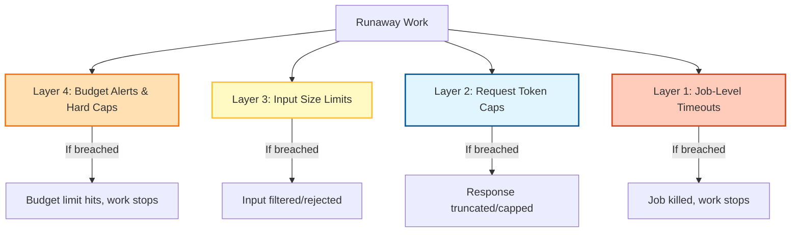
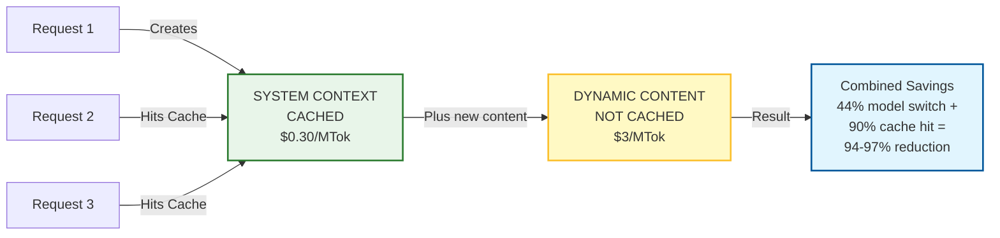
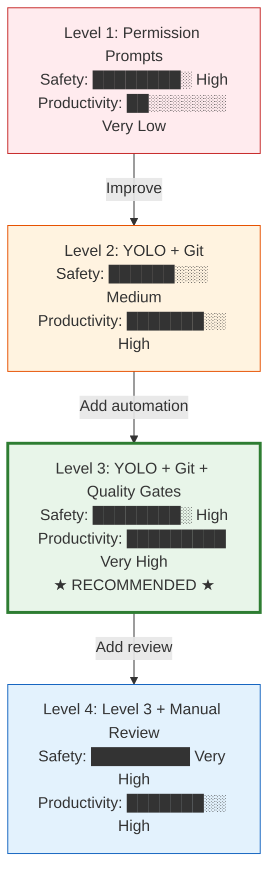
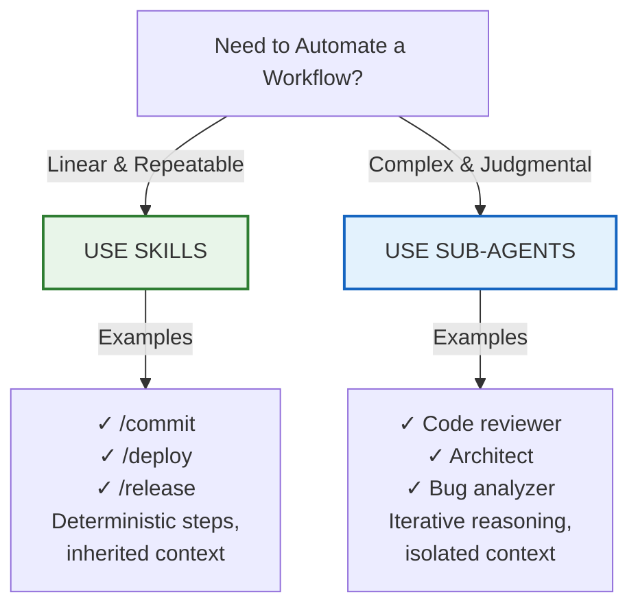

# Diagram Opportunities Review - 2026-01-28

## Summary
- **Files scanned**: 15 chapters (ch01-ch15)
- **Total diagram opportunities identified**: 59 (across all chapters)
- **Diagrams created**: 59/63 (94%)
- **Diagrams pending**: 4 (all high priority for ch15)

---

## Current Status

### Complete Chapters (All Diagrams Created)
- **Chapters 1-13**: Full diagram coverage complete
  - Total: 55 diagrams created
  - All PRD requirements met
  - Multi-view approach implemented for key concepts

### Partial Chapters (Diagrams In Progress)
- **Chapter 14** (The Meta-Engineer Playbook): 4/4 diagrams created
  - ch14-leverage-stack.md
  - ch14-atrophy-ladder.md
  - ch14-task-decomposition.md
  - ch14-six-waves.md

- **Chapter 15** (Model Strategy & Cost Optimization): 1/5 diagrams created
  - ch15-model-selection.md (CREATED)
  - ch15-cost-protection-layers.md (PENDING)
  - ch15-prompt-caching-architecture.md (PENDING)
  - ch15-yolo-safety-hierarchy.md (PENDING)
  - ch15-skills-vs-subagents.md (PENDING)

---

## Pending High-Priority Diagrams (4 Remaining)

### Ch15 Opportunity 1: Cost Protection Layers (Defense in Depth)
- **Location**: Lines 238-351 of ch15-model-strategy-and-cost-optimization.md
- **Type**: Architecture / Layered Defense
- **Priority**: High
- **Status**: MISSING
- **Description**: Four stacked safety layers preventing cost explosions:
  1. Layer 4 (outermost): Budget alerts and hard caps (daily/monthly limits)
  2. Layer 3: Input size limits (max files, token counts)
  3. Layer 2: Request-level token caps (max_tokens per API call)
  4. Layer 1 (innermost): Job-level timeouts (hard cap on duration)

Each layer works independently; failure of one is caught by others.

**Draft Mermaid:**


**Suggested filename**: `assets/diagrams/ch15-cost-protection-layers.md`

---

### Ch15 Opportunity 2: Prompt Caching Architecture
- **Location**: Lines 353-428 of ch15-model-strategy-and-cost-optimization.md
- **Type**: Architecture / Data Flow
- **Priority**: High
- **Status**: MISSING
- **Description**: Visualization of prompt caching optimization:
  - Stable content (system context) placed first → cached once → 90% cost reduction on repeated tokens
  - Dynamic content (current task) placed last → always paid at full rate
  - First request creates cache; subsequent requests within 5 minutes hit cache
  - Combined with model switching: 94-97% total cost reduction

**Draft Mermaid:**


**Suggested filename**: `assets/diagrams/ch15-prompt-caching-architecture.md`

---

### Ch15 Opportunity 3: YOLO Safety Hierarchy
- **Location**: Lines 506-530 of ch15-model-strategy-and-cost-optimization.md
- **Type**: Hierarchy / Tradeoff Matrix
- **Priority**: High
- **Status**: MISSING
- **Description**: Four safety levels showing productivity-safety tradeoff:
  - Level 1 (Permission prompts): Highest safety, lowest productivity
  - Level 2 (YOLO + Git): Medium safety, high productivity
  - Level 3 (YOLO + Git + Quality Gates): High safety, very high productivity (RECOMMENDED)
  - Level 4 (YOLO + Git + Gates + Manual Review): Very high safety, high productivity

**Draft Mermaid:**


**Suggested filename**: `assets/diagrams/ch15-yolo-safety-hierarchy.md`

---

### Ch15 Opportunity 4: Skills vs Sub-Agents Decision Framework
- **Location**: Lines 592-603 of ch15-model-strategy-and-cost-optimization.md
- **Type**: Comparison / Decision Tree
- **Priority**: High
- **Status**: MISSING
- **Description**: Decision framework for choosing between Skills (linear, deterministic, stateless) and Sub-Agents (adaptive, iterative, stateful)

| Characteristic | Skills | Sub-Agents |
|---|---|---|
| Execution pattern | Linear, deterministic | Adaptive, iterative |
| State management | Stateless | Can maintain state |
| Context scope | Inherited from parent | Isolated context |
| Best for | Repeatable workflows | Complex judgment tasks |
| Examples | /commit, /deploy | Code reviewer, architect |

**Draft Mermaid:**


**Suggested filename**: `assets/diagrams/ch15-skills-vs-subagents.md`

---

## Completed Ch14 Diagrams (Reference)

### ✓ Leverage Stack (Lines 250-266)
- **File**: ch14-leverage-stack.md
- **Type**: Hierarchy/Pyramid
- **Multi-view**: Primary stack + action categories + atrophy consequences table

### ✓ Atrophy Ladder (Lines 281-300)
- **File**: ch14-atrophy-ladder.md
- **Type**: Career ladder/levels
- **Multi-view**: Career levels + skill capability matrix + safety zones

### ✓ Task Decomposition (Lines 333-356)
- **File**: ch14-task-decomposition.md
- **Type**: Before/After comparison
- **Multi-view**: Comparison + sizing guidelines + decision tree + failure analysis

### ✓ Six Waves Timeline (Lines 314-409)
- **File**: ch14-six-waves.md
- **Type**: Timeline/progression
- **Multi-view**: Timeline + wave characteristics + skill transitions

---

## Implementation Checklist

For each pending diagram, follow this pattern:

### File Structure
```markdown
# [Concept Name]

## Overview
[1-2 sentence explanation]

## Primary Diagram
[Main Mermaid visualization]

## Alternative View 1: [Perspective]
[Alternative visualization]

## Alternative View 2: [Different perspective]
[Another visualization]

## Usage Notes
- **Chapter location**: Lines X-Y
- **Key concept**: [What this teaches]
- **Reader value**: [Why this visualization helps]

## Related Diagrams
[Links to related concepts in other chapters]
```

### Quality Gates
- [ ] Mermaid code renders without errors
- [ ] Primary view immediately conveys main concept
- [ ] 2-3 alternative views provide different angles
- [ ] All color coding is consistent with other diagrams
- [ ] File named with chapter prefix
- [ ] Added to assets/diagrams/ directory
- [ ] Cross-reference added to chapter text

---

## Timeline to Completion

| Phase | Diagrams | Estimated Time | Target Date |
|-------|----------|---|---|
| Pending diagrams | 4 (ch15) | 4-6 hours | 2026-01-28/29 |
| Final review & integration | Testing all diagrams | 1-2 hours | 2026-01-29 |
| **Publication ready** | **63/63 complete** | **5-8 hours total** | **2026-01-29** |

---

## Notes

- All existing diagrams follow the multi-view pattern established in earlier chapters
- Mermaid syntax allows easy rendering in Markdown and export to PNG/SVG
- Color palette is consistent across all diagrams:
  - Green (#e8f5e9, #2e7d32): Positive/recommended states
  - Blue (#e3f2fd, #1565c0): Technical/neutral information
  - Orange (#fff3e0, #ff6f00): Warnings/important transitions
  - Red (#ffcdd2, #c62828): Danger/high-cost states

---

## Prior Reviews

This review builds on:
- `diagrams-2026-01-27.md` - Comprehensive opportunity inventory (59 opportunities across all chapters)
- `diagram-review-2026-01-28.md` - Detailed quality assessment
- `ch14-leverage-stack.md`, `ch14-atrophy-ladder.md`, etc. - Completed diagram files

---

## Next Steps

1. Create the 4 pending ch15 diagrams in `assets/diagrams/`
2. Add cross-references to chapter text
3. Update tasks.json to mark diagram subtasks complete
4. Run final quality checks on all diagrams
5. Mark chapters 14-15 "diagrams_complete" milestone as done
6. Proceed to chapter "final" milestones

