# Diagram Opportunities - 2026-01-27

## Summary
- Files scanned: 11 chapters (ch05-ch15)
- Existing diagrams: 11 (one per chapter, all have primary diagrams created)
- Additional high-priority opportunities: 8
- Additional medium-priority opportunities: 5

## Diagrams Already Created

### By Chapter
| Chapter | Filename | Topic |
|---------|----------|-------|
| ch05 | ch05-12factor-overview.md | 12-Factor framework overview |
| ch06 | ch06-verification-ladder.md | Verification level hierarchy |
| ch07 | ch07-quality-gates.md | Quality gate flow |
| ch08 | ch08-error-diagnostic.md | Error diagnostic framework |
| ch09 | ch09-context-window.md | Context window architecture |
| ch10 | ch10-ralph-loop.md | RALPH Loop process |
| ch11 | ch11-subagent-architecture.md | Sub-agent team structure |
| ch12 | ch12-workflows.md | Development workflows |
| ch13 | ch13-harness-architecture.md | Four-layer harness |
| ch14 | ch14-six-waves.md | Six waves of AI evolution |
| ch15 | ch15-model-selection.md | Model tier selection |

All chapters have a primary diagram created. This review identifies complementary diagrams that would add clarity.

---

## High-Priority Missing Diagrams

### Opportunity 1: The Four-Turn Framework (Chapter 5)

**Location**: Lines 26-34

**Type**: Flowchart / State diagram

**Priority**: High

**Description**: The four-turn framework is central to the chapter's argument about production reliability. The text mentions "Understand → Decide → Execute → Verify" but this process flow with parallel feedback loops would benefit from a diagram showing:
- The four sequential turns
- What happens at each turn
- How errors create feedback loops back to earlier stages
- Real impact on reliability (exponential vs linear)

This is a critical conceptual tool that the chapter references repeatedly. A diagram would make it immediately clear and memorable.

**Draft Mermaid:**

```mermaid
flowchart TB
    subgraph Four["Four-Turn Framework"]
        U["1️⃣ UNDERSTAND\nVerify context\nand requirements"]
        D["2️⃣ DECIDE\nChoose appropriate\nresponse"]
        E["3️⃣ EXECUTE\nPerform the task"]
        V["4️⃣ VERIFY\nConfirm success"]

        U --> D --> E --> V
        V -->|Success| End["✅ Complete"]
        V -->|Failure| Recovery["🔄 Escalate\nor Retry"]
        Recovery --> U
    end

    subgraph Impact["Reliability Impact"]
        Before["Demo agents:\nSkip turns 1 & 4\n(35% success)"]
        After["Production agents:\nAll 4 turns\n(92% success)"]
    end

    Four -.->|Apply to workflow| Impact
```

**Suggested filename**: `assets/diagrams/ch05-four-turn-framework.mmd`

---

### Opportunity 2: Reliability Stack - Layered Defense (Chapter 5)

**Location**: Lines 37-46

**Type**: Architecture/Layered diagram

**Priority**: High

**Description**: The reliability stack is mentioned but shown only as bullet points. A layered diagram would show:
- Each layer's responsibility
- How errors caught at layer 1 prevent layer 4 failures
- Progressive abstraction from task decomposition through human escalation
- Multiplicative effect of stacked layers

This teaches the key insight that reliability compounds through layers.

**Draft Mermaid:**

**Suggested filename**: `assets/diagrams/ch05-reliability-stack.mmd`

---

### Opportunity 3: Five-Point Error Diagnostic Framework (Chapter 8)

**Location**: Lines 9-49

**Type**: Decision tree / Classification diagram

**Priority**: High

**Description**: The five error categories (Context, Model, Rules, Testing, Quality Gate) are the chapter's core diagnostic tool. A decision tree would help readers quickly classify their errors:
- First decision: Is context missing?
- If no: Is the model insufficient?
- If no: Does CLAUDE.md specify this?
- And so on...

This is a critical taxonomy that deserves visual representation.

**Draft Mermaid:**

```mermaid
flowchart TD
    Start["Error Occurred"]

    Q1{"Does the AI have\nrelevant examples?"}
    Q1 -->|No| C["🔴 Context Problem\n60% of errors\n→ Add files, patterns, examples"]
    Q1 -->|Yes| Q2

    Q2{"Can a more powerful\nmodel succeed?"}
    Q2 -->|Yes| M["🟡 Model Problem\n10% of errors\n→ Escalate to Opus"]
    Q2 -->|No| Q3

    Q3{"Does CLAUDE.md\nspecify this?"}
    Q3 -->|No| R["🔵 Rules Problem\n15% of errors\n→ Add rule to CLAUDE.md"]
    Q3 -->|Yes| Q4

    Q4{"Do tests catch\nthis error type?"}
    Q4 -->|No| T["🟢 Testing Problem\n10% of errors\n→ Add test case"]
    Q4 -->|Yes| Q5

    Q5{"Does automation\nenforce this?"}
    Q5 -->|No| G["🟣 Quality Gate Problem\n5% of errors\n→ Add lint rule or hook"]
    Q5 -->|Yes| Fix["Fix the specific\ninstance"]

    C --> Encode["THEN: Encode\nthe lesson"]
    M --> Encode
    R --> Encode
    T --> Encode
    G --> Encode
    Fix --> Encode

    Encode --> Future["Prevents entire\nerror class"]
```

**Suggested filename**: `assets/diagrams/ch08-error-diagnostic-tree.mmd`

---

### Opportunity 4: Context Debugging Framework - Four Layers (Chapter 8)

**Location**: Lines 116-262

**Type**: Hierarchical/Layered architecture

**Priority**: High

**Description**: The chapter presents debugging in four layers (Context, Prompting, Model Power, Manual Override) ordered by likelihood of success. This layered approach would be clearer with:
- Each layer's success rate and typical time
- What problems each layer solves
- When to escalate to the next layer
- Cost comparison of different approaches

This is the most practical debugging guide in the chapter and deserves visualization.

**Draft Mermaid:**

**Suggested filename**: `assets/diagrams/ch08-context-debug-layers.mmd`

---

### Opportunity 5: Learning Loops - Encode Prevention (Chapter 8)

**Location**: Lines 579-622

**Type**: Process flow / Cycle diagram

**Priority**: High

**Description**: The learning loop pattern "Problem → Fix → Ask: How to prevent this class? → Encode" is fundamental to the compound engineering philosophy. A cycle diagram would show:
- Where different types of learnings go (CLAUDE.md, hooks, tests, lint rules)
- How each encoding prevents future errors
- The cumulative effect across sessions
- Connection to the harness layers

This visualizes how individual problems compound into systematic improvements.

**Draft Mermaid:**

**Suggested filename**: `assets/diagrams/ch08-learning-loops.mmd`

---

### Opportunity 6: Incremental Development Pattern (Chapter 12)

**Location**: Lines 171-248

**Type**: Process flow / Step-by-step breakdown

**Priority**: High

**Description**: The chapter contrasts large monolithic requests (which fail 65% of the time) with incremental 20-50 line increments. A visual breakdown would show:
- How large requests fragment error probability
- Each increment's validation cycle
- How context accumulates across increments
- Why this pattern works for AI agents

This is a critical practical technique that deserves clear visualization.

**Draft Mermaid:**

```mermaid
flowchart LR
    subgraph Problem["Large Request Problem"]
        B["❌ 1,247 lines\n12 files\n65% chance of error"]
    end

    subgraph Solution["Incremental Pattern"]
        I1["✅ Increment 1<br/>20 lines<br/>User model"]
        V1["🔍 Validate"]
        I2["✅ Increment 2<br/>30 lines<br/>Password hashing"]
        V2["🔍 Validate"]
        I3["✅ Increment 3<br/>25 lines<br/>Repository"]
        V3["🔍 Validate"]
        I4["..."]
    end

    subgraph Effect["Error Probability"]
        Per100["~10% error per 100 lines"]
        Large["1000 lines → 65% chance"]
        Incremental["50 lines × N increments<br/>→ ~5% chance per step<br/>= Tight feedback loops"]
    end

    B --> Per100
    I1 --> V1 -->|Pass| I2
    V1 -->|Fail| Fix1["Fix Increment 1\nbefore proceeding"]
    Fix1 --> I2

    I2 --> V2 -->|Pass| I3
    V2 -->|Fail| Fix2["Fix Increment 2\nbefore proceeding"]
    Fix2 --> I3

    I3 --> V3 -->|Pass| I4
    V3 -->|Fail| Fix3["Fix Increment 3\nbefore proceeding"]
    Fix3 --> I4

    Large -.-> Solution
    Solution -.-> Incremental
```

**Suggested filename**: `assets/diagrams/ch12-incremental-development.mmd`

---

### Opportunity 7: Four-Layer Harness Architecture (Chapter 13)

**Location**: Lines 1-18 (conceptual overview)

**Type**: Architecture / Layered diagram

**Priority**: High

**Description**: Chapter 13 introduces a four-layer harness architecture but doesn't visualize it clearly. A nested architecture diagram would show:
- Layer 1: Claude Code configuration
- Layer 2: Repository engineering
- Layer 3: Meta-engineering (automation)
- Layer 4: Closed-loop optimization
- How each layer controls the signal path
- Feedback loops between layers

This is the book's meta-framework for building systems around AI.

**Draft Mermaid:**

```mermaid
graph TB
    subgraph Harness["Harness Architecture: Four Protective Layers"]
        subgraph L4["Layer 4: Closed-Loop Optimization 🔄<br/>Telemetry → Constraints → Agent → Code"]
            O["Metric violations\ntrigger optimizer agent"]
        end

        subgraph L3["Layer 3: Meta-Engineering 🤖<br/>Automating the automation"]
            M["Claude Code hooks\nWorkflow scripts\nNightly jobs"]
        end

        subgraph L2["Layer 2: Repository Engineering 🏗️<br/>Environment clarity"]
            R["Testing infrastructure\nObservability stack\nDDD structure"]
        end

        subgraph L1["Layer 1: Claude Code Configuration ⚙️<br/>Innermost control"]
            C["CLAUDE.md\nHooks\nConstraints"]
        end

        subgraph LLM["Raw LLM (Noisy Channel) 🌊"]
            AI["Probabilistic outputs\nHigh variance\nUnpredictable"]
        end
    end

    L1 --> LLM
    L1 -.->|Constraint| L2
    L2 -.->|Signal| L3
    L3 -.->|Feedback| L4
    L4 -.->|Control| L1

    subgraph Effect["Signal Path"]
        Raw["Raw LLM: 30% reliable"]
        With1["+ L1: 50% reliable"]
        With2["+ L2: 70% reliable"]
        With3["+ L3: 85% reliable"]
        With4["+ L4: 95%+ reliable"]
    end

    AI -.-> Raw
    Raw -.-> With1 -.-> With2 -.-> With3 -.-> With4
```

**Suggested filename**: `assets/diagrams/ch13-harness-layers.mmd`

---

### Opportunity 8: AI Development Waves Evolution (Chapter 14)

**Location**: Lines 314-356

**Type**: Timeline / Progression diagram

**Priority**: High

**Description**: The six waves of AI-enabled development are presented in a table. A visual timeline would show:
- Progression from Wave 1-6
- Productivity multiplier at each wave
- Current position (Wave 3 → Wave 4 transition)
- Timeline expectations
- Skill requirements shift at each wave

This shows the trajectory of AI-assisted development and helps readers understand their place in the evolution.

**Draft Mermaid:**

**Suggested filename**: `assets/diagrams/ch14-ai-waves-evolution.mmd`

---

## Medium-Priority Missing Diagrams

### Opportunity 1: Three-Tier Model Hierarchy with Strengths (Chapter 15)

**Location**: Lines 44-112

**Type**: Comparison table / Matrix diagram

**Priority**: Medium

**Description**: The three tiers (Haiku, Sonnet, Opus) are described separately but a visual comparison matrix showing:
- Cost per token
- Speed
- Best use cases
- Strengths/weaknesses
- When to escalate

Would help readers make quick routing decisions.

**Draft Mermaid:**

```mermaid
graph TB
    subgraph Tiers["Three-Tier Model Hierarchy"]
        H["⚡ HAIKU<br/>$0.25/$1.25 input/output<br/>1-2 sec response<br/>60-80% of requests<br/><br/>✅ File I/O<br/>✅ Pattern matching<br/>✅ Simple edits<br/><br/>❌ Architecture<br/>❌ Complex decisions"]

        S["⚙️ SONNET<br/>$3/$15 input/output<br/>2-4 sec response<br/>15-30% of requests<br/><br/>✅ Feature implementation<br/>✅ Standard refactoring<br/>✅ Bug fixes<br/><br/>❌ System design<br/>❌ Large refactors"]

        O["🧠 OPUS<br/>$15/$75 input/output<br/>4-8 sec response<br/>5-10% of requests<br/><br/>✅ Architecture<br/>✅ Security design<br/>✅ Complex debugging<br/><br/>❌ Quick edits<br/>❌ Simple file reads"]
    end

    subgraph Routing["Routing Strategy"]
        R1["Simple task?<br/>→ Haiku"]
        R2["Standard work?<br/>→ Sonnet"]
        R3["Complex reasoning?<br/>→ Opus"]

        R1 -.-> H
        R2 -.-> S
        R3 -.-> O
    end

    subgraph Cost["Annual Cost per Developer"]
        C1["Default (100% Sonnet):<br/>$594/year"]
        C2["Optimized (70H/25S/5O):<br/>$234/year<br/>(60% savings)"]
    end
```

**Suggested filename**: `assets/diagrams/ch15-model-tiers-matrix.mmd`

---

### Opportunity 2: Budget Protection Layers (Chapter 15)

**Location**: Lines 238-352

**Type**: Nested architecture / Defense-in-depth diagram

**Priority**: Medium

**Description**: The chapter describes four layers of cost protection (job timeout, request token cap, input limits, budget alerts). A nested visualization would show:
- How each layer protects against different failure modes
- What happens when each layer is triggered
- The cascade of protections
- Real-world examples of when each layer catches problems

This shows defense-in-depth thinking applied to cost control.

**Draft Mermaid:**

```mermaid
graph TB
    subgraph Protection["Cost Protection: Four Defense Layers"]
        subgraph L1["Layer 1: Job-Level Timeout<br/>Hard cap: 15 minutes<br/>Catches: Runaway loops"]
            T1["If job runs > 15 min<br/>→ Kill entire process"]
        end

        subgraph L2["Layer 2: Step Timeout<br/>Hard cap: 10 minutes<br/>Catches: Stuck steps"]
            T2["If step runs > 10 min<br/>→ Kill step, cleanup"]
        end

        subgraph L3["Layer 3: Request Token Cap<br/>max_tokens: 4096<br/>Catches: Verbose responses"]
            T3["If output > 4096 tokens<br/>→ Truncate response"]
        end

        subgraph L4["Layer 4: Budget Alerts<br/>Daily: $10, Monthly: $100<br/>Catches: Systemic overspend"]
            T4["If spend > threshold<br/>→ Alert & pause new work"]
        end
    end

    Runaway["Runaway Process"] -->|Layer 1| T1
    Stuck["Stuck Operation"] -->|Layer 2| T2
    Verbose["Verbose Agent"] -->|Layer 3| T3
    Systemic["Systemic Overspend"] -->|Layer 4| T4

    subgraph Fallback["Fallback Behavior"]
        All["Even if one layer fails,<br/>others provide protection<br/>Defense in depth prevents<br/>catastrophic cost"]
    end

    T1 --> Fallback
    T2 --> Fallback
    T3 --> Fallback
    T4 --> Fallback
```

**Suggested filename**: `assets/diagrams/ch15-budget-protection-layers.mmd`

---

### Opportunity 3: Skill Atrophy Framework (Chapter 14)

**Location**: Lines 224-312

**Type**: Hierarchical/Leverage stack diagram

**Priority**: Medium

**Description**: The chapter introduces a leverage stack showing what to keep sharp vs. what to forget. A visual stack would help readers understand:
- Which skills are irreplaceable
- Which can be delegated
- Which skills to let atrophy
- Career implications of skill loss

This directly addresses the "will AI make me obsolete?" concern.

**Draft Mermaid:**

```mermaid
graph TD
    subgraph Stack["Leverage Stack: What to Protect"]
        L5["⭐ Understanding the Problem<br/>KEEP SHARP<br/>AI doesn't know which problems matter"]
        L4["⭐ Designing the Solution<br/>KEEP SHARP<br/>Wrong solution executed perfectly is still wrong"]
        L3["⭐ Verification & Correctness<br/>KEEP SHARP<br/>AI is confidently wrong"]
        L2["🔄 Implementation Patterns<br/>OK TO DELEGATE<br/>Patterns can be learned from examples"]
        L1["📚 Syntax & API Recall<br/>OK TO FORGET<br/>Lookup tools handle this"]
        L0["🗑️ Boilerplate<br/>GOOD RIDDANCE<br/>Let AI eliminate tedium"]
    end

    subgraph Risk["Career Risk by Atrophy Level"]
        R5["Level 5: Can specify, verify, derive<br/>→ Architect / Staff+ (SAFE)"]
        R4["Level 4: Can specify & verify<br/>→ Senior Engineer (SAFE)"]
        R3["Level 3: Can specify & verify,<br/>couldn't derive from scratch<br/>→ Mid-level with leverage"]
        R2["Level 2: Can verify, can't specify<br/>→ Junior with tools"]
        R1["Level 1: Can't verify<br/>→ Prompt operator (CEILING)"]
    end

    L5 -.-> R5
    L4 -.-> R4
    L3 -.-> R3
    L2 -.-> R2
    L1 -.-> R1
```

**Suggested filename**: `assets/diagrams/ch14-skill-leverage-stack.mmd`

---

### Opportunity 4: Generalist vs. Specialist Agent Quality (Chapter 11)

**Location**: Lines 7-29

**Type**: Comparison / Quality matrix

**Priority**: Medium

**Description**: The chapter shows metrics comparing single generalist vs. specialized sub-agents. A visual comparison would make the quality differential obvious and justify the architectural overhead.

**Draft Mermaid:**

**Suggested filename**: `assets/diagrams/ch11-generalist-vs-specialist.mmd`

---

### Opportunity 5: Plan Mode Two-Phase Pattern (Chapter 12)

**Location**: Lines 5-28

**Type**: Process flow / Two-phase diagram

**Priority**: Medium

**Description**: Plan Mode is introduced but not visualized. A diagram showing:
- Phase 1: Strategic thinking (Shift+Tab, no code written)
- Phase 2: Execution (Following the plan)
- Questions to ask before exiting Plan Mode
- When to skip Plan Mode

Would help readers understand when and how to use this feature.

**Draft Mermaid:**

**Suggested filename**: `assets/diagrams/ch12-plan-mode-phases.mmd`

---

## Recommended Priority Order for Implementation

### Immediate (High Priority - Create Next)
1. **ch08-error-diagnostic-tree.mmd** - Decision tree helps readers classify any error
2. **ch05-four-turn-framework.mmd** - Core reliability concept
3. **ch08-learning-loops.mmd** - Shows compound improvement cycle
4. **ch13-harness-layers.mmd** - Meta-framework for entire book

### Next Sprint (High Priority)
5. **ch08-context-debug-layers.mmd** - Practical debugging guide
6. **ch12-incremental-development.mmd** - Critical AI coding pattern
7. **ch14-ai-waves-evolution.mmd** - Timeline showing career trajectory
8. **ch05-reliability-stack.mmd** - Architectural foundation

### Follow-up (Medium Priority)
9. **ch15-model-tiers-matrix.mmd** - Cost optimization guide
10. **ch14-skill-leverage-stack.mmd** - Addresses career concerns
11. **ch11-generalist-vs-specialist.mmd** - Justifies sub-agent overhead
12. **ch12-plan-mode-phases.mmd** - Feature walkthrough

## Notes for Diagram Creation

All suggested diagrams:
- Use consistent Mermaid syntax and styling
- Include relevant emojis for visual scanning
- Connect to specific chapter content with citations
- Show process flows or architecture clearly
- Include context about WHY each diagram matters

Each diagram should include:
1. Diagram Description (what concept it visualizes)
2. Primary Mermaid code
3. Alternative views if helpful
4. Usage notes (where in chapter)
5. Context from chapter (relevant quotes)
